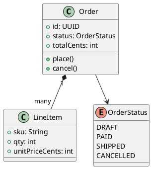
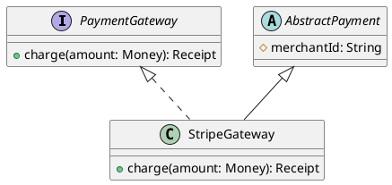
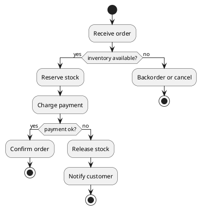
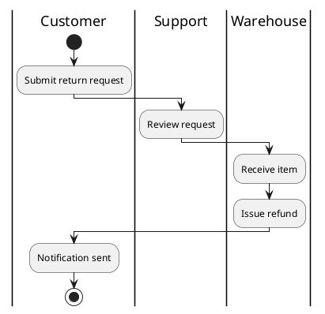
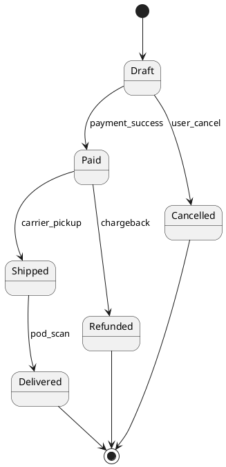
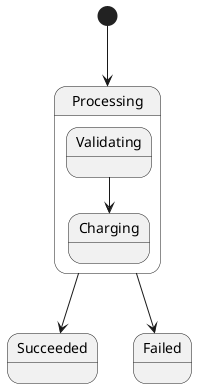
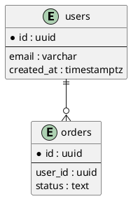

---
label: "V"
subtitle: "クラス・アクティビティ・状態"
group: "PlantUML"
order: 5
---
PlantUML — Part V
**Class** diagrams model **types and relationships**. **Activity** diagrams model **steps and decisions**. **State** diagrams model **lifecycle transitions**. Use them for domain design, onboarding, and clarifying business rules — not as a substitute for auto-generated code diagrams.

## 1. Class diagrams

| Syntax | Meaning |
|--------|---------|
| **`+` / `-` / `#`** | public / private / protected |
| **`*--`** | Composition |
| **`o--`** | Aggregation |
| **`-->`** | Association |
| **`<|--`** | Inheritance |
| **`..|>`** | Implementation |

### Interfaces and abstracts

**Tip:** generate class diagrams from code with **IDE plugins** or tools when the codebase is the source of truth; hand-drawn classes are best for **early design** and **bounded-context** discussions.

## 2. Activity diagrams

| Element | Syntax |
|---------|--------|
| **Action** | `:Label;` |
| **Decision** | `if () then () else () endif` |
| **Fork/join** | `fork` / `end fork` |
| **Swimlanes** | `|Lane name|` before actions |
| **Partition** | `partition Name { ... }` |

Swimlane example:

Activity diagrams complement **sequence** diagrams: activity = **business process**; sequence = **message-level** interactions.

## 3. State diagrams

| Syntax | Meaning |
|--------|---------|
| **`[*]`** | Start / end pseudo-state |
| **`State --> State : event`** | Transition on event |
| **`state "Long Name" as SN`** | Alias long states |

### Composite states

Map states to **enum values** or **status columns** in the database — reviewers can verify code and diagram agree.

## 4. ER diagrams (data model sketch)

PlantUML can sketch **entity-relationship** models alongside SQL migrations:

Pair with [Postgres schema notes](../postgres/iii-schema-and-migrations.md) when documenting table design.

## 5. When to use which

| Diagram | Best for |
|---------|----------|
| **Class** | Domain nouns, service boundaries, ORM mapping discussions |
| **Activity** | Multi-step workflows, approval chains, ETL pipelines |
| **State** | Order status, job lifecycle, connection state machines |
| **ER** | Table relationships before writing migrations |

## Next

Continue with [Docs, repos & CI](vi-docs-repos-and-ci.md) to embed diagrams in Markdown and validate them in pipelines.
