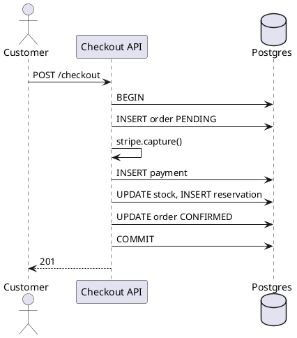

---
label: "IV"
subtitle: "EC チェックアウト・ローカル ACID"
group: "System design"
order: 4
---
E-commerce checkout local ACID
The **same checkout** — order, payment record, inventory — inside **one Java application** and **one Postgres database**, coordinated by a **single local transaction** (`@Transactional`). No saga, no event bus, no compensations on the happy path: failure rolls back with `ROLLBACK`.

Compare with [Orchestrated saga](ii-ecommerce-checkout-saga.md) and [Choreography](iii-ecommerce-checkout-choreography.md) when you split services.

## 1. When this is the right pattern

| Signal | Stay on local ACID |
|--------|-------------------|
| One team, one deployable | Yes |
| Moderate traffic; one DB scales | Yes |
| Strong consistency required on checkout | Yes |
| Separate DB per bounded context needed | No → split + saga/choreography |

**Rule:** start here; extract Payment/Inventory services only when **independent scale, ownership, or failure domains** justify the distributed cost.

## 2. Modular monolith layout

```text
shop-api.jar (Spring Boot)
  ├── checkout/     CheckoutController, CheckoutService
  ├── orders/       OrderRepository
  ├── payments/     StripeClient, PaymentRepository
  └── inventory/    StockRepository
        │
        └── single Postgres (schemas or table prefixes OK)
```

| Module | Tables |
|--------|--------|
| **orders** | `orders`, `order_items` |
| **payments** | `payments` |
| **inventory** | `stock_levels`, `reservations` |

Logical boundaries in code; **one** connection pool, **one** `COMMIT`.

## 3. Happy path — one transaction



```java
@Transactional
public Order checkout(Cart cart, String idempotencyKey) {
    Order order = orderRepo.save(Order.pending(cart));
    Payment payment = stripe.capture(cart.total(), idempotencyKey);
    paymentRepo.save(payment.forOrder(order.getId()));
    inventoryRepo.reserve(cart.items(), order.getId());
    order.confirm();
    return orderRepo.save(order);
}
```

Any exception after `BEGIN` → Spring rolls back **all** SQL in the transaction. Stripe charge is the awkward part — see §5.

## 4. vs distributed patterns

| | Local ACID (this) | [Saga](ii-ecommerce-checkout-saga.md) | [Choreography](iii-ecommerce-checkout-choreography.md) |
|---|-------------------|--------------------------------------|--------------------------------------------------------|
| Consistency | **Strong** in DB | Eventual across services | Eventual |
| Failure | `ROLLBACK` | Compensating calls | Compensating events |
| Ops complexity | Low | Orchestrator + N DBs | Bus + N consumers |
| Stripe on failure | Manual reconcile | Refund saga step | `PaymentRefunded` event |

## 5. External systems inside a local transaction

Stripe is **not** in your Postgres transaction. Typical approach:

| Strategy | Detail |
|----------|--------|
| **Authorize then capture after DB** | Hold card; capture only after stock reserved in same txn |
| **Capture first, saga on DB fail** | If `COMMIT` fails after capture → **refund job** (mini compensation) |
| **Idempotency-Key on Stripe** | Safe retry of whole `checkout()` — see [Idempotency](vi-ecommerce-checkout-idempotency.md) |

Pure local ACID is cleanest when payment can be **idempotent** and you order steps so irreversible actions happen **last** (or use auth/hold).

## 6. Evolution path

```text
Monolith + local ACID
  → extract Inventory (still sync HTTP, 2PC avoided — orchestrator or outbox)
  → extract Payment
  → full saga or choreography
```

Extract **read-heavy** modules (catalog + [cache-aside](vii-product-catalog-cache-aside.md)) before splitting checkout writes.

## 7. Rehearsal questions

- What happens to `orders` and `stock` rows if `stripe.capture()` throws after `INSERT order`?
- Why is modular monolith not the same as a ball-of-mud monolith?
- At what metric would you split Inventory out first?

**Related:** [Checkout saga](ii-ecommerce-checkout-saga.md), [Transactional outbox](v-ecommerce-checkout-transactional-outbox.md) (first step when publishing events from monolith).
