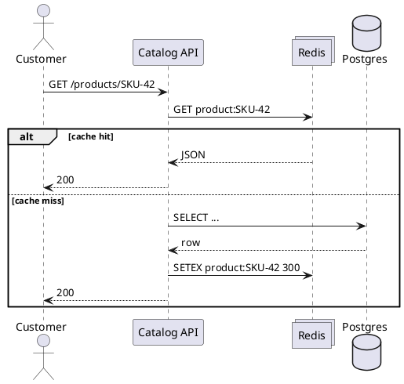

---
label: "VII"
subtitle: "商品カタログ・キャッシュアサイド"
group: "System design"
order: 7
---
Product catalog cache-aside
**E-commerce catalog** — product pages, cart validation, search suggestions — is **read-heavy**. **Cache-aside** with **Redis** in front of Postgres avoids hammering the DB on every `GET /products/{sku}`.

Checkout examples ([Saga](ii-ecommerce-checkout-saga.md), etc.) focus on **writes**; this note covers the **read path** customers hit before checkout.

Theory: [Core building blocks](../i-core-building-blocks.md) §4 caching, [Redis patterns](../../redis/iv-patterns-and-use-cases.md).

## 1. Read path

```text
GET /products/{sku}
  → app checks Redis key product:{sku}
      HIT  → return JSON
      MISS → SELECT from Postgres → SET Redis TTL 300s → return
```



## 2. Java sketch

```java
public Product getProduct(String sku) {
    String key = "product:" + sku;
    String cached = redis.get(key);
    if (cached != null) return deserialize(cached);

    Product p = productRepo.findBySku(sku)
        .orElseThrow(() -> new NotFoundException(sku));
    redis.setex(key, Duration.ofMinutes(5), serialize(p));
    return p;
}
```

## 3. Invalidation

| Event | Action |
|-------|--------|
| Admin updates price/stock display | `DEL product:{sku}` or publish invalidation event |
| Bulk import | Flush prefix `product:*` or versioned cache keys `product:v2:{sku}` |
| Inventory reserved at checkout | **Catalog** stock may be eventually consistent — checkout hits **Inventory service** authoritative stock |

**Checkout rule:** cart validation for **purchase** must use **inventory reservation**, not catalog cache alone.

## 4. Thundering herd

Hot product TTL expires → **N** concurrent misses → **N** identical DB queries.

| Mitigation | How |
|------------|-----|
| **Singleflight** | One thread loads; others wait on same key |
| **Probabilistic early refresh** | Refresh before hard TTL |
| **Stale-while-revalidate** | Return stale Redis; async refresh |

See [Application-level bottlenecks](../bottleneck-analysis/vii-application-level.md).

## 5. What to cache

| Cache | TTL | Skip cache |
|-------|-----|------------|
| Product metadata, images URLs | 1–15 min | Per-user pricing (unless key includes `user_id`) |
| Category tree | Longer | Admin-only drafts |
| Cart contents | Session store | — |

## 6. Sizing (back-of-envelope)

```text
50k SKUs × 2 KB JSON ≈ 100 MB Redis
```

Fit one Redis node; shard catalog cache only at very large catalogs.

## 7. Rehearsal questions

- Why not write-through cache on every inventory change?
- How do you cache a product page that includes “only 3 left” messaging?
- Catalog cache vs [CDN](../scalable-patterns/vi-cdn-and-edge-caching.md) for product images?

**Related:** [Core building blocks](../i-core-building-blocks.md), [Redis](../../redis/i-overview.md).
