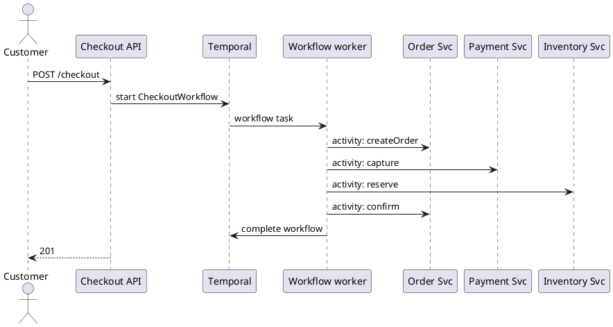

---
label: "X"
subtitle: "EC チェックアウト・ワークフローエンジン"
group: "System design"
order: 10
---
E-commerce checkout workflow engine
Same checkout steps as [Orchestrated saga](ii-ecommerce-checkout-saga.md) — order → payment → inventory → confirm — but the **state machine** and **durable timers** live in a **workflow engine** (Temporal, Cadence, AWS Step Functions). Your Java code runs in **workers** that call microservices; the engine survives process crashes and exposes workflow history.

## 1. Who is the orchestrator?

| Piece | Role |
|-------|------|
| **Workflow engine** | Stores saga state, schedules steps, retries, timeouts |
| **Java workflow worker** | Defines steps + compensations (like orchestrator code) |
| **Activity workers** | Execute HTTP calls to Order, Payment, Inventory |
| **API** | `POST /checkout` starts workflow execution |

Not the API gateway; not Order service. The **workflow** is the orchestrator — your Java class is **workflow code** executed by Temporal.

## 2. Architecture

```text
POST /checkout
  → Checkout API starts WorkflowExecution(checkoutId)
        → Temporal service (history + task queues)
              → Workflow worker (Java) — state machine
              → Activity tasks → Activity worker → HTTP → Order/Payment/Inventory
```



## 3. Temporal workflow sketch (Java)

```java
@WorkflowInterface
public interface CheckoutWorkflow {
    @WorkflowMethod
    OrderResult run(CheckoutInput input);
}

public class CheckoutWorkflowImpl implements CheckoutWorkflow {
    private final OrderActivities order = Workflow.newActivityStub(OrderActivities.class, options);
    private final PaymentActivities pay = Workflow.newActivityStub(PaymentActivities.class, options);
    private final InventoryActivities inv = Workflow.newActivityStub(InventoryActivities.class, options);

    @Override
    public OrderResult run(CheckoutInput input) {
        String orderId = order.createPending(input.cart());
        try {
            String paymentId = pay.capture(orderId, input.amount(), input.idempotencyKey());
            inv.reserve(orderId, input.items());
            order.confirm(orderId);
            return OrderResult.confirmed(orderId);
        } catch (InventoryException e) {
            Saga.compensate(() -> pay.refund(paymentId), () -> order.cancel(orderId));
            throw e;
        }
    }
}
```

Activities are **retried** by Temporal with backoff; activities must be **idempotent** ([Idempotency example](vi-ecommerce-checkout-idempotency.md)).

## 4. vs hand-rolled orchestrator

| | Checkout service + `checkout_sagas` table | Temporal / Step Functions |
|---|------------------------------------------|---------------------------|
| State storage | Your Postgres | Engine persistence |
| Crash recovery | Resume job reads DB | Engine replays workflow |
| Timers (payment SLA) | Cron / scheduled jobs | Built-in `Workflow.sleep` |
| Visibility | Custom dashboards | Workflow UI / history |
| Ops | You operate DB + app | Operate Temporal cluster or managed cloud |

## 5. Compensation

Temporal **saga pattern**: run compensations in `catch` or `Saga` helper — same order as [Saga example](ii-ecommerce-checkout-saga.md): refund → cancel.

Engine records each activity attempt — debugging “stuck on payment” is a workflow history query, not grep across logs.

## 6. AWS Step Functions (alternative)

| Concept | Step Functions |
|---------|----------------|
| State machine | JSON ASL or CDK |
| Activities | Lambda invoking Order/Payment HTTP |
| Compensation | Catch → Refund state → Cancel state |

Same logical flow; less Java-in-workflow, more declarative graph.

## 7. When to adopt

| Good fit | Stay with hand-rolled orchestrator |
|----------|-------------------------------------|
| Long-running checkout (BNPL, async fraud) | Sub-second sync checkout only |
| Many workflows (checkout, returns, subscriptions) | One checkout saga |
| Team wants durable timers/retries without custom jobs | Small team, minimal infra |

## 8. Rehearsal questions

- Where is saga state stored — Checkout DB or Temporal?
- Activity timeout on Payment — what should workflow do before compensating?
- How does this compare to [Choreography](iii-ecommerce-checkout-choreography.md)?

**Related:** [Checkout saga](ii-ecommerce-checkout-saga.md), [Idempotency](vi-ecommerce-checkout-idempotency.md).
