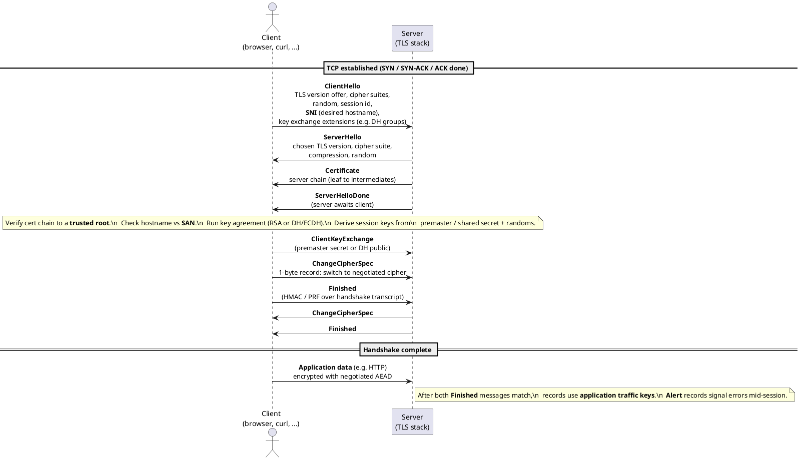

Networking — Part III: TLS handshake and certificates

**TLS** (successor to SSL) provides **confidentiality** (encryption), **integrity** (tamper detection), and usually **server authentication** (and optionally **client authentication**) using **public-key cryptography** and **X.509 certificates**.

## 1. What the handshake achieves

Before application data (e.g. HTTP):

1. **Agree on TLS version and cipher suite** — algorithms for key exchange, encryption, and MAC/AEAD.
2. **Authenticate the server** — client verifies the server’s certificate chain against trusted **CAs** (certificate authorities).
3. **Establish shared secrets** — often via **Diffie–Hellman** (or ECDH) so **forward secrecy** is possible: compromise of the server’s long-term key does not decrypt old sessions if ephemeral keys were used.
4. **Derive session keys** — symmetric keys used for bulk encryption of the rest of the connection.

## 2. Classic full handshake (conceptual)

Modern TLS 1.2/1.3 differ in detail; a simplified story:

1. **ClientHello** — supported versions, cipher suites, random nonce, key share (TLS 1.3), **SNI** (Server Name Indication: which hostname the client wants — critical for shared IPs).
2. **ServerHello** — chosen parameters, server **certificate chain**, optional **CertificateRequest** (for mutual TLS).
3. **Client** verifies certificates, finishes key exchange, sends **Finished** (proof of handshake transcript).
4. **Server Finished** — both sides now derive **traffic keys** and send **encrypted** application data (HTTP).

**TLS 1.3** reduces round trips (often **1-RTT** for first connection; **0-RTT** resumption exists but has replay trade-offs).

### Sequence diagram (TLS 1.2–style, simplified)

Diagram below: **TCP is already up**; then the **TLS record layer** exchanges handshake messages. Cipher names and optional messages (**ServerKeyExchange**, **client auth**) are omitted for clarity. **TLS 1.3** encrypts most of the server’s first flight and usually completes in fewer round trips—same goals (agree keys, authenticate server, **Finished** proves transcript integrity).



**If the diagram still does not show:** the default **Markdown** preview does **not** render ` ```plantuml ` blocks. Use the **PlantUML** extension command **PlantUML: Preview Current Diagram** (place the cursor inside the fenced block, then **Ctrl+Shift+P** → type the command). You need **Java** on your `PATH` (the extension runs `plantuml.jar`). **Markdown Preview Enhanced** is a separate preview window that can embed diagrams—again not the stock preview.

## 3. Certificates and trust

- A **leaf certificate** binds a **public key** to names (**CN** / **SAN**: DNS names like `api.example.com`).
- The client chains to a **root CA** in its trust store (OS or browser).
- **Validity period**, revocation (**OCSP** / **CRL**), and **pinning** (rare, brittle) affect real-world security.

## 4. TLS termination

**Edge termination:** load balancer or **ingress** decrypts TLS and may forward **plain HTTP** to pods (cluster-internal) or re-encrypt to backends (**mTLS**). Implications:

- Backends see **X-Forwarded-Proto: https** or similar when the edge sets it.
- **End-to-end TLS** to the app requires configuring the proxy to **pass-through** or **re-encrypt** with its own certs.

## 5. Common pitfalls

- **Mixed content** — HTTPS page loading HTTP subresources (blocked or warned).
- **SNI** missing or wrong — virtual hosting on one IP fails or serves the wrong cert.
- **Expired or mis-issued certs** — monitoring and automation (**ACME** / Let’s Encrypt) reduce outages.

Next: **DNS** (how names become addresses before TCP/TLS), then **ingress** and edge routing.
