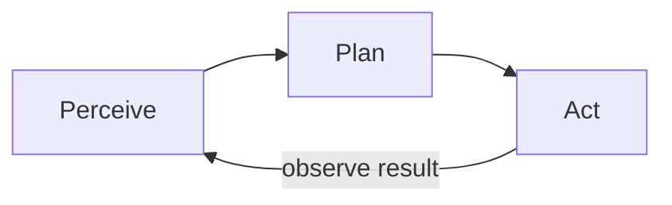

Agentes e fluxos de trabalho de agentes — visão geral
Aprofundamento em **agentes e fluxos de trabalho de agentes** — dividido em notas específicas abaixo.

## Mapa deste submenu

| Nota | Foco |
|------|--------|
| [Chat, assistente e agente](ii-chat-assistant-agent.md) | Modos comparados; ferramentas (integradas, MCP, habilidades + scripts, por exemplo, Traduzir API) |
| [Agentes diretores](iii-directing-agents.md) | Acompanha parte dos fluxos de trabalho de agentes e agentes |
| [Produtos e humanos no circuito](iv-products-and-human-in-the-loop.md) | Acompanha parte dos fluxos de trabalho de agentes e agentes |
| [Minha configuração](v-my-setup.md) | Agente de regras versus agentes de recompra; trabalho paralelo multi-repo e mesmo repo |

Agentes e fluxos de trabalho de agente
Um **AI agente** (nos produtos que você usa) é um modelo que **persegue uma meta em várias etapas** — planejamento, chamada de **ferramentas** (pesquisa, código, arquivos, APIs) e ajuste quando algo falha — em vez de responder de uma só vez.

Você não implanta agentes sozinho; você os **direciona** em Cursor, ChatGPT, Claude, Copilot e plataformas de automação.

## Ordem de estudo

[Chat, assistente e agente](ii-chat-assistant-agent.md) → [Agentes diretores](iii-directing-agents.md) → [Produtos e humanos no circuito](iv-products-and-human-in-the-loop.md) → [Minha configuração](v-my-setup.md)
