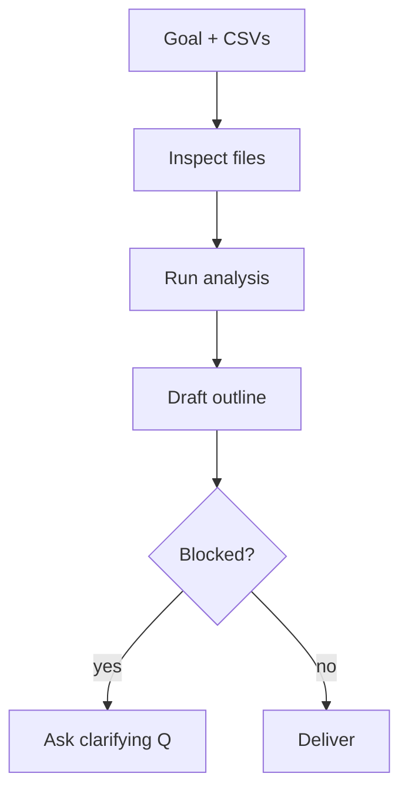
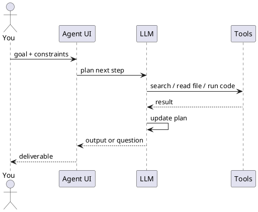
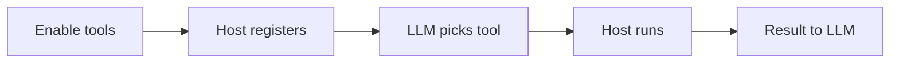

Bate-papo, assistente e agente

## 1. Bate-papo x assistente x agente

| Modo | Você dá | AI faz |
|------|----------|--------|
| **Bate-papo** | Pergunta | Resposta única |
| **Assistente** | Pergunta + documentos/instruções salvos | Resposta baseada no seu conhecimento |
| **Agente** | **Meta** | Planejar → agir → observar → repetir até terminar ou bloquear |



## 2. O que “orquestração de agente” significa para os usuários

**Orquestração** = coordenação de **etapas e ferramentas** para concluir um fluxo de trabalho.

| Camada | Exemplo voltado para o usuário |
|-------|---------------------|
| **Agente único** | Cursor Agente: editar repositório a partir de uma descrição de tarefa |
| **Uso de ferramenta** | ChatGPT com navegação + Python + seu Google Drive |
| **Multiagente** (gerenciado pelo produto) | Modo de pesquisa que busca, lê, sintetiza |
| **Orquestração externa** | Zapier/Make: gatilho → etapa AI → postar no Slack |

Você projeta **metas e grades de proteção**; o produto executa o loop.



## 3. Adicionando mais ferramentas ao seu LLM

**Ferramentas** são ações que o modelo pode **solicitar** por meio do aplicativo host — pesquisar na Web, ler um arquivo, executar código, chamar um API — em vez de apenas gerar texto. Mais ferramentas = o LLM pode **fazer** mais no loop do agente acima.

Você não modifica os pesos do modelo. Você **expõe os recursos** dos fios do produto no loop de chamada de ferramenta.



| O que você adiciona | O que o LLM ganha |
|--------------|-------------------|
| Pesquisa na web | Atualidades, documentos, citações |
| Intérprete de código | Gráficos, análise CSV, pequenos scripts |
| Conector de arquivo/unidade | Leia seus documentos sem colar |
| GitHub / Linear MCP | Edições, PRs, ingressos ao vivo |
| Terminal (agente IDE) | Testes, compilações, git |
| Habilidade + roteiro | Fluxo de trabalho API repetível que o agente executa sob comando |
| MCP / Ação envolvendo um script | Mesmo script, exposto como um nome`translate`ferramenta |

### Opção A — Ferramentas integradas (alternar em UI)

A maioria dos produtos de chat inclui ferramentas; você os **ativa** por chat ou espaço de trabalho.

| Produto | Integrados típicos | Como adicionar |
|--------|-------------------|--------|
| **Bate-papoGPT** | Navegação, intérprete de código, imagem | Modo seletor de modelo/agente; GPT **Ações** personalizadas para seus APIs |
| **Cláudio** | Pesquisa na Web, análise, utilização do computador (quando ativado) | Configurações de projeto ou chat; **conectores** para Drive, GitHub |
| **Gêmeos** | Pesquisa Google, espaço de trabalho | Extensões em aplicativos Gemini |
| **Cursor** | Codebase, terminal, navegador, editar arquivos | Modo agente;`@`arquivos e documentos |
| **Copiloto** | Gráfico M365, contexto do repositório | Plug-ins de locatário / Copilot Studio |

Comece aqui antes da fiação personalizada: nenhuma configuração além das permissões.

### Opção B — Conectores de aplicativos (OAuth)

**Conectores** permitem que o host leia ou atue no SaaS que você já usa.

```text
Settings → Connect Google Drive / Slack / GitHub → approve OAuth scopes → model can search or summarise connected data
```

| Bom para | Cuidado |
|----------|-----------|
| Menos copiar e colar | Conecte apenas dados que você possa expor a AI |
| Contexto mais atual | Escopo do conector errado = acesso excessivamente amplo |

Mesma ideia de [padrões de orquestração](../tools-and-orchestration/iii-orchestration-patterns.md) — seção de conectores.

### Opção C — servidores MCP (estender IDE e agentes de desktop)

**MCP (Model Context Protocol)** adiciona **ferramentas personalizadas** por meio de pequenos programas conectores — Postgres, Sentry, APIs internos.

| Etapa | Ação |
|------|--------|
| 1 | Escolha ou instale um servidor MCP (`@modelcontextprotocol/server-github`, plugin do fornecedor, servidor HTTP hospedado pela equipe) |
| 2 | Configurar no host (`mcp.json`em Cursor, configurações do Claude Desktop) |
| 3 | Fornece tokens via env vars - nunca no git |
| 4 | Reinicie o host; ferramentas aparecem na lista de ferramentas do agente |
| 5 | Pergunte em linguagem natural; modelo escolhe`search_issues`,`run_query`, etc. |

**Cursor`mcp.json`(conceptual):**

```json
{
  "mcpServers": {
    "github": {
      "command": "npx",
      "args": ["-y", "@modelcontextprotocol/server-github"],
      "env": { "GITHUB_PERSONAL_ACCESS_TOKEN": "..." }
    }
  }
}
```

O formato de transmissão é **JSON-RPC** (stdio ou HTTP), não algo que você cria manualmente em prompts. Detalhes completos: [Como MCP funciona](../how-mcp-works/i-overview.md).

### Opção D — Ações personalizadas/seu próprio API (usuários avançados)

| Mecanismo | Ajuste |
|-----------|-----|
| **Ações GPT personalizadas** | Esquema OpenAPI → ChatGPT chama seus endpoints HTTPS |
| **Uso da ferramenta Claude + MCP** | Mesmo padrão para integrações desktop/API |
| **Zapier / Make / n8n** | LLM etapa em um fluxo de trabalho; ferramentas = outros nós SaaS |
| **Seu back-end** | O aplicativo chama LLM com`tools`parâmetro (OpenAI/Anthropic APIs) — caminho do construtor |

Para **não desenvolvedores**, ações GPT personalizadas e plataformas de automação são a maneira usual de “adicionar mais uma ferramenta” (por exemplo, criar registro CRM, postar no Slack).

### Opção E — Habilidades + chamada de script (são ferramentas?)

**Resposta curta:** uma **habilidade não é uma ferramenta**; um **script pode ser**.

| Peça | O que é | Ferramenta que pode ser chamada? |
|-------|------------|----------------|
| **Habilidade (`SKILL.md`)** | Instruções: quando agir, qual comando, formato de saída | **Não** — carregado como **contexto** (manual) |
| **Roteiro** (`translate.py`) | Código que atinge API e imprime um resultado | **Sim** — quando o host pode **executá-lo** (terminal, MCP, back-end de ação personalizada) |
| **Habilidade + roteiro juntos** | Skill diz ao agente *“para tradução, execute este script”* | **Ferramenta indireta** — chamadas de modelo **run terminal** ou um wrapper **`translate`** ferramenta |

```text
Skill     →  "Use scripts/translate.py for any translate request"
Script    →  calls Google Translate API, returns JSON/text
Host tool →  Shell (Cursor Agent) OR MCP tool OR HTTPS Action
LLM       →  sees tool result, writes answer to user
```

Três maneiras comuns de conectar o mesmo script:

| Fiação | Quem executa o script | Modelo vê |
|--------|---------------------|------------|
| **IDE agente + habilidade** | Host é executado`python scripts/translate.py …`no terminal | Saída do terminal no resultado da ferramenta |
| **MCP servidor** | Servidor MCP invoca script ou HTTP internamente |`translate`na lista de ferramentas |
| **Ação GPT personalizada** | Seu pequeno API executa script no lado do servidor |`translateText`em ações OpenAPI |

Habilidades e scripts são adequados para **uma equipe, um repositório, uma chave API no ambiente** — sem construir um servidor MCP completo no primeiro dia.

#### Exemplo: traduzir com o Google Cloud Translation API

**1. Ativar** [Tradução na nuvem API](https://cloud.google.com/translate/docs) e crie uma chave API (restringir por IP ou usar um gerenciador de segredos na produção).

**2. Roteiro ** -`scripts/translate.py`(somente stdlib; digite env):

```python
#!/usr/bin/env python3
"""Usage: python scripts/translate.py "Hello team" ja"""
import json
import os
import sys
import urllib.parse
import urllib.request

API_KEY = os.environ["GOOGLE_TRANSLATE_API_KEY"]

def translate(text: str, target: str = "en") -> str:
    params = urllib.parse.urlencode({"q": text, "target": target, "key": API_KEY})
    url = f"https://translation.googleapis.com/language/translate/v2?{params}"
    with urllib.request.urlopen(url) as resp:
        data = json.load(resp)
    return data["data"]["translations"][0]["translatedText"]

if __name__ == "__main__":
    text = sys.argv[1]
    target = sys.argv[2] if len(sys.argv) > 2 else "en"
    print(translate(text, target))
```

```bash
export GOOGLE_TRANSLATE_API_KEY="your-key"
python scripts/translate.py "Welcome to the beta" ja
# → ベータ版へようこそ
```

**3. Habilidade** -`.cursor/skills/translate/SKILL.md`(ou`.claude/skills/…`):

```markdown
---
name: google-translate
description: Translate user text via scripts/translate.py and Google Translation API. Use when the user asks to translate, localize, or convert text to another language.
---

# Translate

1. Detect target language from the user request (default `en`).
2. Run: `python scripts/translate.py "<text>" <target_lang_code>`
3. Return the script output verbatim; do not invent translations.
4. API key is in env `GOOGLE_TRANSLATE_API_KEY` — never print it.
```

**4. O usuário pergunta no Cursor Agente:**

```text
Translate this sentence to Japanese: "Ship date is April 15."
```

**5. O que acontece:**

```text
Agent loads skill → chooses terminal tool → runs script → gets 「発売日は4月15日です」 → replies to you
```

Isso é **chamada de script como ferramenta**: o LLM não ligou diretamente para o Google; o **código executado pelo host** e retornou o resultado.

**Mesmo script de uma ferramenta formal (MCP / API):** wrap`translate()`em um servidor MCP que expõe`tools/call`método`translate`com`{ "text", "target" }`ou expor`POST /translate`em OpenAPI para uma ação GPT personalizada — a camada HTTP/MCP é a ferramenta; a lógica do script permanece a mesma.

| Abordagem | Melhor quando |
|----------|-----------|
| Habilidade + terminal | Solo dev, Cursor/Claude Code, utilitário interno rápido |
| MCP invólucro | Lista de ferramentas compartilhadas, auditoria, sem shell arbitrário |
| Ação GPT personalizada | Somente usuários não técnicos no ChatGPT |

#### Isso reduz o uso de token?

**Às vezes sim, mas as habilidades e os scripts afetam os tokens de maneira diferente.**

| Peça | Efeito simbólico | Por que |
|-------|-------------|-----|
| **Habilidade carregada no contexto** | **Custa tokens** |`SKILL.md`texto é adicionado ao prompt (geralmente apenas quando relevante — depende do produto) |
| **Resultado da ferramenta Script / API** | **Geralmente economiza tokens** | O modelo obtém um **resultado factual curto** (uma linha traduzida) em vez de gerar ou raciocinar longamente |
| **Menos tentativas** | **Economiza tokens** | Comando certo na primeira vez vs cinco bate-papos “tente novamente” |
| **Cada rodada de chamada de ferramenta** | **Custa tokens** | Nome da ferramenta, argumentos JSON e resultado voltam ao contexto para o próximo turno LLM |

**Exemplo de tradução — compare:**

| Abordagem | Imagem simbólica aproximada |
|----------|----------|
| LLM traduz no chat | Tokens de saída para resposta completa + às vezes cadeia de pensamento; risco de qualidade |
| Cole documentos API do Google sempre | Grande **entrada** em cada sessão |
| Habilidade uma vez + chamada de script | Custo único de habilidade; resultado da ferramenta ≈ uma sequência curta; Documentos API ficam **fora** do modelo |

```text
Expensive:  "Here is our 2-page translation policy…" pasted every chat
Cheaper:    SKILL.md (~30 lines, loaded when needed) + tool result "発売日は4月15日です"
```

**Economia líquida quando:**

- O script retorna dados **compactos** (tradução, preço, código de status) — não megabytes de logs
- A habilidade substitui instruções longas **repetidas** que você colaria de outra forma
- Você evita loops de correção **multivoltas**

**Custo líquido ou nenhuma vitória quando:**

- O arquivo de habilidade é **enorme** (cole um manual em`SKILL.md`- usar`reference.md`+ habilidade curta em vez disso)
- **Muitas** ferramentas são acionadas em uma tarefa (cada resultado adicionado ao contexto)
- Você habilita **dezenas** de ferramentas MCP — apenas as **descrições** das ferramentas sobrecarregam o prompt do sistema
- A saída do script é enorme (despejar DB inteiro) - corte antes de retornar para LLM

**Regra prática:** troca de habilidades **um pequeno custo fixo de instrução** por **menos problemas no chat**; os scripts trocam **uma rodada de ferramentas** por **não solicitar ao modelo que simule um API**. Juntos, eles geralmente reduzem o **total de tokens de sessão** — não porque o modelo funciona menos magicamente, mas porque você para de reenviar as mesmas regras e para de gerar o código já computado.

Consulte [Habilidades e instruções do agente](../skills-and-agent-instructions/i-overview.md) para manter as habilidades curtas; [Como MCP funciona](../how-mcp-works/i-overview.md) para promover o script a uma ferramenta MCP de primeira classe.

### O que o modelo realmente vê

O LLM **não** obtém chaves API brutas. Ele vê um **catálogo de ferramentas**:

| Campo | Finalidade |
|-------|---------|
| **Nome** |`get_issue`,`search_docs`|
| **Descrição** | Quando usar – a qualidade é importante para escolhas corretas |
| **Parâmetros** | Esquema JSON que o host valida |

Melhores descrições → menos chamadas de ferramentas erradas. Se uma ferramenta falhar, restrinja a descrição ou reduza o número de ferramentas ativadas ao mesmo tempo.

### Lista de verificação prática

| Etapa | Faça |
|------|-----|
| 1 | Liste o que o agente deve **ler** vs **escrever** (somente leitura primeiro) |
| 2 | Habilite **integrações** que cobrem 80% (pesquisa, arquivos, código) |
| 3 | Adicione **conectores** para seus armazenamentos de documentos |
| 4 | Adicione **MCP** apenas para sistemas ao vivo, o chat não pode ser alcançado |
| 5 | Estreito **OAuth / escopos de token**; girar segredos |
| 6 | Teste com um objetivo claro: “Encontrar bugs P1 abertos e resumir” |

| Evite | Por que |
|-------|-----|
| Habilitando todos os servidores MCP de uma vez | O modelo escolhe a ferramenta errada; superfície de ataque mais ampla |
| Escreva ferramentas sem revisão humana | Os agentes podem postar, excluir ou cobrar APIs |
| Duplicando os mesmos dados via conector + MCP + upload | Contexto conflitante |

**Relacionado:** [Habilidades e instruções do agente](../skills-and-agent-instructions/i-overview.md), [Como MCP funciona](../how-mcp-works/i-overview.md), [Padrões de orquestração](../tools-and-orchestration/iii-orchestration-patterns.md), [Agentes diretores](iii-directing-agents.md), [Confiar e verificar](../trust-privacy-and-verify/i-overview.md).