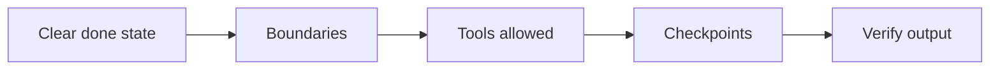

Agentes diretores

## 3. Quando os agentes ajudam versus prejudicam

| Bom para agentes | Melhor como bate-papo simples |
|-----------------|----------------------|
| Tarefas de codificação de vários arquivos | Definição única |
| Pesquisa em muitas fontes | Reescrita curta |
| Operações repetitivas com cheques | Ações sensíveis e irreversíveis sem revisão |
| “Descubra como funciona esse repositório” | Pesquisa factual que você pode verificar em um documento |

| Risco | Mitigação |
|------|------------|
| Arquivo errado editado | Pequenas tarefas; revisar diferenças |
| Citações inventadas | Exigir links; verificar |
| Escopo descontrolado | “Pare após o passo 3 e mostre o plano” |
| Custo/tempo | Estabeleça limites; usar modelo menor para rascunhos |

## 4. Como direcionar bem um agente

Use os mesmos blocos de construção de [Solicitação eficaz](../effective-prompting/i-overview.md), mais:

| Adicionar | Exemplo |
|-----|---------|
| **Limpar estado concluído** | “Feito quando: PR-ready diff + saída do comando de teste.” |
| **Limites** | “Não altere os arquivos em`/legacy`.” |
| **Ferramentas permitidas** | “Use apenas pesquisa de repositório; sem rede.” |
| **Pontos de verificação** | “Depois do plano, espere pelo meu OK antes das edições.” |
| **Verificação** | “Execute testes e cole o resumo.” |

Agentes **Cursor / IDE:** apontam para pastas, mencionam pilha, referenciam padrões existentes (“correspondem`UserService`estilo").

**Agentes de pesquisa:** especificam o intervalo de datas, as fontes preferidas e o esquema de saída (tabela, memorando, slides).