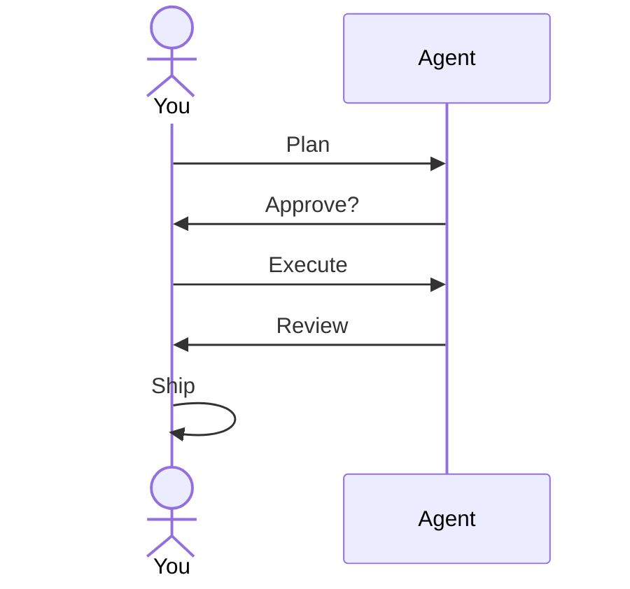

Produtos e humanos no circuito

## 5. Padrões de agência em produtos (2025–2026)

| Área de produto | Comportamento de agente |
|--------------|----------------------|
| **Cursor Agente** | Alterações de código de vários arquivos, terminal, navegador |
| **Bate-papoGPT** | Modo agente, pesquisa profunda, conectores |
| **Cláudio** | Projetos + uso de ferramentas, uso de computador (quando habilitado) |
| **Copiloto Microsoft** | Gráfico M365 + ações no locatário |
| **Devin/agentes de codificação** | Tarefas de software de longo horizonte (revisão humana crítica) |

As capacidades mudam rapidamente — os princípios permanecem: **objetivo, restrições, verificação**.

## 6. Humano no circuito

Trate a saída do agente como **rascunho**:

Para implantações legais, médicas, financeiras ou de produção: **você** é responsável; o agente é um estagiário rápido.

## 7. Perguntas de ensaio

- Qual a diferença entre um agente e um longo chat?
- Cite duas proteções antes de permitir que um agente edite o código.
- O que é orquestração em uma frase para um não desenvolvedor?

**Relacionado:** [Ferramentas e orquestração](../tools-and-orchestration/i-overview.md), [Habilidades e instruções do agente](../skills-and-agent-instructions/i-overview.md), [Confiar e verificar](../trust-privacy-and-verify/i-overview.md).