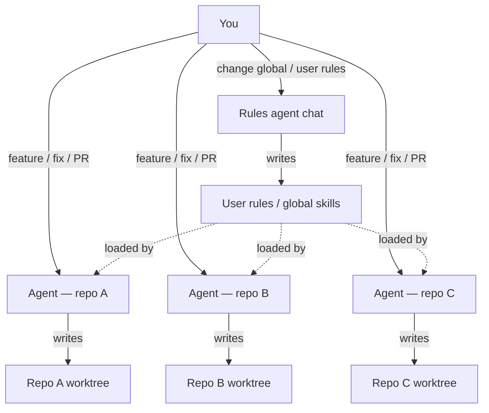
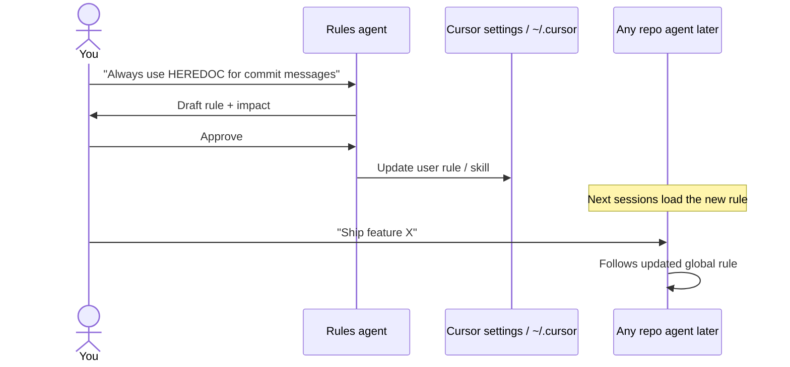
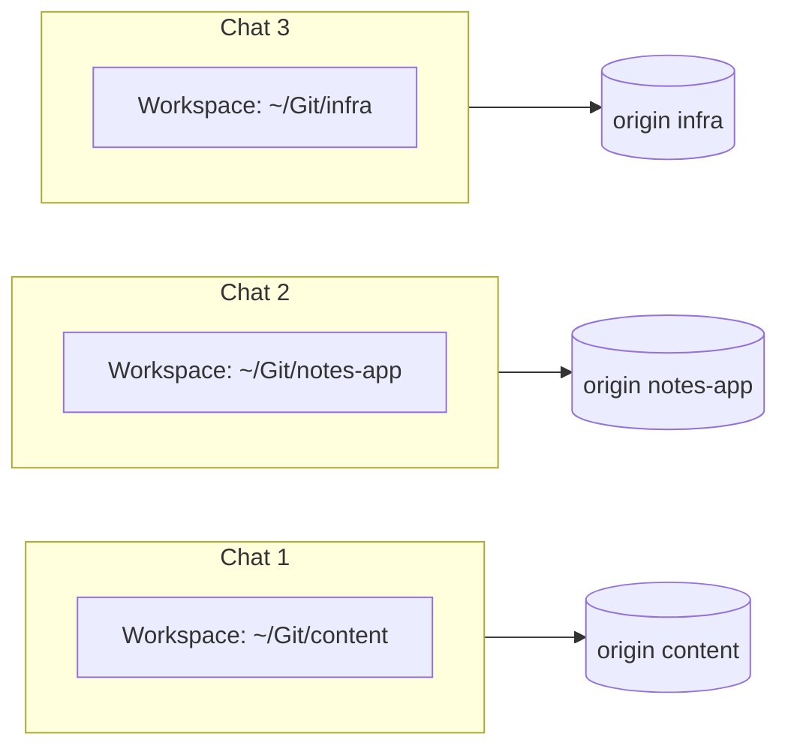
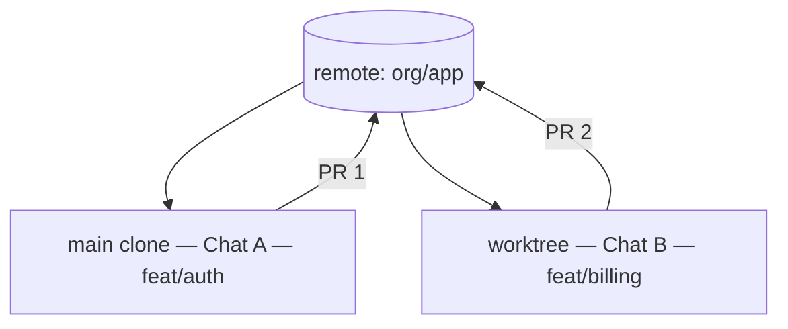
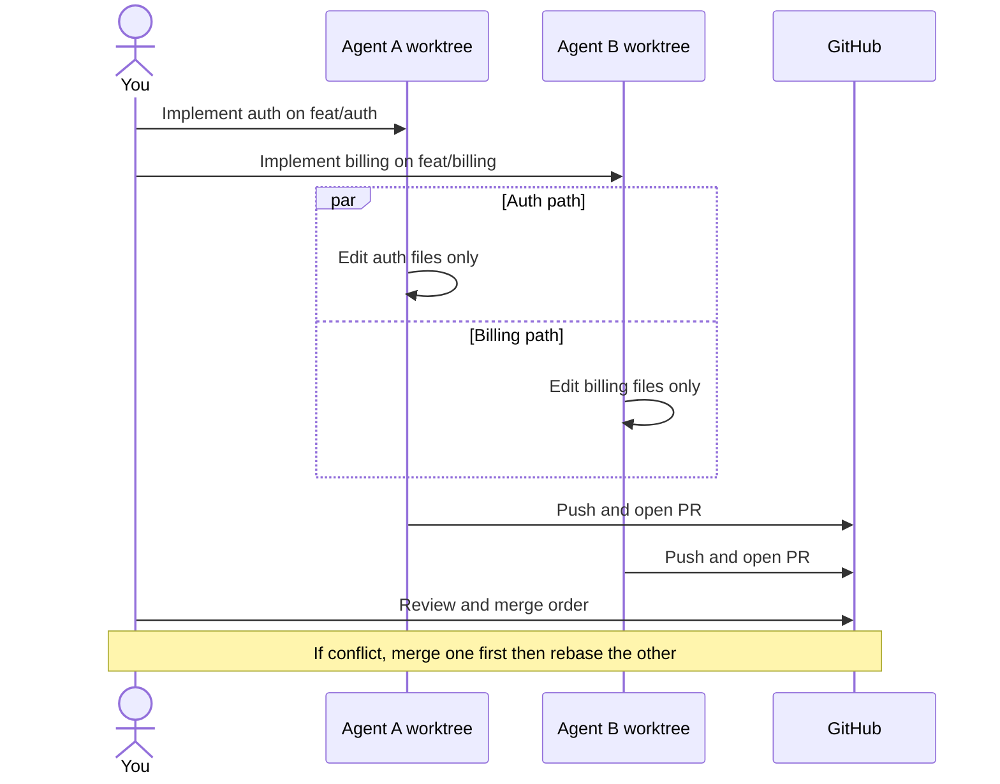
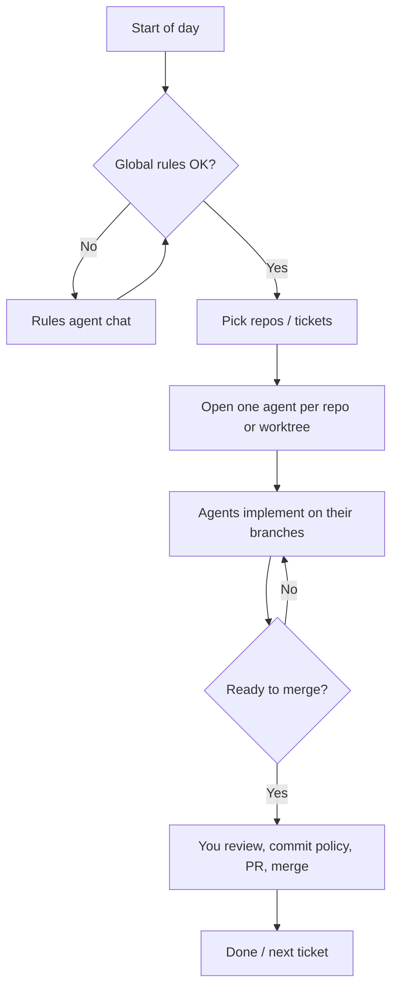

Minha configuração - fluxo de trabalho Cursor multiagente
Como executo **Cursor agentes** no dia a dia: um chat possui **regras globais**, outros chats fazem **trabalho de repositório** e eu mantenho o **trabalho paralelo** seguro quando vários agentes tocam a mesma base de código.

Este é um modelo operacional pessoal, não um requisito do produto. Relacionado: [Agentes diretores](iii-directing-agents.md), [Cursor habilidades, regras e AGENTS.md](../skills-and-agent-instructions/iv-cursor-skills-rules-agents-md.md), [Orquestração de agentes](../skills-and-agent-instructions/using-skills-agents-and-hooks/vi-agent-orchestration.md).

## 1. Visão geral das funções

| Bate-papo do agente | Possui | Não possui |
|------------|------|-------------|
| **Agente de regras** | Regras de usuário, hábitos globais, convenções entre repositórios | Apresentar PRs em repositórios de produtos |
| **Agentes de recompra** | Um (ou poucos) controles remotos/árvores de trabalho git cada | Editando meu conjunto de regras globais “enquanto eles estão fazendo isso” |
| **Eu** | Mesclar decisões, quais chats podem escrever | Confiança cega em cada chamada de ferramenta |



**Regra:** o agente de regras altera **o modo como todos os agentes se comportam**. Os agentes do repositório alteram o **código**. Misturar essas tarefas em um chat causa diferenças surpreendentes e edições de regras incompletas.

## 2. Agente de regras (global)

Use um **bate-papo dedicado** (e geralmente um espaço de trabalho de rascunhos ou anotações) cuja única função é a área de superfície de instruções:

| Camada | Localização típica | Escopo |
|-------|------------------|-------|
| **Regras do usuário** | Cursor regras de usuário (conta/configurações) | Cada projeto |
| **Habilidades do usuário** |`~/.cursor/skills/`| Cada projeto |
| **Ganchos de usuário** | Ganchos de nível de usuário, se você os usar | Cada projeto |
| **Regras da equipe** | Somente quando você abre explicitamente esse repo | Esse controle remoto |

Padrão de prompt para o agente de regras:

```text
You only edit global / user-level Cursor rules and skills.
Do not change application code in product repos.
Propose the rule text, show before/after, wait for my OK, then apply.
```



Mantenha um breve **registro de alterações** no bate-papo de regras (ou uma nota privada): data, o que mudou, por quê — para que você possa reverter instruções globais incorretas.

## 3. Agentes Repo (diferentes controles remotos)

Gire **um chat de agente por repositório ativo** (ou por épico). Aponte a raiz do espaço de trabalho para esse clone antes de solicitar edições.



| Prática | Por que |
|----------|-----|
| **Nomeie o chat** após o repo/ticket | Menos sangramento de contexto |
| **Uma agência por agente** quando possível | RP mais limpos |
| **Informe ao agente o caminho do repositório** se as raízes puderem se mover | Evite editar a árvore errada |
| **Não peça ao Chat B para “também corrigir regras globais”** | Esse é o trabalho do agente de regras |

## 4. Mesmo repositório, mesma hora

Vários agentes em **um controle remoto** são adequados se não brigarem pelos mesmos arquivos. Prefira **árvores de trabalho git** (ou clones separados) para que cada chat tenha seu próprio checkout e branch.



### Lista de verificação de coordenação

| Risco | Mitigação |
|------|------------|
| Dois agentes editam o mesmo arquivo | Dividir por diretório/propriedade; ou serializar |
| Ambos confirmam em um branch | **Uma agência por agente**; rebase/mesclagem através de você |
| Contexto obsoleto após pull | Diga a cada bate-papo quando`main`movido |
| Lutas de arquivo de gancho / bloqueio | Não execute instaladores longos em duas árvores ao mesmo tempo sem necessidade |
| As regras mudam no meio do voo | Pausar agentes de recompra; atualizar agente de regras; currículo |



### Quando *não* paralelizar

- Grandes renomeações/movimentos que tocam toda a árvore  
- Bloqueios gerados compartilhados (`package-lock.json`) sem um plano  
- “Refatorar tudo” + “enviar um hotfix” nas mesmas horas

Então: **um agente**, ou hotfix primeiro, refatore depois.

## 5. Formato do dia de ponta a ponta



## 6. Trechos de prompt que reutilizo

**Agente de regras**

```text
Scope: user-level Cursor rules only.
Output: proposed rule text, files touched, rollback note.
Do not modify any git repo application source.
```

**Agente de recompra**

```text
Repo: <path or name>. Branch: feat/<ticket>.
Do not change user/global Cursor rules.
If a standing rule should change, say so — I will run the Rules agent.
```

**Paralelo do mesmo repositório**

```text
You own paths: <dirs>. Other agent owns: <dirs>.
Do not edit outside your paths. Worktree: <path>. Branch: <name>.
```

## 7. Notas relacionadas

| Tópico | Nota |
|-------|------|
| Como orientar os agentes | [Agentes diretores](iii-directing-agents.md) |
| Onde residem as regras/habilidades | [Cursor habilidades, regras e AGENTS.md](../skills-and-agent-instructions/iv-cursor-skills-rules-agents-md.md) |
| Ciclos de aprovação humana | [Produtos e humanos no circuito](iv-products-and-human-in-the-loop.md) |

## Próximo

Retorne para [Visão geral de agentes e fluxos de trabalho de agente](i-overview.md).
