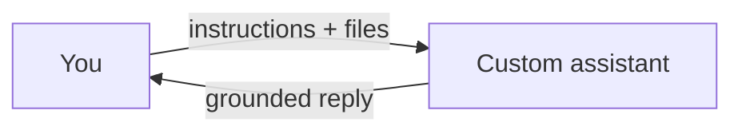

Assistentes personalizados e conhecimento — visão geral
Aprofunde-se em **assistentes personalizados e conhecimento** — dividido em notas específicas abaixo.

## Mapa deste submenu

| Nota | Foco |
|------|--------|
| [Produtos e assistentes de construção](ii-products-and-building-assistants.md) | Parte dos assistentes personalizados e trilha de conhecimento |
| [RAG e bibliotecas de conhecimento](iii-rag-and-knowledge-libraries.md) | Parte dos assistentes personalizados e trilha de conhecimento |
| [Memória e governança](iv-memory-and-governance.md) | Parte dos assistentes personalizados e trilha de conhecimento |

Assistentes personalizados e conhecimento
Os produtos permitem que você anexe **seus** documentos e **instruções permanentes** para que AI responda como um colega de equipe que lê o manual, sem precisar ajustar os modelos por conta própria.

## Ordem de estudo

[Produtos e assistentes de construção](ii-products-and-building-assistants.md) → [RAG e bibliotecas de conhecimento](iii-rag-and-knowledge-libraries.md) → [Memória e governança](iv-memory-and-governance.md)
