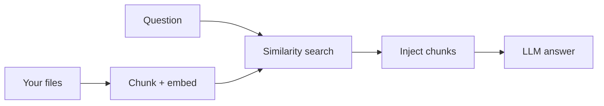

RAG e bibliotecas de conhecimento

## 4. RAG sem o jargão

**Geração aumentada de recuperação (RAG)** = AI **pesquisa seus arquivos** e **grava usando esses pedaços**.

| Você faz | O produto faz |
|--------|-------------|
| Carregar PDFs / conectar unidade | Pedaço, incorporação, pesquisa em cada pergunta |
| Faça pergunta | Injete passagens relevantes no prompt |

Dicas para melhores respostas:

| Dica | Por que |
|-----|-----|
| **Nomes de arquivos descritivos** | Ajuda na recuperação e na sua sanidade |
| **Um tópico por documento** | Reduz pedaços errados misturados |
| **Peça “citar a fonte”** | Mais fácil de verificar |
| **Divida PDFs enormes** | Por capítulo se o produto permitir |

Profundidade técnica: [LLM RAG](../../llms/v-rag-and-fine-tuning.md), [Exemplo de pesquisa de pedido](../../swe101/sysdesign/examples/viii-order-search-cdc.md).

## 5. Bibliotecas de conhecimento da equipe

| Abordagem | Ajuste |
|----------|-----|
| **Projeto único compartilhado/GPT** | Equipe pequena, um domínio |
| **Assistentes por produto** | Diferentes políticas e tom |
| **Wiki + AI barra lateral** | Noção AI, Confluence AI em wiki existente |

Governança: proprietário por assistente, changelog quando as políticas são atualizadas.