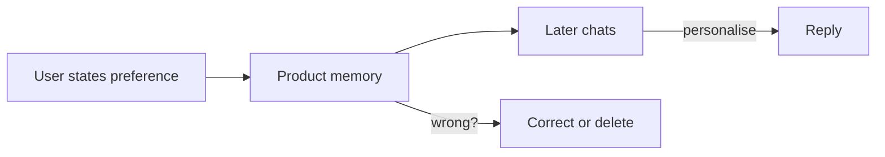

Memória e governança

## 6. Recursos de memória

Alguns produtos **lembram** fatos em bate-papos (“o usuário prefere marcadores”).

| Vantagens | Desvantagem |
|--------|----------|
| Menos repetição | A memória errada persiste — corrija ou exclua |
| Personalização | Privacidade – saiba quais fornecedores armazenam |

Desligue ou limpe a memória de **máquinas compartilhadas** ou **trabalhos confidenciais**.

## 7. Perguntas de ensaio

- GPT personalizado vs bate-papo único - quando vale a pena configurar?
- Por que pedir ao modelo para citar fontes?
- O que pertence às instruções versus arquivos enviados?

**Relacionado:** [Solicitação eficaz](../effective-prompting/i-overview.md), [Confiar e verificar](../trust-privacy-and-verify/i-overview.md).