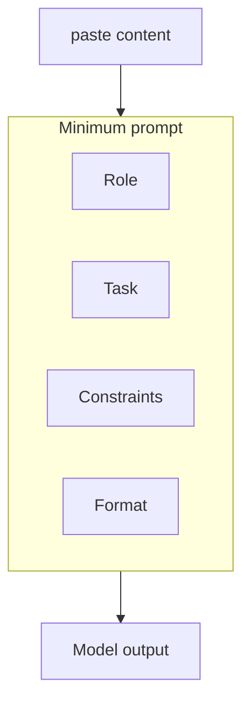

Prompt e técnicas mínimas

## 1. O prompt mínimo bom

Inclua quatro peças quando a tarefa for importante:

| Peça | Exemplo |
|-------|---------|
| **Função/perspectiva** | “Você é um editor conciso de um blog técnico.” |
| **Tarefa** | “Reescreva o rascunho abaixo para maior clareza.” |
| **Restrições** | “Mantenha menos de 300 palavras; preserve todos os números.” |
| **Formato de saída** | “Use marcadores; sem parágrafo de introdução.” |

Fraco: “Torne isso melhor.”  
Forte: “Liste três edições concretas; para cada uma, cite a frase original e sua revisão.”

## 2. Técnicas que realmente ajudam

| Técnica | Quando usar | Frase de exemplo |
|-----------|------------|----------------|
| **Tiro zero** | Tarefa simples e conhecida | “Traduzir para Japonês:…” |
| **Poucos tiros** | Você tem um modelo de estilo | Cole 2 exemplos e depois “Agora faça o mesmo para…” |
| **Cadeia de pensamento** | Matemática, lógica, planejamento | “Pense passo a passo e depois dê a resposta final.” |
| **Rascunho → crítica → revisão** | Documentos importantes | “Primeiro rascunho, depois listar os pontos fracos e depois a versão melhorada.” |
| **Alternância de público** | Mesmo conteúdo, leitor diferente | “Explique duas vezes: para executivos e depois para engenheiros.” |

**Cadeia de pensamento:** peça raciocínio **antes** da resposta final quando os erros custarem caro. Oculte as etapas em sua cópia se precisar apenas da conclusão.