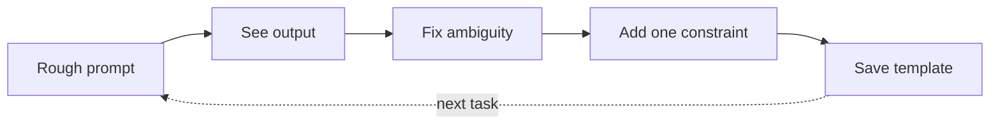

Iteração e modelos

## 3. Loop de iteração (como funcionam os profissionais)



| Feedback ao modelo | Melhor que |
|-----------------------|-------------|
| “Mais curto; descarte adjetivos; mantenha todas as datas.” | “Tente novamente.” |
| “Errado: a receita está na tabela 2, não na tabela 1.” | “Isso está errado.” |
| “Use o modelo na minha primeira mensagem.” | Iniciando um novo bate-papo |

**Novo chat vs continuar:** novo chat quando o tópico muda ou o contexto é poluído; continue ao refinar o mesmo produto final.

## 4. Modelos por tipo de tarefa

### Resumir

```text
Summarise for a busy [role].
Length: [N bullets / N words].
Include: decisions, open questions, owners.
Exclude: background I already know.
Source:
"""
…
"""
```

### Comparar opções

```text
Compare A vs B for [decision].
Criteria: cost, risk, time, quality (weight quality highest).
Output: table + one-paragraph recommendation.
Context: …
```

### Ajuda do código (sem envio às cegas)

```text
Language: [X]. Goal: [one sentence].
Show approach first, then code.
Flag assumptions and edge cases.
Do not invent APIs — say if unsure.
```

### E-mail/rascunho de mensagem

```text
Tone: [direct / warm / formal].
Relationship: [client / manager / peer].
Goal: [what should reader do after reading].
Facts only from below — do not invent names or dates.
```

**Próximo:** [Instruções e erros do sistema](iv-system-instructions-and-mistakes.md).