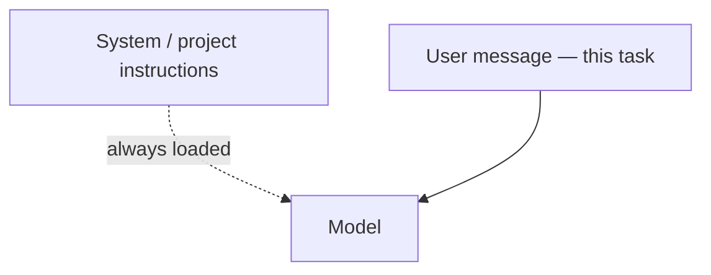

Instruções e erros do sistema

## 5. Instruções do sistema versus mensagem de bate-papo

| Produto | Onde residem as regras de “sempre seguir” |
|--------|---------------------------------|
| **Bate-papoGPT** | Instruções GPT personalizadas ou primeira mensagem |
| **Cláudio** | Instruções do projeto |
| **Cursor** | Regras,`.cursorrules`, documentos do projeto |
| **Copiloto** | Instruções do copiloto no código VS |

Coloque regras **estáveis** nas instruções do sistema/projeto; coloque **o conteúdo desta tarefa** na mensagem do usuário.

## 6. Erros comuns

| Erro | Correção |
|--------|-----|
| Objetivo vago | Um resultado mensurável |
| Parede de texto, sem estrutura | Títulos, delimitadores`"""…"""`|
| Pedir o “melhor” sem critérios | Listar critérios ou pesos |
| Confiando na primeira resposta aos fatos | Peça fontes; verificar ([Confiar e verificar](../trust-privacy-and-verify/i-overview.md)) |
| Colando segredos | Redigir; use o nível corporativo, se necessário |

## 7. Perguntas de ensaio

- Quais são as quatro peças que pertencem a uma “instrução mínima válida”?
- Quando a cadeia de pensamento vale os tokens extras?
- Por que salvar prompts que funcionaram?

**Próximo:** [Solicitação de loop — Visão geral](../loop-prompting/i-overview.md).

**Relacionado:** [Agentes e fluxos de trabalho de agente](../agents-and-agentic-workflows/i-overview.md), [Assistentes personalizados](../custom-assistants-and-knowledge/i-overview.md).