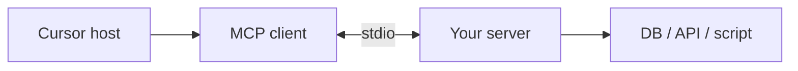

Como criar seu MCP personalizado — visão geral
Treinamento prático para construir um servidor **MCP** — um pequeno programa que expõe **ferramentas** (e opcionalmente **recursos** / **prompts**) para que Cursor, Claude Desktop e outros hosts possam chamar **seus** APIs, scripts ou dados.

Leia [Como MCP funciona](../i-overview.md) primeiro para JSON-RPC, stdio vs HTTP e as funções de host/cliente/servidor. Esta trilha é **implementação**: andaime → definir ferramentas → testar → conectar em Cursor.

## Mapa deste submenu

| Nota | Foco |
|------|--------|
| [Planeje seu servidor](ii-plan-your-server.md) | Escopo, ferramentas versus recursos, variáveis ​​ambientais, um trabalho por servidor |
| [Construa com o SDK](iii-build-with-the-sdk.md) | Configuração do projeto TypeScript e Python |
| [Ferramentas, recursos e instruções](iv-tools-resources-and-prompts.md) | Esquemas, manipuladores, formas de erro |
| [Teste e conecte em Cursor](v-test-and-wire-cursor.md) | MCP Inspetor,`mcp.json`, depuração |
| [Segurança e distribuição](vi-security-and-distribution.md) | Segredos, escopos, npm/pip, implementação de equipe |

## O que você está construindo

| Você escreve | Alças de host |
|-----------|--------------|
| Nomes de ferramentas, esquemas de entrada, lógica de tratamento | Processo de geração, JSON-RPC, escolha da ferramenta LLM |
| Segredos baseados em ambiente (`API_KEY`) | Injetando ambiente de`mcp.json`|
| Retornando texto / JSON em MCP`content`| Alimentando os resultados da ferramenta de volta ao modelo |

## Quando um MCP personalizado faz sentido

| Construir MCP personalizado | Em vez disso, use habilidades / existentes |
|------------------|------------------------------------------|
| API interno ou DB que somente sua equipe possui | Oficial`@modelcontextprotocol/server-*`já existe |
| Ações repetíveis do agente (criar ticket, executar consulta) | Instruções únicas → [Habilidades](../../skills-and-agent-instructions/i-overview.md) |
| Mesmo conector para Cursor + Claude Desktop | Documentos estáticos que o modelo deve ler sempre |

## Ordem de estudo

[Planeje seu servidor](ii-plan-your-server.md) → [Construir com o SDK](iii-build-with-the-sdk.md) → [Ferramentas, recursos e prompts](iv-tools-resources-and-prompts.md) → [Teste e conecte em Cursor](v-test-and-wire-cursor.md) → [Segurança e distribuição](vi-security-and-distribution.md)

## Pré-requisitos

| Habilidade | Por que |
|-------|-----|
| Básico **JSON** | As entradas/saídas da ferramenta têm formato JSON |
| **Nó 18+** ou **Python 3.10+** | SDKs MCP oficiais |
| Um **sistema externo** para embrulhar | REST API, Postgres, caminho do sistema de arquivos, script de shell |

**Referência de especificações:** [modelcontextprotocol.io](https://modelcontextprotocol.io)
