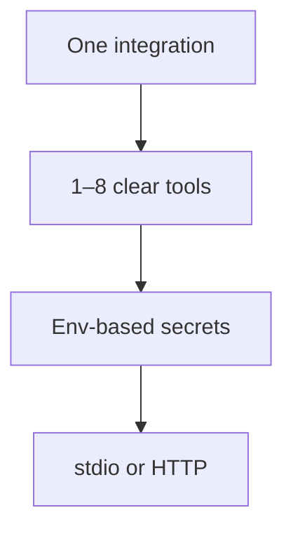

Planeje seu servidor

Antes de escrever o código, decida **o que o agente pode fazer** e **o que ele nunca deve fazer**. Os servidores MCP são conectores pequenos – não aplicativos completos.



## 1. Um servidor, uma integração

| Bom | Evite |
|------|-------|
|`company-crm-mcp`— CRM pesquisa + criação de lead | Um megaservidor para CRM + GitHub + email + shell |
|`team-runbooks-mcp`— leia páginas wiki internas | Expondo cada tabela do banco de dados como uma ferramenta separada |
|`deploy-status-mcp`— consulta CI / liberação API | Passando SQL bruto do modelo sem guarda-corpos |

Lista de hosts **todas as ferramentas** dos servidores habilitados. Menos ferramentas e mais claras → melhor escolha de ferramentas pelo LLM.

## 2. Ferramentas versus recursos versus prompts

| MCP primitivo | O que é | Exemplo |
|---------------|------------|---------|
| **Ferramenta** | Função que o modelo **chama** com argumentos |`search_issues`,`run_health_check`|
| **Recurso** | **Legível** URI o usuário ou modelo pode buscar |`runbook://oncall/checkout`|
| **Aviso** | **Modelo** pré-construído que o host pode inserir |`summarize-incident`com slots |

**Comece apenas com ferramentas** — elas cobrem 90% das integrações personalizadas. Adicione recursos quando o agente deve **ler** documentos estáveis; adicione prompts quando desejar modelos de estilo de comando de barra reutilizáveis.

## 3. Projete cada ferramenta

Para cada ferramenta, escreva uma especificação de uma linha antes de codificar:

| Campo | Pergunta |
|-------|----------|
| **Nome** | Snake_case frase verbal —`get_order`, não`order`|
| **Descrição** | O que ele faz **e quando** o modelo deve usá-lo (os hosts mostram isso para o LLM) |
| **Entradas** | Esquema JSON mínimo - obrigatório versus opcional |
| **Saída** | Resumo de texto para o modelo ou JSON estruturado como texto |
| **Efeitos colaterais** | Somente leitura versus gravação – marque claramente as ferramentas destrutivas na descrição |
| **Autorização** | Qual env var ou arquivo de configuração fornece o token API |

```text
Tool: search_customers
Description: Search CRM by email or company name. Read-only. Use when user asks about a customer record.
Inputs: { "query": string, "limit"?: number }
Output: JSON array of { id, name, email } (max 10)
Auth: CRM_API_KEY from environment
```

## 4. Configuração e segredos

| Padrão | Usar |
|--------|-----|
| **Variáveis ​​ambientais** | Chaves API, URLs base - injetadas pelo host`mcp.json`|
| **Caminho do arquivo de configuração** |`CONFIG_PATH`apontando para YAML o servidor lê na inicialização |
| **Sem segredos no repositório** | Nunca comprometa tokens; documento necessário env vars em README |

```json
"env": {
  "CRM_API_KEY": "from-your-secret-store",
  "CRM_BASE_URL": "https://crm.internal.example"
}
```

## 5. Escolha de transporte

| Transporte | Quando |
|-----------|------|
| **stdio** (padrão) | Desenvolvedor local, Cursor, Claude Desktop — host gera seu processo |
| **Transmitivel HTTP** | Conector hospedado pela equipe, serviço compartilhado, agentes remotos |

Este curso se concentra em **stdio** — caminho mais rápido para um servidor personalizado em funcionamento. Consulte [JSON-RPC e transportes](../ii-json-rpc-and-transports.md) para implantação HTTP.

## 6. Lista de verificação antes da codificação

- [] Nome e versão do servidor (`my-team-crm`,`1.0.0`)
- [] Lista de 1 a 8 ferramentas com descrições
- [] Env vars documentado
- [ ] Ferramentas de leitura vs gravação identificadas; escreve a necessidade de humano no circuito no produto UX sempre que possível
- [] Mensagens de erro retornam **texto acionável** (limite de taxa, 404, ID inválido) — o modelo irá lê-las

## Próximo

[Construa com o SDK](iii-build-with-the-sdk.md) - andaime TypeScript ou Python.
