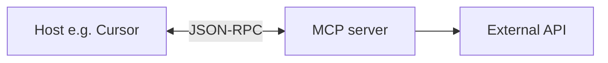

Como MCP funciona — visão geral
Aprofunde-se em **como funciona o mcp** — dividido em notas específicas abaixo.

## Mapa deste submenu

| Nota | Foco |
|------|--------|
| [JSON-RPC e transportes](ii-json-rpc-and-transports.md) | Parte de como funciona o mcp track |
| [Fluxo ponta a ponta & LLM](iii-end-to-end-flow-and-llm.md) | Parte de como funciona o mcp track |
| [MCP vs conectores e segurança](iv-mcp-vs-connectors-and-security.md) | Parte de como funciona o mcp track |
| [Vetor DB, habilidades e referência](v-vector-db-skills-and-reference.md) | Parte de como funciona o mcp track |
| **[Como criar seu MCP personalizado](how-to-create-your-custom-mcp/i-overview.md)** | Planeje, construa, teste e envie seu próprio servidor MCP |

Como MCP funciona
**MCP (Model Context Protocol)** é como ferramentas como **Cursor**, **Claude Desktop** e **Claude Code** se conectam a **sistemas externos** — bancos de dados, GitHub, Linear, Sentry — por meio de pequenos **programas conectores** chamados servidores **MCP**.

Você os configura uma vez; o agente **chama ferramentas** que o servidor expõe. Esta nota explica **como essa conexão funciona** — API, gRPC ou qualquer outra coisa.

## Ordem de estudo

[JSON-RPC e transportes](ii-json-rpc-and-transports.md) → [Fluxo ponta a ponta & LLM](iii-end-to-end-flow-and-llm.md) → [MCP vs conectores e segurança](iv-mcp-vs-connectors-and-security.md) → [Vetor DB, habilidades e referência](v-vector-db-skills-and-reference.md)

**Crie o seu próprio:** [Como criar seu MCP personalizado](how-to-create-your-custom-mcp/i-overview.md) — depois de entender os transportes e o fluxo de ponta a ponta.
