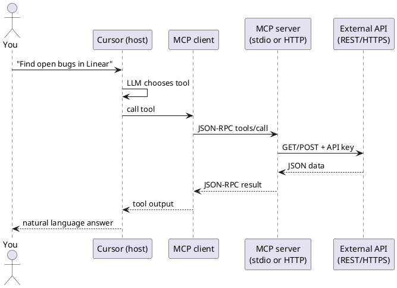
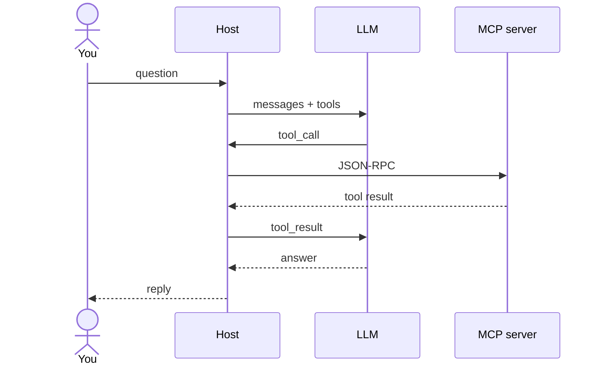
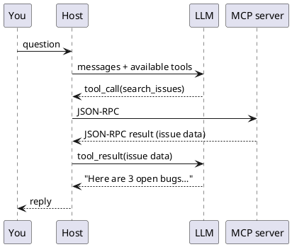

Fluxo ponta a ponta e LLM

## 5. Fluxo ponta a ponta

| Etapa | Protocolo |
|------|----------|
| Você ↔ Anfitrião | Bate-papo UI |
| Host ↔ servidor MCP | **JSON-RPC** sobre stdio ou HTTP |
| Servidor MCP ↔ SaaS | **Esse produto é API** (REST, GraphQL, SDK) |

## 6. JSON vai direto para LLM?

**Quase — mas não diretamente.** O servidor MCP envia JSON de volta para o **cliente MCP do host**, não diretamente para o modelo API sem etapa intermediária. O **host** (Cursor, Claude Desktop) então **injeta esse resultado no chat** como um **resultado da ferramenta**, e o **LLM o lê no próximo turno**.

| Pulo | O que viaja | Quem vê |
|-----|-------------|-------------|
| MCP cliente ↔ MCP servidor | **JSON-RPC** (protocolo de ligação) | Somente host — não mostrado no chat UI |
| Anfitrião ↔ LLM | **Chamada de ferramenta + resultado de ferramenta** (texto/JSON em mensagens) | Modelo usa isso como contexto |
| Anfitrião ↔ Você | **Linguagem natural** | O que você lê |

Então, sim: os **dados** geralmente são JSON (lista de problemas, linhas de consulta, conteúdo do arquivo). O LLM **consome** esse conteúdo — mas **por meio do host**, que o envolve no loop padrão de **chamada de ferramenta**. O LLM **não** abre um soquete para o próprio servidor MCP.

O loop pode se repetir: LLM pode chamar **várias** ferramentas MCP antes de responder.

**O que você vê:** a prosa final (e talvez indicadores de execução da ferramenta no UI). **O que você não vê:** JSON-RPC bruto entre cliente e servidor — a menos que você depure logs.

## 7. O que o servidor MCP expõe

Após a conexão, o servidor anuncia os recursos:

| Capacidade | Agente pode… |
|------------|------------|
| **Ferramentas** | Funções de chamada (`create_issue`,`run_query`) |
| **Recursos** | Ler URIs (`file://`,`db://schema/users`) |
| **Avisos** | Use modelos de prompt pré-construídos (menos comuns para usuários) |

O **LLM** vê **nomes e descrições** das ferramentas; o host mapeia a intenção do modelo para MCP **chamadas de ferramenta**.