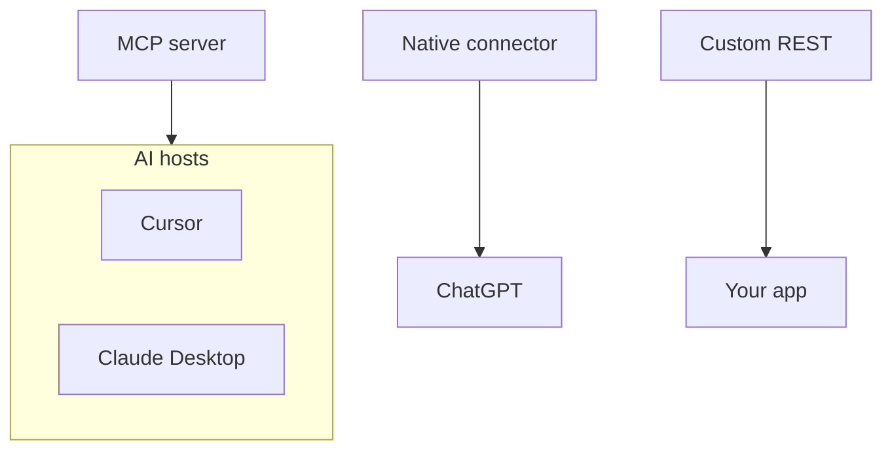

MCP vs conectores e segurança

## 8. MCP vs “conector integrado” vs REST

| Abordagem | Quem constrói | Conecte ao host AI |
|----------|---------------|-----------------|
| **MCP servidor** | Comunidade ou fornecedor | JSON-RPC (estdio/HTTP) |
| **Integração nativa** | ChatGPT/Anthropic/Microsoft | API específico do fornecedor |
| **REST personalizado em seu aplicativo** | Seu back-end | Seu código — não MCP, a menos que você o envolva |

O valor de MCP é **um formato de conector** que muitos hosts podem reutilizar - o mesmo servidor GitHub para Cursor e Claude Desktop.

## 9. Segurança (lista de verificação do usuário)

| Risco | Mitigação |
|------|------------|
| O servidor MCP possui chaves **API** | Variáveis ​​ambientais; nunca comprometa tokens; girar |
| **Ferramentas muito amplas** | Habilite apenas os servidores necessários |
| **Remoto MCP URL** | HTTPS apenas; confie no provedor |
| **servidor stdio é executado localmente** | Ele pode ler arquivos/shell de acordo com seu design - ler documentos do servidor |
| **Injeção imediata → abuso de ferramenta** | Limitar escopos; revisar as ações do agente ([Confiar e verificar](../trust-privacy-and-verify/i-overview.md)) |

MCP não substitui **modelos de permissão** de APIs subjacentes — seu token GitHub ainda faz apenas o que GitHub permite.