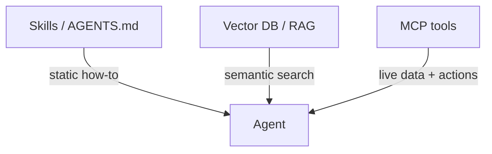
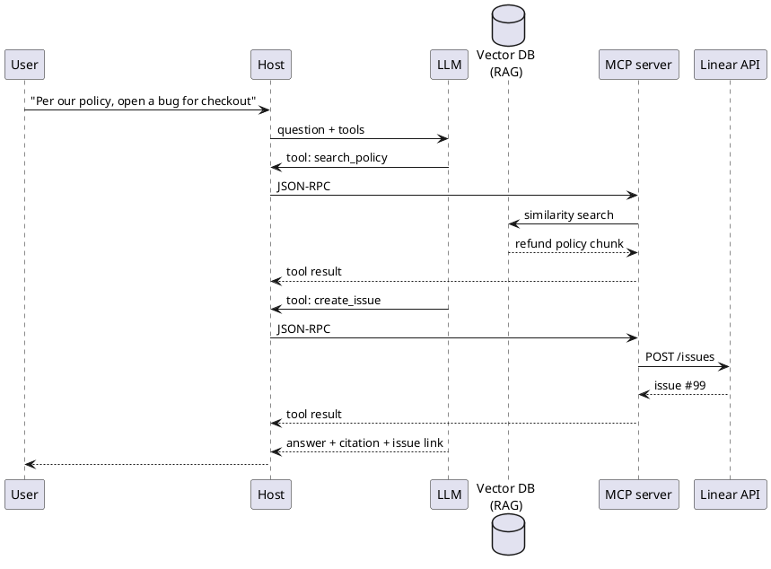

Vetor DB, habilidades e referência

## 10. Quando você precisa de MCP vs habilidades vs vetor DB

Eles resolvem **problemas diferentes**. Você costuma combiná-los.



| Necessidade | Mecanismo | Exemplo |
|------|-----------|--------|
| **Como escrever uma avaliação PR** | [Habilidade](../skills-and-agent-instructions/i-overview.md) | Manual estático em`SKILL.md`|
| **Layout do repositório e comando de teste** |`AGENTS.md`/ regras | Fatos do projeto sempre em contexto |
| **Pesquise 10 mil PDFs de suporte por significado** | **Vetor DB + RAG** | “Qual é a nossa política de reembolso para EU?” |
| **Busque a edição Linear ao vivo nº 42** | **MCP** ferramenta | Dados exatos e atuais do ticket |
| **Correr`SELECT * FROM orders WHERE id = …`** | **MCP** → Postgres/SQL | Pesquisa estruturada, não similaridade |

```text
Skills / AGENTS.md     →  always-on instructions (small, static)
Vector DB (RAG)        →  semantic search over large text corpus
MCP tools              →  live actions & exact queries (APIs, SQL, GitHub)
```

### Para que serve um vetor DB aqui?

Um **banco de dados vetorial** armazena **incorporações** — representações numéricas de texto — para que você possa encontrar **“pedaços semelhantes em significado”** à pergunta do usuário, não apenas correspondências de palavras-chave.

```text
Offline:  docs → chunk → embed → store vectors (+ metadata)
Online:   question → embed → nearest-neighbour search → top-k chunks → prompt → LLM
```

Esse padrão é **[RAG](../../llms/v-rag-and-fine-tuning.md)**. O vetor DB é o **mecanismo de recuperação**; o LLM ainda escreve a resposta usando esses pedaços.

### Quando usar um vetor DB

| Use o vetor DB quando… | Por que |
|---------------------|-----|
| **Conjunto de documentos grande e mutável** | Políticas, manuais, wiki, tickets anteriores — grandes demais para serem colados em todos os prompts |
| **As perguntas são confusas/parafraseadas** | O usuário diz “cancelar assinatura”; doc diz “encerrar plano” – semelhança ajuda |
| **Você precisa de citações de prosa** | A resposta deve citar as seções do manual |
| **Falha na pesquisa por palavra-chave** | Sinônimos, erros de digitação, linguagem cruzada, questões conceituais |

### Quando você **não** precisa de um vetor DB

| Ignorar vetor DB quando… | Use em vez disso |
|----------------------|------------|
| **Contexto pequeno e fixo** | Habilidades,`AGENTS.md`, alguns arquivos enviados (Projeto ChatGPT, regras Cursor) |
| **Exatamente ID ou pesquisa de chave** | SQL, REST API através de **MCP** (`get_order`,`fetch_issue`) |
| **Estado operacional ativo** | “A implantação é verde?” → monitoramento API, não pesquisa de documentos |
| **Filtros estruturados** |`status=open AND team=billing`→ consulta ao banco de dados, não k-NN |
| **O repositório inteiro se ajusta ao contexto do agente** | IDE indexa arquivos abertos;`@docs`pode ser suficiente para uma base de código |

### Onde os bancos de dados vetoriais ficam em relação a MCP

Bancos de dados vetoriais **não** fazem parte de JSON-RPC ou da especificação MCP. Eles são **armazenamento por trás** da recuperação – geralmente alcançados de duas maneiras:

**A) Produto RAG construído (você não conecta MCP)**

ChatGPT Projects, NotebookLM, Copilot — eles agrupam, incorporam e pesquisam **dentro do produto**. Você carrega arquivos; nenhum vetor MCP é necessário.

**B) MCP expõe a pesquisa como uma ferramenta**

Seu aplicativo ou um servidor MCP personalizado encapsula o armazenamento de vetores:

```text
LLM → host → MCP tool "search_handbook" → vector DB (similarity) → chunks → tool result → LLM
```

**Exemplo de pilha local:** [TurboVec + Ollama + arquivos locais](../../implementation-example/vii-turbovec-ollama-local-files.md) — nenhum serviço de vetor gerenciado; arquivos e índice no disco.

O mesmo caminho JSON-RPC de qualquer outra ferramenta MCP; o servidor executa embed + k-NN, retorna pedaços de texto.

**C) Seu back-end faz RAG antes do agente**

```text
User question → your API retrieves from vector DB → builds prompt → LLM
Separate MCP tools for: create_ticket, run_sql, post_slack
```

Comum na produção: **RAG para conhecimento**, **MCP para ações**.



### Árvore de decisão rápida

```text
Is it "find relevant paragraphs in lots of text"?
  Yes → vector DB (RAG), maybe via MCP search tool
  No ↓
Is it "get this exact record / call this API now"?
  Yes → MCP tool (SQL, REST, SDK)
  No ↓
Is it "how should the agent behave"?
  Yes → skill / AGENTS.md / custom GPT instructions
```

Habilidades = **manual**. Vetor DB = **memória semântica sobre documentos**. MCP = **mãos ativas** nos sistemas.

**Mais profundo:** [RAG e ajuste fino](../../llms/v-rag-and-fine-tuning.md), [Assistentes personalizados e conhecimento](../custom-assistants-and-knowledge/i-overview.md).

## 11. Referência rápida

| Pergunta | Resposta |
|----------|--------|
| O que é JSON-RPC? | **Chamada de procedimento remoto** — invoca um **método** nomeado com JSON **params**, obtém JSON **resultado** ou **erro** |
| MCP é gRPC? | **Não** — JSON-RPC 2.0 |
| O servidor MCP responde diretamente ao LLM? | **Não** — a resposta vai para **host**, o host passa o **resultado da ferramenta** para LLM |
| Local Cursor MCP? | Normalmente **stdio** (subprocesso) |
| Equipe hospedada MCP? | **Transmitivel HTTP** (POST + opcional SSE) |
| Como o servidor chega ao Linear? | **HTTPS REST** (ou fornecedor SDK) |
| Eu escrevo JSON-RPC? | **Não** — host e servidor cuidam disso |
| Quando preciso de um vetor DB? | **Corpus de texto grande + pesquisa semântica difusa** (RAG) — não para pesquisas exatas API/SQL |
| Vetor DB parte de MCP? | **Não** — **backend** opcional por trás de uma ferramenta de pesquisa MCP ou de seu próprio aplicativo RAG |

## 12. Perguntas de ensaio

- O que significa JSON-RPC e quais são os três campos que identificam uma solicitação?
- MCP vs vetor DB — qual para “edição linear aberta nº 42” versus “o que nosso manual diz sobre reembolsos”?
- Qual protocolo transporta mensagens entre o cliente e o servidor MCP?
- Quem fica entre o servidor MCP e o LLM?
- stdio vs Streamable HTTP — quando cada um é usado?
- Quem chama o API da Linear - o servidor LLM ou MCP?

**Relacionado:** [Ferramentas e orquestração](../tools-and-orchestration/i-overview.md), [Agentes e fluxos de trabalho de agentes](../agents-and-agentic-workflows/i-overview.md), [Habilidades e instruções do agente](../skills-and-agent-instructions/i-overview.md), [Como criar seu MCP personalizado](how-to-create-your-custom-mcp/i-overview.md), [TurboVec + Ollama + arquivos locais](../../implementation-example/vii-turbovec-ollama-local-files.md).