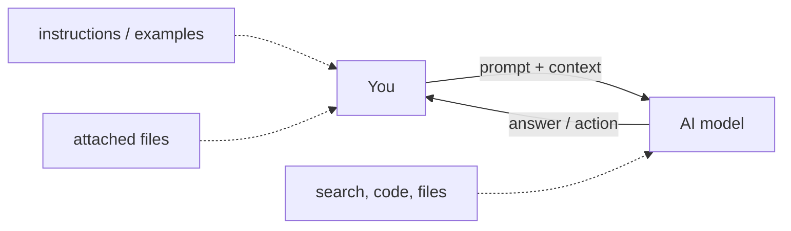

AI Aplicado — visão geral
**AI prático para pessoas que o utilizam** — ChatGPT, Claude, Gemini, Copilot, Cursor e ferramentas semelhantes — não para modelos de treinamento ou leitura de artigos de pesquisa.

Se você quiser saber como os modelos funcionam nos bastidores, consulte [Aprendizado de máquina](../machine-learning/i-overview.md) → [Aprendizado profundo](../deep-learning/i-overview.md) → [LLMs](../llms/i-overview.md). **Comece aqui** se sua meta for melhores **resultados**, **fluxos de trabalho** e **confiança** no trabalho diário.

## Mapa deste submenu

| Parte | Tópico |
|------|--------|
| **I — Visão geral** | Para quem se destina, modelo mental, escolha seu caminho |
| **[Solicitação eficaz](effective-prompting/i-overview.md)** | Estrutura imediata, técnicas, modelos |
| **[Aviso de loop](loop-prompting/i-overview.md)** | Configure uma vez, itere em loops - não solicite novamente todas as vezes |
| **[Agentes e fluxos de trabalho de agentes](agents-and-agentic-workflows/i-overview.md)** | AI multietapas, ferramentas, guarda-corpos |
| **[Ferramentas e orquestração](tools-and-orchestration/i-overview.md)** | Aplicativos de bate-papo, agentes IDE, automações, introdução MCP |
| **[Assistentes e conhecimento personalizados](custom-assistants-and-knowledge/i-overview.md)** | Projetos, GPTs personalizados, RAG para usuários |
| **[Multimodal e arquivos](multimodal-and-files/i-overview.md)** | PDFs, imagens, planilhas, voz |
| **[Confiança, privacidade e verificação](trust-privacy-and-verify/i-overview.md)** | Alucinações, dados sensíveis, verificação de factos |
| **[Habilidades e instruções do agente](skills-and-agent-instructions/i-overview.md)** |`SKILL.md`, regras,`AGENTS.md`|
| **[Como MCP funciona](how-mcp-works/i-overview.md)** | JSON-RPC, stdio vs HTTP, vetor DB vs MCP; [customizado MCP](how-mcp-works/how-to-create-your-custom-mcp/i-overview.md) |
| **[Exemplos de implementação](implementation-example/i-overview.md)** | Hugging Face downloads, tempos de execução locais, dimensionamento RAM, corredores CPU; [TurboVec RAG](implementation-example/vii-turbovec-ollama-local-files.md) |
| **[Ollama](ollama/i-overview.md)** | Instalação, modelos, API, Modelfile, solução de problemas de GPU |

## Modelo mental (visão do usuário)

**Solicitação de loop:** armazene as instruções uma vez e, em seguida, envie **deltas curtos** na mesma sessão ou de acordo com uma programação — consulte [Solicitação de loop](loop-prompting/i-overview.md).

| Você controla | AI controles |
|------------|------------|
| Objetivo, tom, formato, exemplos | Redação e raciocínio (dentro dos limites) |
| Quais arquivos/contexto anexar | Para qual ferramenta ligar (no modo agente) |
| Quando parar ou redirecionar | Ordem das etapas em tarefas de várias etapas |

## Quem deve ler o quê

| Seu trabalho | Comece com |
|----------|------------|
| Trabalhador do conhecimento (PM, analista, escritor) | [Solicitação eficaz](effective-prompting/i-overview.md) → [Solicitação de loop](loop-prompting/i-overview.md) → [Assistentes personalizados](custom-assistants-and-knowledge/i-overview.md) |
| Desenvolvedor usando Cursor/Copilot | [Aviso de loop](loop-prompting/i-overview.md) → [Agentes](agents-and-agentic-workflows/i-overview.md) → [Habilidades e instruções](skills-and-agent-instructions/i-overview.md) |
| Gerente implementando AI para uma equipe | [Confiança e privacidade](trust-privacy-and-verify/i-overview.md) → [Assistentes personalizados](custom-assistants-and-knowledge/i-overview.md) |
| Ferramentas avançadas de encadeamento de usuários | [Orquestração](tools-and-orchestration/i-overview.md) → [Agentes](agents-and-agentic-workflows/i-overview.md) |

## Mudança 2024–2026: do chat para loops e agentes

| Época | Interação | Exemplo |
|-----|-------------|---------|
| **Bate-papo** | Uma pergunta → uma resposta | “Resumir este e-mail” |
| **Aviso de loop** | Instruções armazenadas + deltas curtos | Regras do projeto + “fixar tabela 2” /`/loop 5m check CI`|
| **Assistentes** | Instruções salvas + arquivos | Projeto Claude, Personalizado GPT |
| **Agentes** | Objetivo → muitas etapas + ferramentas | “Pesquise concorrentes e elabore uma tabela” |
| **Orquestração** | Vários AIs ou automações conectadas entre si | CRM → resumo de AI → Folga |

Você não precisa construir nada disso - os produtos expõem isso no UI. Você **precisa** de objetivos claros, bom contexto e hábitos de verificação.

## Próximo

Continue com [Solicitação efetiva](effective-prompting/i-overview.md), depois [Solicitação de loop](loop-prompting/i-overview.md).

**Relacionado:** [LLM engenharia imediata (técnica)](../llms/iv-prompt-engineering.md), [RAG para usuários](custom-assistants-and-knowledge/i-overview.md).
