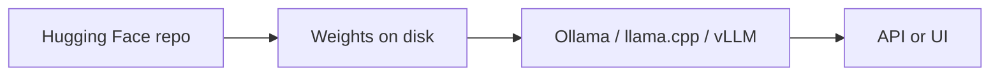

Exemplos de implementação – visão geral
Notas práticas para **executar modelos abertos localmente** — baixar pesos do Hugging Face, escolher um tempo de execução, dimensionar RAM e usar executores compatíveis com CPU quando você não tiver um GPU grande.

Este curso é para **praticantes** que desejam ir além dos aplicativos de bate-papo hospedados. Para saber como os modelos funcionam conceitualmente, consulte [LLMs](../../llms/i-overview.md).

## Mapa deste submenu

| Nota | Foco |
|------|--------|
| [Baixando do Hugging Face](ii-downloading-from-huggingface.md) | CLI, Git LFS, auth e o que você realmente obtém |
| [Plataformas de execução local](iii-local-run-platforms.md) | Ollama, llama.cpp, LM Studio, vLLM e mais – prós e contras |
| [Requisitos do modelo RAM](iv-model-ram-requirements.md) | Quantização, comprimento de contexto e tabelas de dimensionamento |
| [CPU e corredores leves](v-cpu-and-lightweight-runners.md) | airLLM, llama.cpp CPU, MLX e compensações |
| [Instalar e executar em RTX 1080](vi-install-and-run-rtx-1080.md) | Instalação por plataforma, verificação de GPU e escolha de modelo para 8 GB VRAM |
| [TurboVec + Ollama + arquivos locais](vii-turbovec-ollama-local-files.md) | Local RAG — indexe seus arquivos, vetores compactados, sem nuvem |
| [Ollama](../ollama/i-overview.md) | Trilha Ollama completa – instalação por meio de solução de problemas |

## Modelo mental

| Etapa | Você decide |
|------|------------|
| **Modelo** | Tamanho, licença, chat vs código, quantização (Q4, Q8,…) |
| **Tempo de execução** | Facilidade de uso versus taxa de transferência versus requisito GPU |
| **Hardware** | RAM para pesos + KV cache; VRAM se estiver usando GPU |

**Escolha de codificação padrão:** **Qwen2.5-Coder 7B** (`ollama pull qwen2.5-coder:7b`) — licença aberta, sem restrição HF, cabe 8 GB GPUs. Veja [Baixando do Hugging Face](ii-downloading-from-huggingface.md).

## Ordem de estudo

[Baixando do Hugging Face](ii-downloading-from-huggingface.md) → [Plataformas de execução local](iii-local-run-platforms.md) → [Requisitos do modelo RAM](iv-model-ram-requirements.md) → [CPU e corredores leves](v-cpu-and-lightweight-runners.md) → [Instalar e executar em RTX 1080](vi-install-and-run-rtx-1080.md) → [TurboVec + Ollama + arquivos locais](vii-turbovec-ollama-local-files.md)

## Quando executar localmente versus usar um API

| Execute localmente | Use um API hospedado |
|------------|------------------|
| Os dados devem permanecer na sua máquina | Você quer os mais novos modelos de fronteira |
| Custo previsível em alto volume | Não há GPU/RAM para gerenciar |
| Off-line ou sem ar | Você precisa de um tempo mínimo de configuração |
| Pesos ajustados ou abertos de nicho | Conformidade permite inferência na nuvem |
