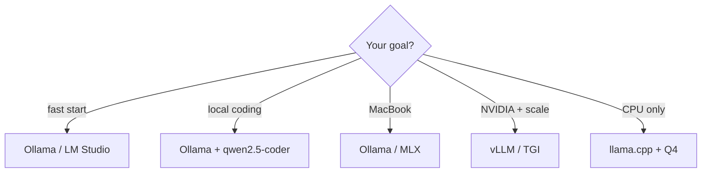

Plataformas de execução local

Depois que os pesos estão no disco, um **tempo de execução** os carrega e expõe o chat — CLI, aplicativo de desktop ou HTTP API. Escolha com base no hardware, no rendimento e na quantidade de configuração que você tolerará.

## 1. Comparação de plataformas

| Plataforma | Melhor para | GPU | CPU | API | Prós | Contras |
|----------|----------|-----|-----|-----|------|------|
| **[Ollama](https://ollama.com)** | Início local rápido, máquinas de desenvolvimento | Sim (CUDA/Metal) | Sim (lento) | Compatível com OpenAI`/v1`| Um comando`ollama pull`; plataforma cruzada; simples UI | Menos botões de afinação; curadoria de catálogo de modelos |

Aprofundamento: [faixa Ollama](../ollama/i-overview.md).
| **[lhama.cpp](https://github.com/ggerganov/llama.cpp)** (`llama-server`) | Controle máximo, ecossistema GGUF | Sim | **Forte** | Servidor HTTP integrado | Enorme comunidade quantitativa; opções baixas de RAM; incorporável | CLI-primeiro; você gerencia modelos/caminhos |
| **[LM Estúdio](https://lmstudio.ai)** | Usuários de desktop, experimentação | Sim | Sim | Servidor local | GUI para pesquisa/download/chat; controle deslizante de descarregamento fácil GPU | Somente desktop; menos adequado para servidores headless |
| **[vLLM](https://github.com/vllm-project/vllm)** | Produção GPU serviço, dosagem | **Obrigatório** (NVIDIA) | Não | Compatível com OpenAI | Alto rendimento; PagedAtenção; multi-GPU | Configuração pesada; precisa de Linux + GPU recente |
| **[TGI](https://github.com/huggingface/text-generation-inference)** (HF) | HF-nativo GPU implantar | **Obrigatório** | Não | REST/gRPC | Boa integração HF; características de produção | Pilha opinativa; GPU focado |
| **[TensorRT-LLM](https://github.com/NVIDIA/TensorRT-LLM)** | NVIDIA desempenho máximo | **Obrigatório** (NVIDIA) | Não | Personalizado / Tritão | Mais rápido em GPUs suportados | Construção complexa; NVIDIA-somente |
| **[MLX](https://github.com/ml-explore/mlx)** | Macs de silício da Apple | Metal | N/A (Apple GPU) | Python/local | Otimizado para série M-; baixo atrito no Mac | Apenas hardware Apple |
| **[GPT4Todos](https://gpt4all.io)** | Área de trabalho offline, especificações baixas | Opcional | **Sim** | Local API | Muito acessível; modelos de pacotes | Seleção de modelo menor; menos hackeável |
| **[KoboldCPP](https://github.com/LostRuins/koboldcpp)** | Escrita criativa, binário único | Sim | Sim | Rede UI + API | Portátil; recursos do modo história | Nicho UI; comunidade menor que Ollama |

## 2. Atalhos de decisão



## 3. Compatibilidade de formato

| Tempo de execução | Formato de peso típico |
|--------|----------------------|
| Ollama | Pacote Ollama (Modelfile) ou importação GGUF |
| llama.cpp / LM Studio / KoboldCPP | **GGUF** |
| vLLM / TGI / transformadores | **tensores de segurança**, AWQ, GPTQ, FP8 |
| MLX | Pesos convertidos em MLX (geralmente vinculados a HF) |

Baixar o formato errado significa converter ou baixar novamente — veja [Baixando do Hugging Face](ii-downloading-from-huggingface.md).

## 4. Forma API (integração)

A maioria das pilhas locais expõem um **OpenAI-compatível** HTTP API para que os clientes existentes funcionem:

```bash
# Ollama + Qwen2.5-Coder (coding)
curl http://localhost:11434/v1/chat/completions \
  -H "Content-Type: application/json" \
  -d '{"model":"qwen2.5-coder:7b","messages":[{"role":"user","content":"Write a Python fib function"}]}'
```

| Plataforma | Base padrão URL |
|----------|------------------|
| Ollama |`http://localhost:11434/v1`|
| servidor lhama |`http://localhost:8080`(configurável) |
| LM Estúdio |`http://localhost:1234/v1`|
| vLLM |`http://localhost:8000/v1`|

Aponte Cursor, Continue ou seu aplicativo naquele URL com uma chave API fictícia se o servidor não impor autenticação. Para codificação, defina o modelo como **`qwen2.5-coder:7b`** (8 GB GPU) ou **`qwen2.5-coder:32b`** (24 GB+ GPU).

## 5. Modelo de codificação recomendado — Qwen2.5-Coder

| Tamanho | etiqueta Ollama | VRAM (Q4, ~4k ctx) | Melhor para |
|------|------------|-------------------|----------|
| 1,5B |`qwen2.5-coder:1.5b`| ~2 GB | Preenchimento automático/pareado com modelo de chat maior |
| 3B |`qwen2.5-coder:3b`| ~2,5 GB | Edições rápidas em GPUs apertados |
| **7B** | **`qwen2.5-coder:7b`** | **~5 GB** | **Padrão para placas RTX 1080/8 GB** |
| 14B |`qwen2.5-coder:14b`| ~9 GB | 12–16 GB VRAM |
| 32B |`qwen2.5-coder:32b`| ~20 GB | 24 GB VRAM — codificador aberto mais forte da família |

Licença Apache 2.0; downloads de HF **não** exigem controle de meta-estilo. Veja [Baixando do Hugging Face](ii-downloading-from-huggingface.md).

## 6. Segurança em servidores locais

| Risco | Mitigação |
|------|------------|
| Abrir porta em LAN | Vincular a`127.0.0.1`somente a menos que você pretenda acesso remoto |
| Sem autenticação | Não exponha`:11434`ou`:8080`para a internet crua |
| Licença de modelo | A execução local não ignora os termos de licença HF ou Meta |

## Próximo

[Requisitos do modelo RAM](iv-model-ram-requirements.md) — dimensione os modelos para sua máquina antes de escolher o comprimento do quant e do contexto.

**Prática:** [Instalar e executar em RTX 1080](vi-install-and-run-rtx-1080.md) — configuração por plataforma para 8 GB Pascal GPUs.
