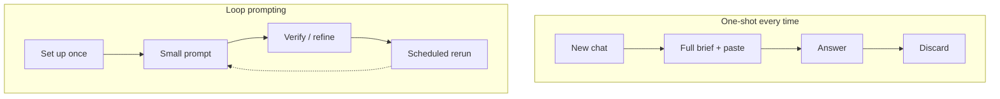

Solicitação de loop — visão geral
**A solicitação de loop** está funcionando com AI em **ciclos** em vez de **reiniciar do zero todas as vezes**. Você investe uma vez em instruções e contexto duráveis, então cada turno é uma pequena correção ou gatilho - e não outro briefing completo.

Isso fica entre [Solicitação efetiva](../effective-prompting/i-overview.md) (como escrever um bom prompt) e [Agentes](../agents-and-agentic-workflows/i-overview.md) (uso de ferramenta em várias etapas). A solicitação de loop é a **camada do hábito**: pare de reexplicar o que o modelo já deveria saber.

## Mapa deste submenu

| Nota | Foco |
|------|--------|
| [One-shot vs loop](ii-one-shot-vs-loop.md) | Antigo hábito de bate-papo versus configuração única, repetição de muitos |
| [Instruções persistentes](iii-persistent-instructions.md) | Projetos, habilidades, regras, contexto do sistema salvo |
| [Sessão e loops recorrentes](iv-session-and-recurring-loops.md) | Refinamento do mesmo thread,`/loop`, automações |
| [Higiene e quando reiniciar](v-hygiene-and-when-to-reset.md) | Podridão do contexto, habilidades obsoletas, limites de confiança |

## 1. Dois tipos de loop

| Tipo de loop | Você faz | Exemplo |
|-----------|--------|--------|
| **Humano no circuito** | Mantenha uma sessão ou projeto; enviar deltas curtos | “Introdução mais curta.” “Corrigir tabela 2.” “Faça testes novamente.” |
| **Loop de tempo/evento** | Armar um gatilho recorrente ou observador | Cursor`/loop 5m check CI`, implantar observador, automação de resumo semanal |

Ambos reutilizam **contexto armazenado** em vez de colar o mesmo preâmbulo em um novo chat.

## 2. Modelo mental

| Camada | O que persiste | Onde (exemplos) |
|-------|---------------|------------------|
| **Identidade e padrões** | Tom, formato, regras da equipe | GPT personalizado, Projeto Claude,`.cursor/rules`|
| **Fluxos de trabalho** | Instruções em várias etapas |`SKILL.md`, biblioteca de prompt salva |
| **Repo/conhecimento** | Arquivos que o modelo deve ver | Arquivos de projeto, RAG,`@folder`em Cursor |
| **Estado da sessão** | Produto atual em curso | Mesmo tópico de bate-papo, transcrição do agente |

## 3. Quem deveria ler isto

| Você… | Comece com |
|------|------------|
| Digite novamente as mesmas instruções diariamente | [Instruções persistentes](iii-persistent-instructions.md) |
| Refine rascunhos em muitas mensagens de “tente novamente” | [One-shot vs loop](ii-one-shot-vs-loop.md) |
| Deseja CI ou implantação verificada sem perguntar todas as vezes | [Sessão e loops recorrentes](iv-session-and-recurring-loops.md) |
| Use fortemente agentes Cursor ou IDE | Esta faixa → [Habilidades e instruções do agente](../skills-and-agent-instructions/i-overview.md) |

## 4. Ordem de estudo

[One-shot vs loop](ii-one-shot-vs-loop.md) → [Instruções persistentes](iii-persistent-instructions.md) → [Sessão e loops recorrentes](iv-session-and-recurring-loops.md) → [Higiene e quando reiniciar](v-hygiene-and-when-to-reset.md)

## 5. Perguntas de ensaio

- Qual é a diferença entre um loop humano e um loop de tempo/evento?
- Cite dois lugares onde as instruções persistentes podem residir.
- Quando um novo chat ainda é a escolha certa?

**Próximo:** [One-shot vs loop](ii-one-shot-vs-loop.md).
