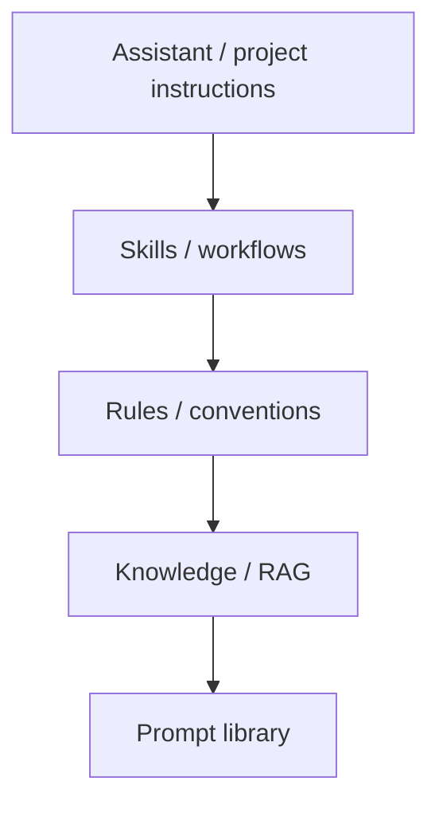

Instruções persistentes
**Instruções persistentes** são o “aviso que você não deve repetir” — carregado automaticamente quando o produto acredita que se aplica. Construa esta camada uma vez; seu loop diário se torna comandos curtos.

## 1. Pilha (escolha o que sua ferramenta suporta)



| Camada | Bate-papoGPT / Cláudio | Cursor / IDE |
|-------|------------------|-------------|
| **Projeto/Personalizado GPT** | Instruções + arquivos enviados | Regras,`AGENTS.md`, índice |
| **Fluxos de trabalho** | Ações e projetos GPT personalizados |`SKILL.md`|
| **Conhecimento** | Conhecimento do projeto, RAG |`@`menções, índice de base de código |

Aprofundamentos: [Assistentes personalizados](../custom-assistants-and-knowledge/i-overview.md), [Habilidades e instruções do agente](../skills-and-agent-instructions/i-overview.md).

## 2. O que pertence à camada persistente

| Armazene persistentemente | Manter por mensagem |
|--------------------|------------------|
| Papel, tom, público | Dados de hoje, fatos pontuais |
| Padrões de formato de saída | “Use apenas os números de terça” |
| Nomenclatura de equipe, pilha, comandos de teste | “Parar após o passo 2” |
| Hábitos de verificação (“citar fontes”) | Caminhos de arquivo específicos neste turno |
| Coisas que você diz toda semana | Novas restrições para este projecto |

**Regra:** se você enviou **três vezes**, externalize.

## 3. Projetos Claude / ChatGPT GPTs personalizados

| Campo | Uso de prompt de loop |
|-------|-------------------|
| **Instruções** | Persona estável + barra de qualidade |
| **Arquivos de conhecimento** | Políticas, glossários, exemplos anteriores |
| **Conversa** | Deltas curtos dentro do projeto |

```text
Project: “Acme PM assistant”
  Instructions: bullet memos, flag risks, never invent dates
  Files: roadmap.pdf, style-guide.md
  Loop message: “Summarise this Slack export for exec standup.”
```

Mesmo projeto na próxima semana – troque apenas a exportação.

## 4. Cursor: regras, habilidades, AGENTS.md

| Artefato | Carrega quando | Conteúdo de exemplo |
|----------|------------|-----------------|
| **`.cursor/rules/*.mdc`** | Padrões de arquivo ou sempre | Tratamento de erros TypeScript |
| **`SKILL.md`** | A tarefa corresponde à descrição | “Como realizamos testes de fumaça” |
| **`AGENTS.md`** | Agente abre repositório | Comando de teste, mapa de pastas |

Você diz **“revise isto PR”** – as regras impõem o estilo, as habilidades definem a lista de verificação,`AGENTS.md`diz como executar testes. Nenhum ensaio na caixa de bate-papo.

Consulte [habilidades de Cursor, regras e AGENTS.md](../skills-and-agent-instructions/iv-cursor-skills-rules-agents-md.md).

## 5. Biblioteca de prompts (persistência leve)

Nem tudo precisa de um GPT personalizado. Uma **biblioteca pessoal** funciona:

```text
prompts/
  weekly-status.md      # role + format + “paste updates below”
  client-email.md
  code-review-delta.md  # “checklist already in SKILL; paste diff”
```

Loop = abrir template em um **projeto que já possui instruções**, colar apenas a parte variável.

## 6. Fluxo de trabalho de promoção

Quando um bate-papo único correu bem:

```text
1. Highlight reusable blocks (role, format, checks)
2. Move to project instructions or SKILL.md
3. Replace long text with a name: “Use weekly-status template”
4. Delete duplicate paragraphs from old chats
5. Test one short prompt — does quality hold?
```

## 7. Antipadrões

| Erro | Correção |
|--------|-----|
| Despeje todo o wiki nas instruções | Link ou RAG; manter as instruções digitalizáveis ​​|
| Regras duplicadas em 5 lugares | Uma fonte de verdade; link de`AGENTS.md`|
| Nunca atualize após alteração do processo | Revise as habilidades trimestralmente |
| Segredos nas instruções | Nunca - use env vars e exemplos redigidos |

## 8. Perguntas de ensaio

- Cite três artefatos que armazenam instruções persistentes em Cursor.
- O que deve permanecer na mensagem em vez de passar para as instruções do projeto?
- Qual é a regra da promoção “três vezes”?

**Próximo:** [Sessão e loops recorrentes](iv-session-and-recurring-loops.md).
