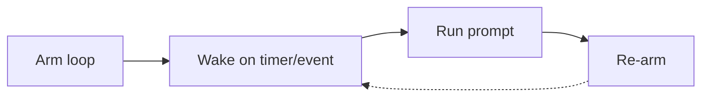

Sessão e loops recorrentes
Além das instruções armazenadas, você pode **fazer loop dentro de uma sessão** (refinar o mesmo trabalho) ou **fazer loop em uma programação/evento** (executar novamente sem abrir um novo chat). Ambos são prompts de loop – o gatilho é diferente.

## 1. Loop de sessão (mesmo thread)

```text
Turn 1: produce draft
Turn 2: fix specific section
Turn 3: change format
Turn 4: verify against source
```

| Prática | Por que |
|----------|-----|
| Referência ao resultado anterior (“apenas secção 2”) | Modelo usa contexto de thread |
| Uma alteração por mensagem | Mais fácil de desfazer mentalmente |
| Fixar arquivos com`@`em IDE | O contexto permanece anexado |
| Diga “parar e resumir o estado” antes do intervalo | Currículo mais fácil |

**Retomar mais tarde:** mesmo projeto/thread se a ferramenta mantiver histórico; caso contrário, cole **resumo do estado** + último artefato válido - não o tópico inteiro.

## 2. Loop recorrente (baseado no tempo)

**Cursor`/loop`** executa um prompt em um intervalo — você define a tarefa uma vez, o agente executa novamente de acordo com um agendamento.

```text
/loop 5m check if main CI is green; if failed paste last error
/loop 30s watch deploy log until "healthy" or 10 min timeout
/loop 1d summarize overnight Sentry errors
```

| Padrão | Usar |
|--------|-----|
| **Intervalo fixo** | Enquete CI, caixa de entrada, painel de métricas |
| **Intervalo dinâmico** | Agente escolhe o próximo atraso após cada execução (ocupado vs silencioso) |
| **Execute uma vez imediatamente** | Confirme a configuração antes de aguardar o primeiro tick |

A sintaxe varia de acordo com o produto; a ideia é universal: **armar → acordar → agir → rearmar** até parar.



## 3. Loop orientado a eventos (observador)

Em vez de uma pesquisa cega, acorde quando algo **mudar**:

```text
Watch: git branch updates, log line matches, file saved, webhook fires
  → run prompt
  → optional fallback heartbeat if no event
```

| Evento | Exemplo de prompt |
|-------|----------------|
| PR aberto | “Revisar diferenças; apenas lista de verificação de comentários” |
| Falha na compilação | “Analisar log; sugerir correção; vincular documento” |
| Novo CSV na pasta | “Mesmo modelo de relatório semanal da sexta-feira passada” |

Os loops de eventos reduzem o ruído vs.`sleep 30s`para sempre.

## 4. Plataformas de automação (sem IDE)

Mesma forma de loop fora de Cursor:

```text
Trigger (schedule / form / webhook)
  → AI step (summarise, classify, draft)
  → Action (Notion, Slack, email)
  → (optional) human approval gate
```

| Plataforma | Bom para |
|----------|----------|
| **Zapier / Make** | Cola SaaS, não desenvolvedores |
| **n8n** | Filiais complexas e auto-hospedadas |
| **GitHub Ações + AI** | CI-loops adjacentes em eventos repo |

Consulte [Padrões de orquestração](../tools-and-orchestration/iii-orchestration-patterns.md). Coloque a **aprovação** antes dos envios para o cliente.

## 5. Projetando um bom prompt de loop

Os prompts recorrentes devem ser **autocontidos** a cada tick — o modelo pode não se lembrar de ontem.

| Incluir cada execução | Omitir (armazenar em outro lugar) |
|-------------------|------------------------|
| O que verificar/ler | Guia de estilo longo → habilidade |
| Critérios de aprovação/reprovação | Mapa completo do repositório →`AGENTS.md`|
| Formato de saída | Contexto histórico, exceto quando necessário |
| Condições de parada | “Seja útil” fofo |

```text
Loop: Every 5m
Task: Read CI status for branch main.
If green: reply "OK" only.
If red: paste failing job name + last 20 log lines + one-line likely cause.
Do not fix code unless I say FIX.
```

## 6. Parada e supervisão

| Risco | Mitigação |
|------|------------|
| Pesquisa de fuga / custo | Duração máxima; recuo exponencial |
| “Correções” erradas repetidas | Loop = somente relatório; comando FIX separado |
| Fadiga de alerta | Notificar apenas no estado **alteração** |
| Loop obsoleto após tarefa concluída | “stop loop” explícito ou comando kill |

**Human-in-the-loop** para loops que editam produção, enviam e-mails ou gastam dinheiro.

## 7. Loop vs execução do agente

| | Loop de refinamento de sessão | Recorrente`/loop`|
|---|---------------------|-------------------|
| **Gatilho** | Você envia a próxima mensagem | Temporizador ou evento |
| **Escopo** | Uma entrega | Monitoramento/lote |
| **Contexto** | Histórico do tópico | Leia cada tick |
| **Melhor** | Escrita, codificação, análise | Operações, CI, resumos |

**Agentes** completos combinam ferramentas dentro de uma execução acionada — [Agentes de direção](../agents-and-agentic-workflows/iii-directing-agents.md).

## 8. Perguntas de ensaio

- Qual a diferença entre um loop de sessão e um loop baseado em tempo?
- Por que os prompts recorrentes devem ser independentes a cada tick?
- Cite uma condição de parada que você adicionaria a um loop de observação CI.

**Próximo:** [Higiene e quando reiniciar](v-hygiene-and-when-to-reset.md).
