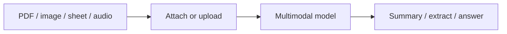

Multimodal e arquivos — visão geral
Aprofunde-se em **multimodal e arquivos** — dividido em notas específicas abaixo.

## Mapa deste submenu

| Nota | Foco |
|------|--------|
| [PDFs e documentos](ii-pdfs-and-documents.md) | Parte da trilha multimodal e de arquivos |
| [Imagens, planilhas e dados](iii-images-spreadsheets-data.md) | Parte da trilha multimodal e de arquivos |
| [Voz, código e limites](iv-voice-code-and-limits.md) | Parte da trilha multimodal e de arquivos |

Multimodal e arquivos
As ferramentas AI modernas aceitam **imagens**, **PDFs**, **planilhas**, **áudio** e **capturas de tela** — e não apenas prompts digitados. Usar arquivos é melhor do que redigitar o conteúdo.

## Ordem de estudo

[PDFs e documentos](ii-pdfs-and-documents.md) → [Imagens, planilhas e dados](iii-images-spreadsheets-data.md) → [Voz, código e limites](iv-voice-code-and-limits.md)
