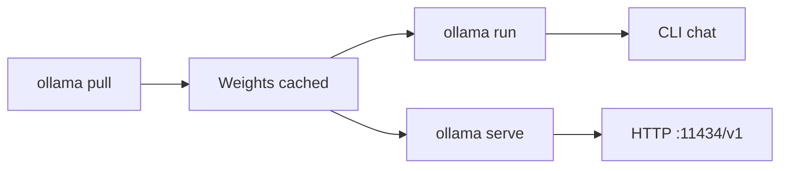

Ollama — visão geral

**[Ollama](https://ollama.com)** executa open LLMs localmente — uma instalação,`ollama pull`, converse no terminal ou por meio de um API compatível com OpenAI. Melhor primeira escolha para **codificação local com Cursor**, **bate-papo off-line** e **experimentos rápidos** sem controle Hugging Face ou caminhos GGUF manuais.

Para comparar Ollama vs llama.cpp / vLLM, consulte [Plataformas de execução local](../implementation-example/iii-local-run-platforms.md). Para dimensionamento de RAM/VRAM, consulte [Requisitos do modelo RAM](../implementation-example/iv-model-ram-requirements.md).

## Mapa deste submenu

| Nota | Foco |
|------|--------|
| [Instalar e configurar](ii-install-and-setup.md) | Linux, macOS, Windows; verificar instalação |
| [Modelos – puxar e gerenciar](iii-models-pull-and-manage.md) |`pull`,`list`,`rm`, tags, incorporações |
| [Executar, conversar e parâmetros](iv-run-chat-and-parameters.md) |`ollama run`,`/set`, contexto, prompt do sistema |
| [Integração API e IDE](v-api-and-ide-integration.md) |`/v1`API, Cursor, Continuar, env vars |
| [Arquivo de modelo e GGUF personalizado](vi-modelfile-and-custom-gguf.md) | Importar pesos HF,`ollama create`|
| [GPU e solução de problemas](vii-gpu-troubleshooting.md) |`ollama ps`, CPU apenas correções, OOM |

## Modelo mental



| Peça | Você controla | Ollama manipula |
|-------|-------------|----------------|
| **Qual modelo** |`ollama pull qwen2.5-coder:7b`| Baixar, quant padrão |
| **GPU versus CPU** | Tamanho do modelo; env vars | back-end llama.cpp, descarregamento |
| **__Acesso IT3__** | Ponto Cursor em`localhost:11434/v1`| Serve conclusões de chat |
| **Modelo personalizado** |`Modelfile`+`ollama create`| Pacotes GGUF + parâmetros |

## Modelos recomendados (2025–2026)

| Caso de uso | Etiqueta de modelo | VRAM (aprox.) |
|----------|-----------|---------------|
| **Codificação local** |`qwen2.5-coder:7b`| ~5 GB |
| Bate-papo geral 7B |`qwen2.5:7b`| ~5 GB |
| Rápido/pequeno GPU |`qwen2.5-coder:3b`,`llama3.2:3b`| ~2–3 GB |
| Incorporações (RAG) |`nomic-embed-text`| Pequeno |
| Melhor codificador aberto (24 GB+) |`qwen2.5-coder:32b`| ~20 GB |

8 GB GPU (por exemplo, RTX 1080): comece com **`qwen2.5-coder:7b`**. Detalhes: [Instalar e executar em RTX 1080](../implementation-example/vi-install-and-run-rtx-1080.md).

## Ordem de estudo

[Instalar e configurar](ii-install-and-setup.md) → [Modelos — extrair e gerenciar](iii-models-pull-and-manage.md) → [Executar, conversar e parâmetros](iv-run-chat-and-parameters.md) → [integração API e IDE](v-api-and-ide-integration.md) → [Arquivo de modelo e GGUF personalizado](vi-modelfile-and-custom-gguf.md) → [GPU e solução de problemas](vii-gpu-troubleshooting.md)

## Comece aqui (5 minutos)

```bash
curl -fsSL https://ollama.com/install.sh | sh
ollama pull qwen2.5-coder:7b
ollama run qwen2.5-coder:7b
```

Digite uma mensagem;`/bye`para sair. Próximo: conecte-se a Cursor — [integração de API e IDE](v-api-and-ide-integration.md).

## Relacionado

- [TurboVec + Ollama + arquivos locais](../implementation-example/vii-turbovec-ollama-local-files.md) — RAG sobre seus documentos
- [Baixando do Hugging Face](../implementation-example/ii-downloading-from-huggingface.md) — quando você precisa de pesos Ollama não cataloga
