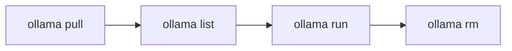

Modelos – extrair e gerenciar

Os modelos são referenciados por **tags** (`model:variant`). Ollama baixa os pesos primeiro`pull`e os armazena em cache localmente.



## 1. Puxar modelos

```bash
# Coding (recommended default)
ollama pull qwen2.5-coder:7b

# General chat
ollama pull qwen2.5:7b
ollama pull llama3.2:3b

# Embeddings (for RAG with Ollama)
ollama pull nomic-embed-text
```

O progresso mostra o tamanho do download. A retomada é automática se interrompida.

## 2. Liste e inspecione

```bash
ollama list
ollama show qwen2.5-coder:7b
ollama show qwen2.5-coder:7b --modelfile
```

`show`imprime parâmetros, modelo e trecho de licença.

## 3. Remover modelos (disco livre)

```bash
ollama rm qwen2.5:7b
ollama rm model-name:tag
```

Liste primeiro – os blobs não são removidos até que nenhum modelo os faça referência.

## 4. Nomeação de tags

| Padrão | Significado |
|--------|---------|
|`llama3.2`| Variante padrão para essa família |
|`llama3.2:3b`| Tamanho específico |
|`qwen2.5-coder:7b`| Família + tamanho |
|`@sha256:…`| Fixar blob exato (avançado) |

Navegue pelo catálogo: [ollama.com/library](https://ollama.com/library)

## 5. Escolhas de modelo por hardware

| VRAM | Tags sugeridas |
|------|----------------|
| **8 GB** |`qwen2.5-coder:7b`,`llama3.2:3b`,`qwen2.5:7b`|
| **16 GB** | acima +`qwen2.5-coder:14b`(pode ser apertado) |
| **24 GB+** |`qwen2.5-coder:32b`,`llama3.1:70b`(quantizado) |
| **CPU apenas** |`llama3.2:1b`,`qwen2.5-coder:3b`|

Consulte [Requisitos do modelo RAM](../implementation-example/iv-model-ram-requirements.md) para teoria.

## 6. Incorporação de modelos

Para RAG local (com LlamaIndex, etc.):

```bash
ollama pull nomic-embed-text
ollama pull mxbai-embed-large
```

Use a **mesma** Ollama base URL para incorporar e conversar em seu aplicativo. Passo a passo: [TurboVec + Ollama + arquivos locais](../implementation-example/vii-turbovec-ollama-local-files.md).

## 7. Abraçando o rosto vs biblioteca Ollama

| Fonte | Quando |
|--------|------|
| **`ollama pull`** | O modelo está na biblioteca Ollama – mais rápido |
| **Arquivo modelo + GGUF** | Você baixou um`.gguf`de HF - consulte [Modelfile e GGUF personalizado](vi-modelfile-and-custom-gguf.md) |
| **Sensores de segurança HF completos** | Use transformers/vLLM ou converta para GGUF primeiro |

Os repositórios fechados Meta Llama precisam de aprovação HF; muitos modelos **Qwen** e **Mistral** extraem de Ollama sem etapas HF.

## Próximo

[Executar, conversar e parâmetros](iv-run-chat-and-parameters.md) — use modelos de forma interativa.
