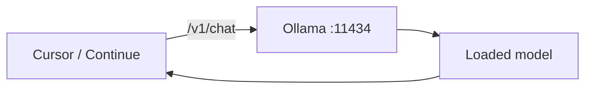

Integração API e IDE

Ollama expõe um **compatível com OpenAI** HTTP API para que IDEs e ferramentas funcionem com um modelo local em vez de um API de nuvem.



## 1. Base URL e autenticação

| Configuração | Valor |
|--------|-------|
| **Base URL** |`http://localhost:11434/v1`|
| **API chave** | Qualquer espaço reservado (por exemplo`ollama`) — não aplicado localmente |
| **Nome do modelo** | Etiqueta exata:`qwen2.5-coder:7b`|

O servidor inicia na primeira solicitação ou é executado explicitamente:

```bash
ollama serve
```

## 2. Teste com curl

**Conclusões do bate-papo:**

```bash
curl http://localhost:11434/v1/chat/completions \
  -H "Content-Type: application/json" \
  -d '{
    "model": "qwen2.5-coder:7b",
    "messages": [
      {"role": "user", "content": "Hello"}
    ]
  }'
```

**Transmissão:**

```bash
curl http://localhost:11434/v1/chat/completions \
  -H "Content-Type: application/json" \
  -d '{
    "model": "qwen2.5-coder:7b",
    "messages": [{"role": "user", "content": "Count to 5"}],
    "stream": true
  }'
```

**Incorporações:**

```bash
curl http://localhost:11434/v1/embeddings \
  -H "Content-Type: application/json" \
  -d '{
    "model": "nomic-embed-text",
    "input": "Hello world"
  }'
```

## 3. Cursor

1. Modelo de tração:`ollama pull qwen2.5-coder:7b`2. Configurações Cursor → **Modelos** → adicionar provedor **compatível com OpenAI** (o texto varia de acordo com a versão):
   - Base URL:`http://localhost:11434/v1`- Tecla API:`ollama`- Modelo:`qwen2.5-coder:7b`3. Selecione esse modelo no modo chat ou agente.

Ollama deve estar em execução na **mesma máquina** que Cursor (ou usar o túnel SSH para controle remoto).

## 4. Continuar (Código VS / JetBrains)

Em`config.json`TÉCNICO.:

```json
{
  "models": [
    {
      "title": "Qwen Coder 7B",
      "provider": "ollama",
      "model": "qwen2.5-coder:7b"
    }
  ]
}
```

Continue detecta Ollama local quando a extensão é instalada e`ollama`está em PATH.

## 5. Variáveis ​​de ambiente

| Variável | Efeito |
|----------|--------|
|`OLLAMA_HOST`| Endereço de ligação (padrão`127.0.0.1:11434`) |
|`OLLAMA_KEEP_ALIVE`| Quanto tempo os modelos permanecem carregados (por exemplo`30m`,`0`= descarregar imediatamente) |
|`OLLAMA_NUM_GPU`| Forçar contagem de camadas GPU;`0`= CPU apenas |
|`OLLAMA_MODELS`| Diretório de modelos personalizados |

Exemplo — escute em LAN (use apenas em redes confiáveis):

```bash
OLLAMA_HOST=0.0.0.0:11434 ollama serve
```

## 6. Segurança

| Risco | Mitigação |
|------|------------|
| Abrir porta em LAN/internet | Manter`127.0.0.1`a menos que você pretenda acesso remoto |
| Sem autorização API | Não exponha`:11434`para a internet pública |
| Alertas sensíveis | Apenas local – os dados permanecem na máquina; ainda reconhece o log |

## Próximo

[Arquivo de modelo e GGUF personalizado](vi-modelfile-and-custom-gguf.md) — importa modelos que não estão na biblioteca.
