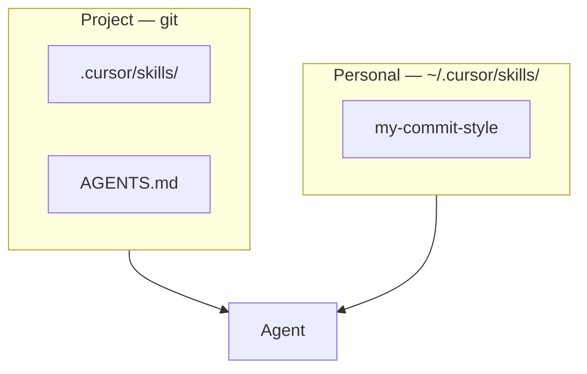

Habilidades e instruções do agente — visão geral

Aprofunde-se nas **habilidades e instruções do agente** — como ensinar seus fluxos de trabalho a um agente uma vez, para que você pare de explicá-los novamente a cada bate-papo.

## O que esta faixa cobre

**Habilidades** e **instruções`.md`arquivos ** codificam *suas* regras: formato de commit, lista de verificação PR, formato de envelope API, frontmatter do documento, etapas de implantação. O produto os carrega quando a tarefa corresponde – você escreve a redução; o agente o segue.

| Você obtém | Sem esta camada |
|--------|-------------------|
| A mesma revisão PR sempre | “Lembre-se de verificar os testes…” cada diferença |
| Agente sabe`npm test`e layout de pastas | Adivinha comandos; edita diretórios errados |
| Equipe compartilha comportamento via git | O agente de cada um se comporta de maneira diferente |

Isso é para **pessoas que usam agentes diariamente** — especialmente **Cursor**, **Claude Code**, **Codex**, Claude Projects e GPTs personalizados. Não para modelos de treinamento.

## Habilidades versus ferramentas ativas (MCP)

| | **Habilidades/regras/`AGENTS.md`** | **MCP / conectores** |
|---|----------------------------------|----------------------|
| **O que** | Instruções de redução estática | APIs ativos (DB, Slack, navegador, etc.) |
| **Quando** | “Como *nós* fazemos X” | “Buscar/atuar em dados *atual*” |
| **Exemplo** | PR revisar habilidade de lista de verificação | Consultar logs de produção via MCP |

Use ambos: as habilidades informam ao agente *seu processo*; MCP dá *acesso ao vivo*. Veja [Como MCP funciona](../how-mcp-works/i-overview.md).



## Habilidades de projeto versus habilidades pessoais (do usuário)

Cursor (e Claude Code) carregam habilidades de **dois lugares diferentes**. A regra é simples: **processo de equipe → repositório**; **seus hábitos → pasta inicial**.

| | **Habilidades de projeto** | **Habilidades pessoais (do usuário)** |
|---|----|---------------------------|
| **Cursor caminho** |`.cursor/skills/<skill-name>/SKILL.md`|`~/.cursor/skills/<skill-name>/SKILL.md`|
| **Caminho do código Claude** |`.claude/skills/<skill-name>/SKILL.md`|`~/.claude/skills/<skill-name>/SKILL.md`|
| **Quem vê** | Todos que clonam o repositório | Somente você, em cada repositório que você abre |
| **Git** | **Commit e PR** código semelhante | **Nunca se comprometa** — vive fora do repositório |
| **Bom para** | PR revisar padrões, implantar etapas, regras de frontmatter de repo | Runbooks privados, seu tom de compromisso, experimentos |
| **Exemplo** |`.cursor/skills/pr-review/SKILL.md`|`~/.cursor/skills/my-weekly-status/SKILL.md`|

```text
/home/you/
  ~/.cursor/skills/              ← YOUR machine only (not in any git repo)
    my-commit-style/SKILL.md

/path/to/your-project/           ← THIS repo (git tracks it)
  .cursor/skills/
    pr-review/SKILL.md
  AGENTS.md
```

**Não** coloque habilidades personalizadas`~/.cursor/skills-cursor/`- esse diretório é apenas para Cursor integrados.

### O que mais está no repositório (gerenciado pelo git)

| Arquivo/pasta | Finalidade | Comprometer-se? |
|---------------|---------|---------|
| **`AGENTS.md`** (raiz do repositório) | Pilha, comandos de teste, mapa de pastas – todo agente lê isto | Sim |
| **`.cursor/skills/`** | Fluxos de trabalho da equipe | Sim |
| **`.cursor/rules/*.mdc`** | Regras de codificação sempre ativas ou com correspondência global (somente Cursor) | Sim |
| **`docs/skills/`** | Cópia **canônica** opcional antes de sincronizar com`.cursor/`-&#09;o`.claude/`| Sim |
| **`.claude/skills/`** | Mesmas habilidades para companheiros de equipe de Claude Code | Sim (se a equipe usar o Código Claude) |
| **`CLAUDE.md`** | Preferências de posição do Código Claude | Sim (opcional) |

Habilidades pessoais nunca vão para o repositório – se você precisar de um fluxo de trabalho de equipe, mova-o de`~/.cursor/skills/`em`.cursor/skills/`e abra um PR.

## Gerenciando habilidades com git

Trate as habilidades do projeto como **código-fonte**: versionado, revisado, de propriedade.

### O que comprometer

```bash
git add AGENTS.md
git add .cursor/skills/pr-review/SKILL.md
git add .cursor/skills/pr-review/scripts/smoke-test.sh   # if the skill ships a script
git add .cursor/rules/typescript-errors.mdc              # rules, not skills — still team config
```

**Incluir no git:** todos`.cursor/skills/`,`AGENTS.md`, opcional`docs/skills/`, scripts em pastas de habilidades.

**Excluir do git:** nada abaixo`~/.cursor/`ou`~/.claude/`(esses caminhos estão fora do repositório de qualquer maneira).

### Fluxo de trabalho típico do git

| Etapa | Ação |
|------|--------|
| **1. Filial** |`git checkout -b skills/add-pr-review`|
| **2. Adicionar habilidade** | Criar`.cursor/skills/pr-review/SKILL.md`(+`reference.md`,`scripts/`se necessário) |
| **3. Link em`AGENTS.md`** | Adicione uma linha abaixo`## Skills`apontando para o caminho da habilidade |
| **4. Teste localmente** | Bate-papo com novo agente → prompt que deve acionar a habilidade → verificar comportamento |
| **5. PR** | Os revisores verificam instruções como código (comando errado = implantação interrompida) |
| **6. Mesclar** | Colegas de equipe adquirem habilidades`git pull`— sem instalação manual |

### Mantenha as habilidades sincronizadas entre as ferramentas

Se alguns colegas de equipe usam **Cursor** e outros **Claude Code**, duplique ou sincronize o mesmo`SKILL.md`TÉCNICO.:

| Estratégia | Como | Git nota |
|----------|-----|----------|
| **Duplicado** | Copiar para`.cursor/skills/`e`.claude/skills/`| Confirmar **ambas** pastas |
| **Canônico`docs/skills/`** | Edite uma vez`docs/skills/pr-review/`, execute o script de sincronização | Comprometer-se`docs/skills/`+ cópias sincronizadas |
| **Link simbólico** (somente local) |`ln -s ../../docs/skills/pr-review .cursor/skills/pr-review`| Os links simbólicos geralmente **não** são bem portados — documento duplicado ou script para CI |

Exemplo de script de sincronização (comprometer-se com o repositório, executar após a edição`docs/skills/`):

```bash
#!/bin/sh
# scripts/sync-skills.sh — from repo root
set -e
for skill in docs/skills/*/; do
  name=$(basename "$skill")
  mkdir -p ".cursor/skills/$name" ".claude/skills/$name"
  cp "$skill/SKILL.md" ".cursor/skills/$name/SKILL.md"
  cp "$skill/SKILL.md" ".claude/skills/$name/SKILL.md"
done
echo "Synced skills to .cursor/ and .claude/"
```

Adicione a README: *“Depois de alterar`docs/skills/`, correr`./scripts/sync-skills.sh`.”*

### PR e práticas de propriedade

| Prática | Por que |
|----------|-----|
| **Uma habilidade = uma pasta = um tema PR** | Revisão mais fácil (“adiciona habilidade de preparação de implantação”) |
| **Nomeie um proprietário** no rodapé da habilidade ou no documento da equipe | Alguém atualiza quando o processo muda |
| **Teste no agente antes da mesclagem** | Mesma barra da alteração de um runbook |
| **Linha do changelog`SKILL.md`** |`<!-- v2: added staging smoke script 2026-07 -->`|
| **Não cometa segredos** | Use env vars em scripts; referência apenas em texto de habilidade |

Quando`AGENTS.md`mudanças (novo comando de teste), atualizar habilidades que dizem`npm test`no **mesmo PR** ou imediatamente depois - evite desvios.

### Clone/lista de verificação de novo companheiro de equipe

Depois`git clone`e abrindo o repositório em Cursor:

1. **`AGENTS.md`** carrega automaticamente (repo root).
2. **`.cursor/skills/`** está disponível — nenhuma etapa extra de instalação.
3. **Habilidades pessoais** em`~/.cursor/skills/`ainda se aplicam **além** às habilidades do projeto (não duplique instruções conflitantes).
4. Opcional: execute`./scripts/sync-skills.sh`somente se sua equipe usar`docs/skills/`como fonte.

## Árvore de pastas de habilidades

Como um diretório típico de habilidades de **projeto** é organizado. Cada habilidade é uma **pasta** com um ** obrigatório`SKILL.md`**; arquivos opcionais contêm detalhes que o agente lê somente quando necessário.

```text
repo/
├── AGENTS.md                          ← repo briefing (stack, tests, layout) — not a skill
├── .cursor/
│   ├── rules/                         ← always-on / glob rules (Cursor-only)
│   │   ├── typescript-errors.mdc
│   │   └── api-conventions.mdc
│   └── skills/                        ← project skills (commit to git)
│       ├── pr-review/
│       │   ├── SKILL.md               ← required — name, description, workflow
│       │   ├── reference.md           ← optional — long checklist, security notes
│       │   └── examples.md            ← optional — good/bad review samples
│       ├── conventional-commits/
│       │   └── SKILL.md
│       ├── deploy-staging/
│       │   ├── SKILL.md
│       │   └── scripts/
│       │       └── smoke-test.sh      ← optional — runnable helpers
│       └── incident-writeup/
│           ├── SKILL.md
│           └── reference.md
│
└── docs/skills/                       ← optional canonical copy (sync to .cursor/)
    └── pr-review/
        └── SKILL.md

~/.cursor/skills/                        ← personal skills (all your repos)
  ├── my-commit-style/
  │   └── SKILL.md
  └── private-runbook/
      ├── SKILL.md
      └── reference.md
```

### Onde os scripts ficam (não dentro do`.md`)

Scripts são **arquivos reais em disco** em um`scripts/`subpasta ao lado de`SKILL.md`. Eles **não** estão incorporados na redução.

```text
.cursor/skills/deploy-staging/
  SKILL.md              ← instructions only: WHEN to run, WHICH command
  scripts/
    smoke-test.sh       ← the actual bash script (separate file)
    validate.py         ← optional second script
```

| Arquivo | Contém |
|------|----------|
| **`SKILL.md`** | Texto: “Execute este comando:`.cursor/skills/deploy-staging/scripts/smoke-test.sh`” |
| **`scripts/*.sh`** | Código executável que o agente executa via **Shell** |
| **`reference.md`** | Prosa extra — não executada |

A habilidade **não** executa nada automaticamente. O agente lê`SKILL.md`e, em seguida, executa o caminho que você escreveu usando a ferramenta de terminal - como se você mesmo tivesse digitado o comando.

**Alternativa:** ponto`SKILL.md`em um script de repositório existente (por exemplo,`npm run smoke:staging`em`package.json`) em vez de um arquivo em`scripts/`. Passo a passo completo: [Vinculando um script fixo](iv-cursor-skills-rules-agents-md.md#linking-a-fixed-script).

| Caminho | Escopo | Comprometer-se com o git? |
|------|-------|----------------|
|`.cursor/skills/<name>/`| **Projeto** — fluxos de trabalho da equipe neste repositório | **Sim** |
|`.claude/skills/<name>/`| **Projeto** — Colegas de equipe de Claude Code | **Sim** (se usado) |
|`docs/skills/<name>/`| **Projeto** — cópia canônica para sincronização | **Sim** |
|`AGENTS.md`,`.cursor/rules/*.mdc`| **Projeto** — briefing + regras | **Sim** |
|`~/.cursor/skills/<name>/`| **Pessoal** — todos os seus repositórios | **Não** (fora do repositório) |
|`~/.claude/skills/<name>/`| **Pessoal** — Código Claude | **Não** (fora do repositório) |

### Seletor rápido: onde isso deveria ficar?

| Você quer… | Coloque aqui |
|-----------|------------|
| Toda a equipe usa a mesma lista de verificação de revisão PR |`.cursor/skills/pr-review/`→ **git commit** |
| Só você deseja um formato de status semanal personalizado |`~/.cursor/skills/weekly-status/`→ **não no git** |
| Todo agente sabe`npm test`e layout de pastas |`AGENTS.md`na raiz do repositório → **git commit** |
| Arquivos TypeScript sempre usam nossos tipos de erro |`.cursor/rules/*.mdc`→ **git commit** |
| Mesma habilidade para Cursor + Código Claude |`.cursor/skills/`+`.claude/skills/`ou`docs/skills/`+ script de sincronização |
| Script bash/Python corrigido para um fluxo de trabalho |`.cursor/skills/<name>/scripts/*.sh`— **não** colado em`SKILL.md`|
| Promovido no chat — agora política da equipe | Mover da pasta pessoal para`.cursor/skills/`, abra PR |

Uma pasta de habilidades = um fluxo de trabalho. Divida tópicos grandes (por exemplo`pr-review`contra`deploy-staging`) em vez de uma mega-habilidade. Coloque comandos fixos em **`scripts/`** e referenciá-los de`SKILL.md`— veja [Vinculando um script fixo](iv-cursor-skills-rules-agents-md.md#linking-a-fixed-script). Detalhes de várias ferramentas: [Configuração portátil de ferramentas cruzadas](iii-cross-tool-portable-setup.md).

## Mapa deste submenu

| Nota | Foco |
|------|--------|
| [Artefatos e por que se preocupar](ii-artifacts-why-and-what.md) | O que criar, qual produto utiliza qual artefato |
| [Exemplos de artefatos](iia-artifact-examples.md) | Amostras de copiar e colar para cada tipo de artefato |
| [Configuração portátil entre ferramentas](iii-cross-tool-portable-setup.md) | Um repositório, Cursor + Código Claude + Codex |
| [Cursor habilidades, regras e AGENTS.md](iv-cursor-skills-rules-agents-md.md) | Layout Cursor, regras versus habilidades,`AGENTS.md`, **vinculando scripts** |
| [Escrita e manutenção de habilidades](v-writing-and-maintaining-skills.md) | Descrições, divulgação progressiva, fluxo de trabalho da equipe |
| **[Usando habilidades, agentes e ganchos](using-skills-agents-and-hooks/i-overview.md)** | Habilidades versus`AGENTS.md`versus ganchos; [orquestração de agentes](using-skills-agents-and-hooks/vi-agent-orchestration.md) |
| **[Exemplos](examples/i-overview.md)** | Scripts parametrizados, loop em logs, ganchos de commit, varreduras de desempenho — tudo com logs JSON em tempo de execução |

**Loop relacionado:** [Instruções persistentes](../loop-prompting/iii-persistent-instructions.md) — quando promover o texto do bate-papo em habilidades.

## Ordem de estudo

[Artefatos e por que se preocupar](ii-artifacts-why-and-what.md) → [Exemplos de artefatos](iia-artifact-examples.md) → [Configuração portátil de ferramentas cruzadas](iii-cross-tool-portable-setup.md) → [Cursor habilidades, regras e AGENTS.md](iv-cursor-skills-rules-agents-md.md) → [Habilidades de redação e manutenção](v-writing-and-maintaining-skills.md) → **[Usando habilidades, agentes e ganchos](using-skills-agents-and-hooks/i-overview.md)** → **[Exemplos](examples/i-overview.md)** quando você deseja copiar e colar scripts com registro

## Comece aqui (15 minutos)

1. **`AGENTS.md`** na raiz do repositório - pilha,`npm test`, mapa de pastas → **comprometer-se com o git**. Consulte [Exemplos de artefatos](iia-artifact-examples.md) §3.
2. **Uma habilidade de projeto** —`.cursor/skills/commit-messages/SKILL.md`(ou`pr-review`) → **comprometer-se com o git**. Não`~/.cursor/skills/`a menos que permaneça pessoal.
3. Novo bate-papo → prompt curto → refinar`description`se a habilidade não carregar.
4. Habilidade pessoal opcional em`~/.cursor/skills/`apenas para hábitos que você **não** deseja que a equipe herde.
