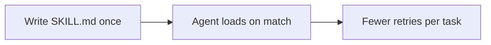
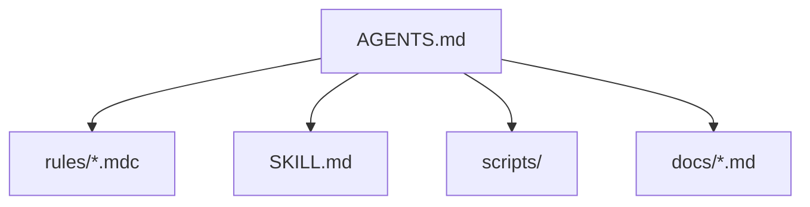

Artefatos e por que se preocupar

## 1. Por que se preocupar?

| Sem instruções persistentes | Com habilidades/regras/documentos do projeto |
|--------------------------------|----------------------------------|
| Repita “usar commits convencionais” diariamente | Agente lê habilidade uma vez por tarefa |
| Agente adivinha layout de pilha e pasta | Pontos em`SKILL.md`ou`AGENTS.md`|
| PR e formato de documento inconsistentes | Sempre o mesmo modelo |
| Longo preâmbulo de bate-papo em cada sessão | Prompt curto + contexto carregado |

Pense nas habilidades como **documentos de integração para o agente** — curtos, acionáveis ​​e com reconhecimento de gatilhos.



**Regra de promoção:** se você digitou a mesma instrução **três vezes**, mova-a para uma habilidade, regra ou`AGENTS.md`. Consulte [Instruções persistentes](../loop-prompting/iii-persistent-instructions.md).

## 2. O que criar (escolha por produto)

| Artefato | Produto | Escopo |
|----------|---------|--------|
| **Habilidade (`SKILL.md`)** | Cursor, **Código Claude**, Codex (configurado) | Fluxos de trabalho específicos de tarefas (revisão, implantação, SQL) — **instruções em remarcação** |
| **`scripts/`na pasta de habilidades** | Cursor (através do agente Shell) | **Separar**`.sh`-&#09;o`.py`arquivos;`SKILL.md`diz quando e qual caminho executar |
| **Regras (`.mdc`)** | Cursor | Padrões de codificação sempre ativos ou de padrão de arquivo |
| **`AGENTS.md`** | Cursor, **Codex**, Claude Code, Copilot, muitos outros | Briefing do agente para todo o repositório na raiz |
| **`CLAUDE.md`** | Código Cláudio | Memória do projeto / instruções permanentes |
| **Instruções do projeto** | Projetos Claude (web) | Tom, formato, conhecimento anexado |
| **Instruções GPT personalizadas** | Bate-papoGPT | Persona + processo para um assistente |
| **Contexto`.md`em repositório** | Qualquer agente IDE |`docs/agent-context.md`, notas de arquitetura |

A mesma ideia de conteúdo em todos os lugares: **quando usar + o que fazer + exemplos**.

Consulte [Exemplos de artefatos](iia-artifact-examples.md) para copiar e colar amostras de cada linha acima.

## 3. Qual artefato? (guia de decisão)

```text
Need a multi-step workflow (review, deploy, incident writeup)?
  → SKILL.md

Need code to always look a certain way in .ts files?
  → Cursor rule (.mdc) with globs

Need every agent to know stack, tests, and folder map?
  → AGENTS.md (repo root)

Claude Code only — stable prefs and gotchas, not a procedure?
  → CLAUDE.md

Web assistant with uploaded policies / no repo?
  → Claude Project instructions or Custom GPT

Deep domain doc (one feature area) linked from AGENTS.md?
  → docs/.../context.md
```

| Pergunta | Resposta |
|----------|--------|
| “Sempre use padrões mais bonitos” | **Regra** (`alwaysApply`ou`globs`) |
| “Como executamos testes de fumaça e lemos resultados” | **Habilidade** |
| “Usamos Next.js 15; os testes são`npm test`” | **`AGENTS.md`** |
| “Nunca invente datas em relatórios de situação” | **Instruções do projeto** ou GPT personalizado |
| Mesmo fluxo de trabalho em Cursor e Claude Code | **`SKILL.md`** em ambos`.cursor/skills/`e`.claude/skills/`|

## 4. Camadas (use juntas)



**Não** cole toda a habilidade em`AGENTS.md`- link para ele. Manter`AGENTS.md`em cerca de 2–3 telas; O Codex impõe um limite de tamanho por padrão.

## 5. Erros comuns

| Erro | Correção |
|--------|-----|
| Uma bolha gigante de instruções | Dividir:`AGENTS.md`+ habilidades +`reference.md`|
| Habilidade vaga`description`(“ajuda com código”) | Nomeie a tarefa + palavras de gatilho: “PR, diff, revisão de código” |
| Duplicando a mesma regra em 5 arquivos | Fonte única; link de`AGENTS.md`|
| Segredos ou chaves API ao vivo em habilidades | Exemplos redigidos; apenas env vars |
| Habilidades nunca atualizadas após mudança de processo | Proprietário + revisão trimestral |

**Próximo:** [Exemplos de artefatos](iia-artifact-examples.md) → [Configuração portátil de ferramentas cruzadas](iii-cross-tool-portable-setup.md).
