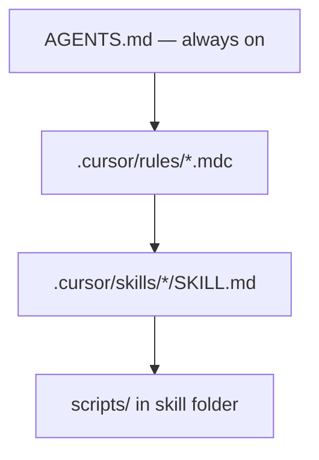

Cursor habilidades, regras e AGENTS.md

Layout específico de Cursor para habilidades, regras e arquivos de briefing de repositório. Para configuração portátil entre Claude Code e Codex, consulte [Configuração portátil de ferramentas cruzadas](iii-cross-tool-portable-setup.md).



## 4. Habilidades Cursor - layout

As habilidades ficam em uma **pasta** com um ** obrigatório`SKILL.md`**:

```text
.cursor/skills/                    # project — shared in git
  pr-review/
    SKILL.md                       # required — instructions only
    reference.md                   # optional deep detail
    examples.md                    # optional
    scripts/                       # optional — real script files (NOT inside .md)
      check-scope.sh

~/.cursor/skills/                  # personal — all your projects
  my-private-skill/
    SKILL.md
```

**Não** coloque habilidades personalizadas`~/.cursor/skills-cursor/`- isso é para Cursor integrados.

| Localização | Usar para |
|----------|---------|
|`.cursor/skills/`(projeto) | Fluxos de trabalho de equipe no git |
|`~/.cursor/skills/`(usuário) | Hábitos pessoais em repositórios |
|`reference.md`na pasta de habilidades | Listas de verificação longas, detalhes API |
|`examples.md`na pasta de habilidades | Amostras de resultados bons/ruins |
|`scripts/`na pasta de habilidades | **Arquivos executáveis** (`.sh`,`.py`) — **não** incorporado em`SKILL.md`; texto de habilidade aponta para o caminho |

### Modelo SKILL.md (revisão de PR)

```markdown
---
name: pr-review-team-standards
description: Review pull requests for security, tests, and team conventions. Use when reviewing PRs, diffs, or when the user asks for a code review.
---

# PR review (team standards)

## Before you comment

- [ ] Read the full diff; note files outside the stated scope
- [ ] Run `npm test` if behaviour changed (see AGENTS.md)
- [ ] Check for secrets, PII, or debug logging left in

## Review output format

1. **Summary** — one line: ship / ship with nits / needs changes
2. **Blockers** — must fix before merge
3. **Suggestions** — optional improvements
4. **Tests** — what is covered; what is missing

## Team conventions

- New API routes need OpenAPI update in `docs/api/`
- Auth changes need test in `tests/auth/`
- No new `any` in `lib/` without comment explaining why

## Deep detail

See [reference.md](reference.md) for security checklist and past incident patterns.
```

Campos de frontmatter:

| Campo | Obrigatório | Finalidade |
|-------|----------|--------|
|`name`| Sim | ID estável; minúsculas, hífens |
|`description`| Sim | **O que** + **quando** — impulsiona o carregamento automático |
|`disable-model-invocation`| Não | Se`true`, só é executado quando o usuário invoca explicitamente |

### Vinculando um script fixo

**Scripts não estão dentro`SKILL.md`.** O arquivo markdown contém apenas **instruções** (quando executar, qual caminho). O código real reside em **`scripts/`** como separado`.sh`,`.py`ou outros arquivos próximos a`SKILL.md`.

```text
WRONG — script body pasted in SKILL.md
  SKILL.md contains:  curl https://staging.example.com/health

RIGHT — script file + pointer in SKILL.md
  .cursor/skills/deploy-staging/
    SKILL.md           →  "Run: .cursor/skills/deploy-staging/scripts/smoke-test.sh"
    scripts/
      smoke-test.sh    →  #!/usr/bin/env bash … (real file on disk)
```

As habilidades **não** executam scripts automaticamente. Você **agrupa** o script na pasta de habilidades e informa ao agente em **`SKILL.md`** para **executá-lo** por meio da ferramenta Shell quando o fluxo de trabalho for executado.

```text
.cursor/skills/deploy-staging/
  SKILL.md
  scripts/
    smoke-test.sh          ← fixed script (committed to git)
    validate-release.py
```

| Peça | Função |
|-------|------|
| **`scripts/`** | Cópia canônica do script que a equipe mantém |
| **`SKILL.md`** | Quando executar, comando exato, como ler a saída |
| **Agente Shell** | Executa o comando que você especificou - não a fiação mágica |

**1. Adicione o script** (caminhos executáveis ​​e relativos ao repositório dentro):

```bash
chmod +x .cursor/skills/deploy-staging/scripts/smoke-test.sh
```

```bash
#!/usr/bin/env bash
# .cursor/skills/deploy-staging/scripts/smoke-test.sh
set -euo pipefail
curl -fsS "${STAGING_URL:-https://staging.example.com}/health"
```

**2. Vincule-o`SKILL.md`** — use linguagem imperativa e o caminho de **repo root**:

```markdown
---
name: deploy-staging
description: Deploy to staging and run smoke checks. Use when the user asks to deploy staging, release to staging, or verify a staging deploy.
---

# Deploy to staging

## Required steps (in order)

1. `npm run build`
2. `npm run deploy:staging`
3. **Always run the smoke script before reporting success:**
   ```festa
   .cursor/skills/deploy-staging/scripts/smoke-test.sh```
4. Paste the script output in your reply. If non-zero exit, stop — do not claim deploy succeeded.

## Do not

- Reimplement the health check inline — use the script above
- Skip the script unless the user explicitly says to skip verification
```

**3. Teste** — novo bate-papo, prompt “implantar no teste”, confirme se o agente executa o caminho do script.

#### Regras de caminho

| Faça | Evite |
|----|-------|
| Caminhos de **repo root** em`SKILL.md`| Caminhos relativos apenas à pasta de habilidades (o agente cwd geralmente é a raiz do projeto) |
| Um comando claro por script | “Execute algo como curl…” (agente pode improvisar) |
|`scripts/`na pasta de habilidades | Scripts únicos dispersos sem dono |
| Barras em caminhos | Barras invertidas |

#### Alternativas (mesma ideia, âncora diferente)

| Abordagem | Quando |
|----------|------|
| **`scripts/`na pasta de habilidades** | Script de fluxo de trabalho de propriedade da equipe; versionado com a habilidade |
| **`npm run smoke:staging`** em`package.json`| O script já faz parte do conjunto de ferramentas do aplicativo; habilidade diz`npm run …`|
| **`AGENTS.md`Comandos** | One-liner usado em muitas habilidades (“testes =`npm test`”) |
| **Ferramenta MCP** | O script envolve um **live API** ou DB que o agente deve chamar repetidamente — veja [Como MCP funciona](../how-mcp-works/i-overview.md) |
| **Cursor gancho** (`.cursor/hooks.json`) | Executar **automaticamente** em eventos (após a edição, antes do shell) — não acionado por habilidade |

```text
Skill + script     → agent runs YOUR file when the TASK matches (deploy, review, …)
Hook               → Cursor runs YOUR file on EVENTS (afterFileEdit, beforeShellExecution, …)
MCP server         → agent calls a TOOL (search, create ticket, query API)
```

Use um **script vinculado a habilidades** para **procedimentos** repetíveis (“sempre execute esta verificação”). Use um **hook** quando ele precisar ser acionado **sem** que o usuário pergunte. Use **MCP** quando o agente precisar de **dados ativos**, não de um comando local fixo.

#### Segurança

- Sem segredos em scripts - leia do env (`STAGING_URL`,`API_KEY`)
- Mantenha os scripts curtos e revisáveis; evitar`rm -rf`ou amplo`git`comandos, a menos que seja intencional
- Para operações destrutivas, adicione`disable-model-invocation: true`e exigir explícito`/deploy-staging`ou confirmação do usuário no corpo da habilidade

Consulte [Habilidades de escrita e manutenção](v-writing-and-maintaining-skills.md) para testes e propriedade da equipe.

## 5. Cursor regras versus habilidades

| | **Regras** (`.cursor/rules/*.mdc`) | **Habilidades** (`SKILL.md`) |
|---|-----------------------------------|---------------------|
| **Objetivo** | Padrões de codificação, convenções | Fluxos de trabalho em várias etapas |
| **Quando carregado** | Sempre ou quando o padrão do arquivo corresponder | Quando a tarefa corresponde`description`|
| **Tamanho** | Seja breve – aplicado com frequência | Pode ser mais longo; carregado sob demanda |
| **Exemplo** | "Usar`async/await`em`**/*.ts`” | “Como executar e interpretar nossos testes de fumaça” |

Use **regras** para “como o código deve ser”; use **habilidades** para “como executar um processo”.

### Modelo de regra

```markdown
---
description: TypeScript error handling conventions
globs: **/*.{ts,tsx}
alwaysApply: false
---

# TypeScript errors

- Never use empty `catch` blocks
- Wrap external API calls with typed errors from `lib/errors.ts`
- Prefer `Result<T, E>` from `lib/result.ts` over throwing in domain code
```

|`alwaysApply`|`globs`| Efeito |
|---------------|---------|--------|
|`true`| ignorado | Governe em todos os chats deste projeto |
|`false`|`**/*.ts`| Regra quando o agente toca nos arquivos correspondentes |
|`false`| omitido | Regra disponível; agente decide relevância |

**Regras do usuário** (Cursor Configurações → Regras) se aplicam a todos os projetos. Prefira **regras do projeto** em`.cursor/rules/`para padrões de equipe no git.

### Seletor rápido

| Você quer… | Usar |
|-----------|-----|
| “Sempre use commits convencionais quando eu pedir para fazer commit” | **Habilidade** (acionada por tarefa) |
| “Nunca esvazie a captura no TypeScript” | **Regra** com`globs`|
| “Toda a nossa equipe usa a mesma largura de aba” | **Regra** com`alwaysApply: true`|
| “Como fazer a triagem de alertas de produção” | **Habilidade** |

## 6. AGENTS.md e arquivos de contexto do projeto

(R)`AGENTS.md`** na raiz do repositório fornece aos agentes um **mapa do repositório**. Cursor, Codex, Claude Code e Copilot leram; mantenha-o na **linha de base portátil**.

| Seção | Conteúdo |
|--------|---------|
| **Pilha** | Linguagem, estrutura, executor de testes |
| **Layout** | Onde vivem rotas, modelos, testes |
| **Comandos** | Instalar, desenvolver, testar, lint, migrar |
| **Não** | Pastas geradas, segredos, árvores vendidas |
| **PR /commit** | Link para habilidade ou padrão de um parágrafo |
| **Habilidades** | Lista opcional: “revisão PR →`.cursor/skills/pr-review/`” |

Seja **curto** – crie links para documentos mais longos em vez de colá-los.

```markdown
# AGENTS.md

## Stack

Node 22, TypeScript, Next.js 15 (App Router), Prisma, Vitest, Playwright.

## Layout

| Path | Purpose |
|------|---------|
| `app/` | Routes and server components |
| `lib/` | Shared utilities, DB client |
| `prisma/` | Schema and migrations |
| `tests/` | Unit (`*.test.ts`) and e2e (`e2e/`) |

## Commands

    npm install
    npm run dev
    npm test
    npm run test:e2e
    npx prisma migrate dev

## Do not

- Edit `node_modules/`, `.next/`, or generated Prisma client
- Commit `.env` or credentials

## PR / commit

Use skill `.cursor/skills/commit-messages/SKILL.md`. Behaviour changes need tests.

## Skills

| Workflow | Path |
|----------|------|
| PR review | `.cursor/skills/pr-review/SKILL.md` |
| Commits | `.cursor/skills/commit-messages/SKILL.md` |

## More context

Checkout flow: `docs/agent-context/checkout.md`
```

### Aninhado`AGENTS.md`

Algumas ferramentas (especialmente Codex) carregam **`AGENTS.md`em subpastas** quando o trabalho acontece lá. Use arquivos aninhados para pacotes monorepo:

```text
repo/
  AGENTS.md                 # global
  services/billing/
    AGENTS.md               # billing-specific commands and layout
```

## 7. Conectando tudo

```text
User: "Review this PR"

  AGENTS.md     → how to run tests, where tests live
  rules/*.mdc   → style while reading .ts files
  pr-review/    → checklist, output format, blockers vs nits
    SKILL.md
```

Você digita um pequeno prompt; a pilha fornece o resto.

**Próximo:** [Habilidades de redação e manutenção](v-writing-and-maintaining-skills.md) — descrições, testes, propriedade da equipe.
