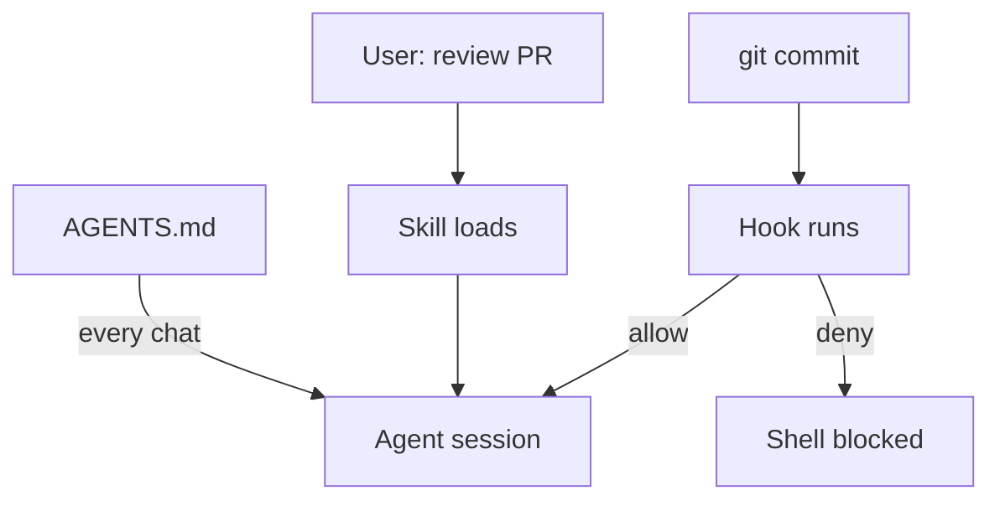

Usando habilidades, agentes e ganchos — visão geral

**Orquestração de agentes** no nível do projeto: coordene **AGENTS.md**, **habilidades**, **ganchos** e **scripts** para que o fluxo de trabalho certo seja executado no momento certo. Consulte [Orquestração de agentes](vi-agent-orchestration.md) para a pilha completa e os padrões.

Três camadas diferentes — **não as mescle em um arquivo**. Cada um tem seu próprio gatilho e trabalho.

| Camada | Arquivo(s) | Quando é executado | Quem inicia |
|-------|------------|-------------|---------------|
| **Informações do agente** |`AGENTS.md`(raiz do repositório) | Cada sessão de agente neste repositório | Cursor / Código Claude automaticamente |
| **Habilidade** |`.cursor/skills/<name>/SKILL.md`| Quando a solicitação do usuário corresponde`description`| **Usuário** (ou invocação de habilidade explícita) |
| **Gancho** |`.cursor/hooks.json`+`.cursor/hooks/*`| Em eventos: shell, commit, edit, stop | **Produto** — sem solicitação do usuário |

## Mapa deste submenu

| Nota | Foco |
|------|--------|
| [Habilidades sozinhas](ii-use-skills-alone.md) | Fluxos de trabalho sob demanda – solicitações do usuário, cargas de habilidades |
| [AGENTS.md sozinho](iii-use-agents-md-alone.md) | Contexto de repositório permanente - nenhuma frase de gatilho necessária |
| [Ganchos no commit](iv-use-hooks-on-commit.md) | Portões automáticos antes`git commit`|
| [Combine todos os três](v-combine-skills-agents-hooks.md) | Fluxo de commit ponta a ponta + quando usar qual |
| [Orquestração de agentes](vi-agent-orchestration.md) | Pilha completa, padrões, loops, MCP + habilidades |

**Scripts executáveis ​​+ implementação completa de gancho:** [Exemplos](../examples/i-overview.md) (cópia`examples/.cursor/`ao seu projeto).

**Exemplos de arquivos para copiar:** [sample/.cursor/](sample/.cursor/README.md) - mínimo`AGENTS.md`, habilidades e`hooks.json`layout.

## Seletor rápido

| Você quer… | Usar | Não |
|-----------|-----|-----|
| “Sempre conheça nosso comando de teste” |`AGENTS.md`| Habilidade |
| “Execute a revisão PR quando eu pedir” | Habilidade | Gancho |
| “Bloquear commit se`.env`encenado” | Gancho | Habilidade sozinha |
| “Explique a falha do gancho no chat” | Habilidade (companheiro) | Gancho (ganchos não conversam) |

## Ordem de estudo

[Habilidades sozinhas](ii-use-skills-alone.md) → [AGENTS.md sozinho](iii-use-agents-md-alone.md) → [Ganchos no commit](iv-use-hooks-on-commit.md) → [Combine todos os três](v-combine-skills-agents-hooks.md) → [Orquestração de agentes](vi-agent-orchestration.md).

## Relacionado

- [Artefatos e por que se preocupar](../ii-artifacts-why-and-what.md)
- [Cursor habilidades, regras e AGENTS.md](../iv-cursor-skills-rules-agents-md.md)
- [Exemplos — scripts e logs parametrizados](../examples/i-overview.md)
