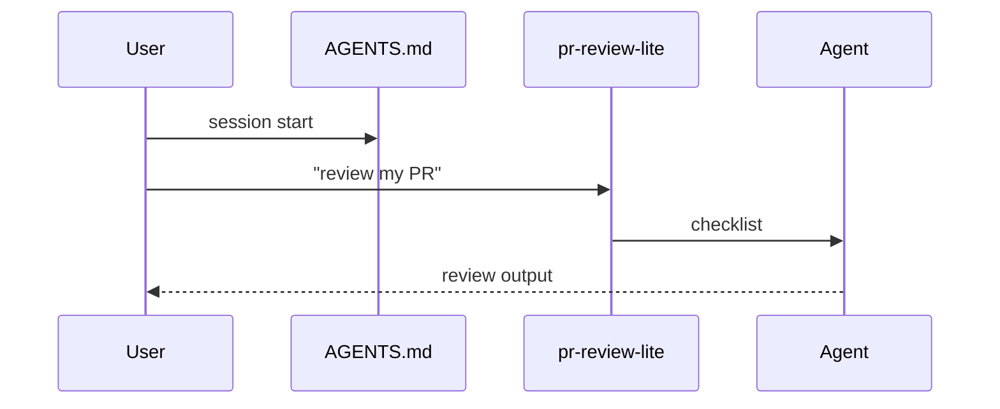

Habilidades sozinhas

Uma **habilidade** é executada quando a **tarefa do usuário** corresponde à habilidade`description`. Nada acontece até que o usuário (ou um comando de habilidade explícito) invoque esse fluxo de trabalho.

## O que uma habilidade não é

| Habilidade não é… | Por que |
|---------------|-----|
| Um gancho | Ganchos disparam em eventos; habilidades esperam pela intenção |
|`AGENTS.md`| O briefing carrega todos os chats; carga de habilidades na partida |
| Um roteiro | Os scripts vivem em`scripts/`; o texto da habilidade informa ao agente **quando** executá-las |

## Habilidade de amostra (pronta para cópia)

Arquivo ativo: [sample/.cursor/skills/pr-review-lite/SKILL.md](sample/.cursor/skills/pr-review-lite/SKILL.md)

```text
.cursor/skills/pr-review-lite/
  SKILL.md
```

### Acionar

O usuário diz qualquer um dos seguintes:

- “revise isto PR”
- “revisão de código”
- “verifique minha diferença antes de mesclar”

Cursor corresponde`description`no frontmatter → cargas de habilidades.

### O que o agente faz

1. Leia o diff (ferramenta)
2. Siga a lista de verificação em`SKILL.md`3. Saída: Resumo/Bloqueadores/Sugestões/Testes

**Nenhum gancho envolvido.** O usuário pode confirmar sem executar esta habilidade — é aconselhável, a menos que você também adicione um gancho.

## Habilidade + script (opcional)

Para fluxos de trabalho que devem executar o **mesmo comando** sempre, aponte a habilidade para um script — consulte [Exemplos: deploy-check](../examples/ii-parameterized-script-clarify.md).

```text
Skill says WHEN + HOW to ask user
Script does the deterministic work + JSON log
Agent reads log and summarizes
```

## Fluxo somente do usuário



## Quando usar habilidades sozinho

| Bom para | Exemplo |
|----------|---------|
| Fluxos de trabalho especializados opcionais | PR revisão, verificação de desempenho, verificação de implantação |
| Precisa de parâmetros do usuário | ambiente, caminho, simulação |
| Loops de iteração | Ler log → corrigir → executar novamente ([exemplo de loop](../examples/iii-loop-on-script-results.md)) |

## Teste

1. Copie [sample/.cursor/skills/pr-review-lite/](sample/.cursor/skills/pr-review-lite/) → seu`.cursor/skills/`2. Novo bate-papo: *“revise este PR”*
3. O agente deve usar o formato de lista de verificação de habilidades

## Próximo

[AGENTS.md sozinho](iii-use-agents-md-alone.md) — contexto que carrega **cada** sessão sem uma frase de gatilho.
