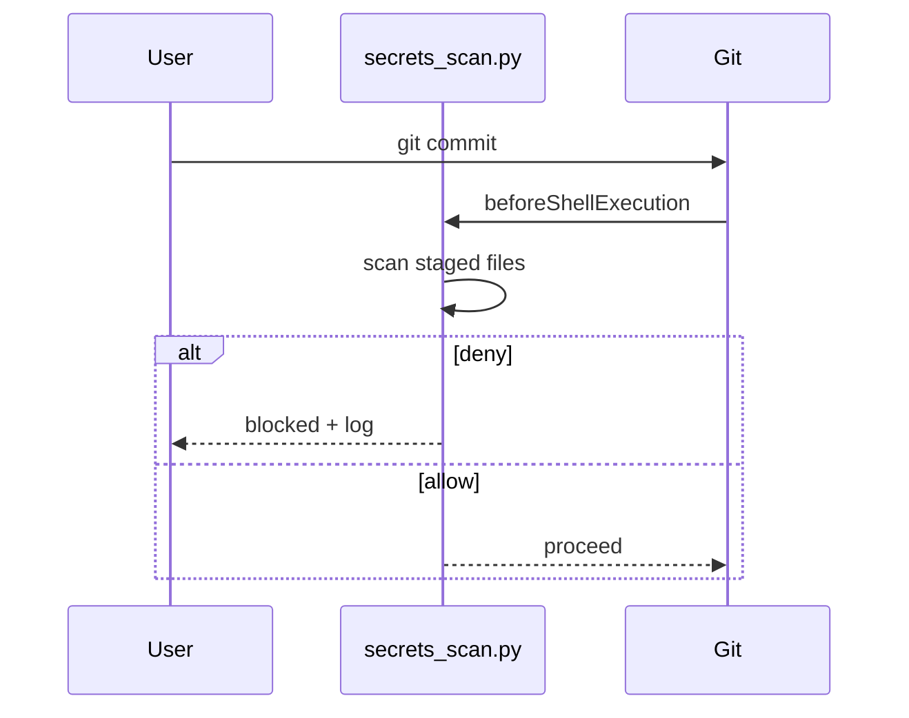

Ganchos no commit

**Hooks** executados em **eventos** — antes da execução do agente ou usuário`git commit`, após a edição de um arquivo, no início da sessão, etc. O usuário **não** precisa perguntar. O produto invoca seu script ou gancho de prompt.

## O que um gancho não é

| Gancho não é… | Por que |
|--------------|-----|
| Uma habilidade | As habilidades precisam da intenção do usuário; ganchos são automáticos |
|`AGENTS.md`| O briefing é passivo; ganchos **gate ou modificação** ações |
| Um substituto para CI | Os ganchos são locais/dev-time; CI ainda roda em push |

## Confirmar fluxo de gancho



**O agente não está no loop** a menos que o commit seja bloqueado e o usuário pergunte o porquê.

## Arquivos ativos

| Peça | Caminho |
|-------|------|
| Configuração do gancho | [Exemplos:`.cursor/hooks.json`](../examples/.cursor/hooks.json) |
| Script de gancho | [Exemplos:`.cursor/hooks/secrets_scan.py`](../examples/.cursor/hooks/secrets_scan.py) |
| Lógica de varredura | [Exemplos:`.cursor/hooks/lib/`](../examples/.cursor/hooks/lib/) |
| Configuração de amostra (mínima) | [amostra/.cursor/hooks.json](sample/.cursor/hooks.json) |

Copie o [examples/.cursor/]( completo../examples/.cursor/README.md) árvore para um portão secreto funcional.

###`hooks.json`(commit portão)

```json
{
  "version": 1,
  "hooks": {
    "beforeShellExecution": [
      {
        "command": "python3 .cursor/hooks/secrets_scan.py",
        "matcher": "git\\s+commit",
        "timeout": 30,
        "failClosed": true
      }
    ]
  }
}
```

| Campo | Significado |
|-------|---------|
|`beforeShellExecution`| Execute antes que o terminal execute o comando |
|`matcher`| JS regex na string completa do shell |
|`failClosed`| Bloquear commit se o gancho travar ou expirar |

## Gancho sem habilidade

```text
git commit
  → hook runs
  → pass → commit proceeds (agent may never know hook ran)
  → fail → shell blocked; user sees user_message from hook JSON
```

## Gancho + habilidade de companheiro (recomendado)

Os ganchos devem permanecer **pequenos e determinísticos**. Coloque **explicação e correção** em uma habilidade:

| Camada | Trabalho |
|-------|-----|
| Gancho | Bloquear + gravar log |
| Habilidade`secrets-scan-help`| Explique o registro, sugira`git reset`, rotação |

Consulte [Exemplos: secrets-scan-help](../examples/.cursor/skills/secrets-scan-help/SKILL.md).

## git pré-commit (fora de Cursor)

A mesma lógica de varredura pode ser executada em`.git/hooks/pre-commit`para companheiros de equipe sem Cursor — veja [Exemplos: hook doc](../examples/iv-hook-secrets-env-scan.md).

## Teste o gancho manualmente

```bash
echo '{"command":"git commit -m test"}' | python3 .cursor/hooks/secrets_scan.py
```

Estágio um`.env`arquivo primeiro para ver`permission: deny`.

## Próximo

[Combine todos os três](v-combine-skills-agents-hooks.md) - como`AGENTS.md`, habilidades e ganchos trabalham juntos em um commit real.
