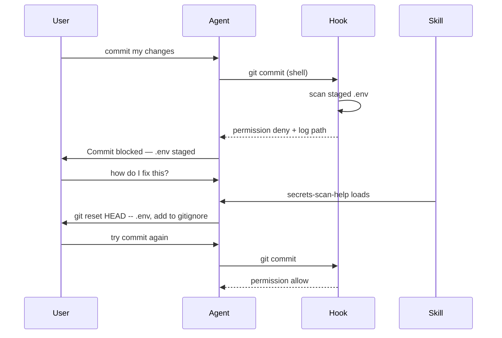

Combine habilidades, agentes e ganchos

Use **cada camada para um trabalho**. Juntos, eles abrangem: contexto sempre ativo, experiência sob demanda e portas automáticas.

## Layout completo do repositório

```text
repo/
  AGENTS.md                           ← every session
  .cursor/
    hooks.json                        ← events (commit, edit, …)
    hooks/
      secrets_scan.py
    skills/
      pr-review-lite/                 ← user asks "review PR"
      deploy-check/                   ← user asks "deploy check"
      secrets-scan-help/              ← user asks "why commit blocked"
      hook-failure-help/              ← generic blocked-action help
```

Copie amostras de [sample/](sample/.cursor/README.md) + scripts de [examples/.cursor/](../examples/.cursor/README.md).

## Cenário A — O usuário solicita revisão de PR (somente habilidade)

```text
1. AGENTS.md → agent knows npm test, folder layout
2. User: "review this PR"
3. pr-review-lite skill loads
4. Agent reviews diff, cites AGENTS.md test command
5. No hook fires
```

## Cenário B — Agente tenta se comprometer com`.env`encenado (apenas gancho)

```text
1. AGENTS.md → line: "Commits gated by secrets scan hook"
2. Agent: git commit -m "add config"
3. beforeShellExecution → secrets_scan.py → DENY
4. Commit never runs; agent sees agent_message from hook
5. secrets-scan-help skill can load if user says "why blocked"
```

## Cenário C — Implantar verificação antes do lançamento (habilidade + script)

```text
1. AGENTS.md → links deploy-check skill
2. User: "are we ready to deploy?"
3. deploy-check skill → asks environment → confirms → runs script
4. Script writes JSON log → agent summarizes
5. Hook not involved unless user commits afterward
```

## Cenário D — Confirmação bloqueada → explicar → corrigir → tentar novamente



## Matriz de responsabilidade

| Preocupação | AGENTS.md | Habilidade | Gancho |
|--------|-----------|-------|------|
| Comando de teste | ✓ | | |
| Lista de verificação PR | link de índice | ✓ procedimento | |
| Bloquear commit incorreto | nota de uma linha | explicar a correção | ✓ fazer cumprir |
| Implantação parametrizada | link de índice | ✓ perguntar + executar script | |
| JSON registros | | agente lê | gancho escreve |

## Antipadrões

| Não | Em vez disso, faça |
|-------|------------|
| Coloque a lista de verificação PR completa`AGENTS.md`| Habilidade + link de`AGENTS.md`|
| Colocar regras de commit apenas em uma habilidade | Gancho para fazer cumprir; habilidade para explicar |
| Faça o gancho chamar o LLM | Gancho = roteiro; habilidade lida com prosa |
| Duplicar o mesmo texto em 3 arquivos |`AGENTS.md`habilidades de índices; scripts de referência de habilidades |

## Lista de verificação de instalação

1. [ ]`AGENTS.md`na raiz do repositório - [amostra](sample/AGENTS.md)
2. [ ]`.cursor/skills/`- [pré-revisão-lite](sample/.cursor/skills/pr-review-lite/SKILL.md) + [exemplos de habilidades](../examples/.cursor/README.md)
3. [ ]`.cursor/hooks.json`+`hooks/`— [exemplos de ganchos](../examples/.cursor/hooks.json)
4. [ ]`.gitignore`-`logs/`sob habilidades e ganchos
5. [] Novo bate-papo + teste de cada caminho (revisão, implantação, preparação`.env`comprometer-se)

## Relacionado

- [Orquestração de agentes](vi-agent-orchestration.md) — pilha completa e padrões avançados
- [Visão geral dos exemplos](../examples/i-overview.md)
- [Habilidades de escrita e manutenção](../v-writing-and-maintaining-skills.md)
- [Aviso de loop](../../loop-prompting/i-overview.md)
