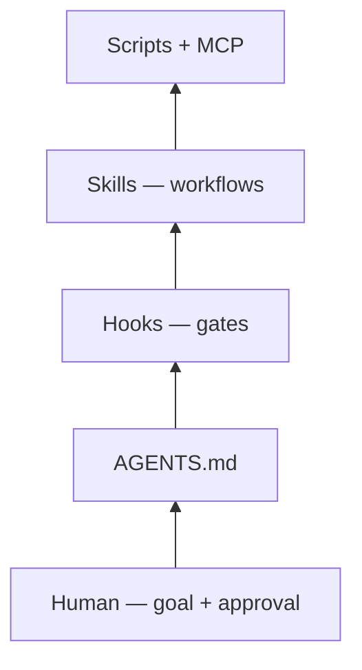
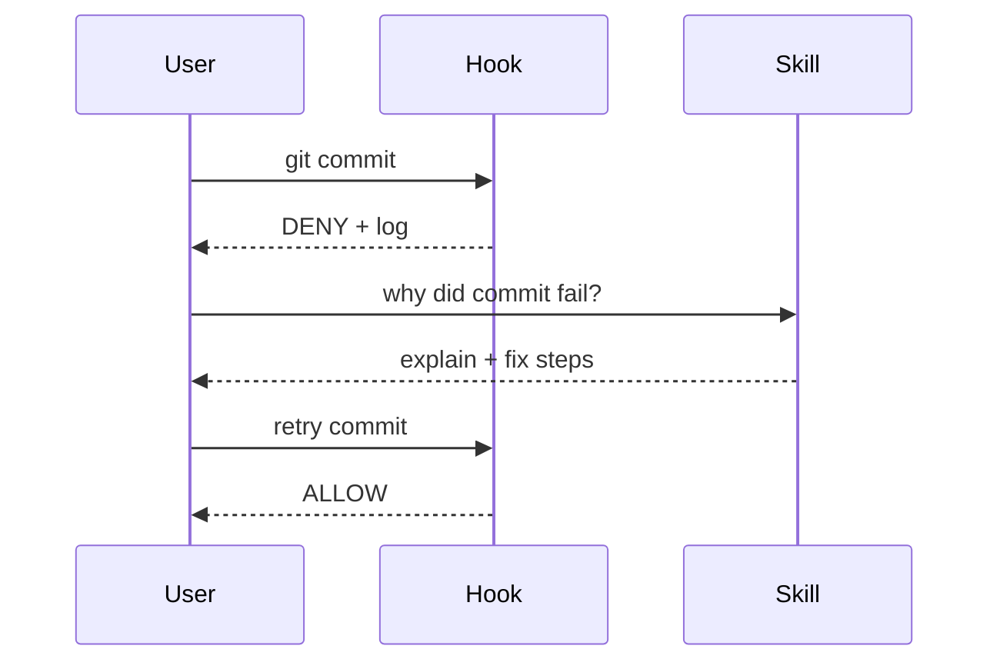

Orquestração de agentes

**Orquestração do agente** é como você **coordena** várias peças — briefing, habilidades, ganchos, scripts, MCP, loops — para que o agente faça a coisa certa no momento certo, sem que você precise explicar novamente cada chat.

Esta pasta é um guia de **orquestração em nível de projeto**. Para padrões de todo o produto (Zapier, conectores), consulte [Padrões de orquestração](../../tools-and-orchestration/iii-orchestration-patterns.md). Para um raciocínio em várias etapas, consulte [Agentes e fluxos de trabalho de agentes](../../agents-and-agentic-workflows/i-overview.md).

## Pilha de orquestração (inferior → superior)



| Camada | Orquestras | Exemplo |
|-------|-------------|---------|
| **AGENTS.md** | *O que é repositório* | “Testes:`npm test`” |
| **Ganchos** | *Quando as ações podem ser executadas* | Bloquear`git commit`se`.env`encenado |
| **Habilidades** | *Qual manual* | Revisão de PR versus verificação de implantação |
| **Roteiros** | *Efeitos colaterais repetíveis* |`deploy_check.py`→ JSON registro |
| **MCP** | *Dados externos ao vivo* | Query Sentry, não texto de habilidade estática |

## Padrões de orquestração em Cursor

### 1. Briefing + habilidade sob demanda (padrão)

```text
Session start → AGENTS.md
User task     → matching skill
Agent         → tools + skill procedure
```

Sem gancho. O usuário controla o tempo. Veja [Habilidades sozinhas](ii-use-skills-alone.md).

### 2. Gate então explique (habilidade de gancho + companheiro)



Forças de gancho; habilidade narra. Veja [Ganchos no commit](iv-use-hooks-on-commit.md).

### 3. Loop de script (habilidade + log JSON)

```text
Skill runs script → log file
Agent reads log   → proposes fix
User approves     → skill re-runs script → compare logs
```

Os mesmos dados refinados entre turnos. Consulte [Loop nos resultados do script](../examples/iii-loop-on-script-results.md).

### 4. Loops de parada/subagente (ganchos avançados)

| Evento de gancho | Uso de orquestração |
|------------|-------------------|
|`stop`+`loop_limit`| Agente termina → gancho injeta acompanhamento (“reler log, iteração 2”) |
|`subagentStart`| Aprovar ou negar spawns de tarefas/subagentes |
|`subagentStop`| Subagente de cadeia com`followup_message`|
|`preToolUse`| Bloqueie ou reescreva chamadas de ferramentas perigosas |

Use quando um **ciclo de habilidade** não for suficiente — você precisa que o **produto** continue sem uma nova mensagem de usuário.

### 5. MCP + habilidades (ao vivo + estática)

| Peça | Função |
|-------|------|
| Habilidade | *Como fazemos a triagem de erros de produção* |
| MCP (Sentinela) | *Rastreamento de pilha atual* |

Habilidade sem MCP = runbook obsoleto. MCP sem habilidade = agente improvisa processo.

## Quem orquestra o quê

| Ator | Responsabilidade |
|-------|----------------|
| **Você** | Metas, parâmetros, aprovar ações destrutivas |
| **AGENTS.md** | Fatos de recompra estáveis ​​|
| **Ganchos** | Portões rígidos e bordas de automação |
| **Habilidades** | Fluxos de trabalho nomeados e formato de saída |
| **Agente (LLM)** | Raciocínio dentro dos limites das habilidades |
| **Roteiros** | Verificações e registros determinísticos |
| **CI/git** | Verdade pós-push (ganchos não substituem) |

## Regras de design

| Regra | Por que |
|------|-----|
| **Ganchos ficam burros** | Rápido, auditável; nenhuma latência de modelo em cada commit |
| **As habilidades permanecem procedimentais** | “Perguntar → confirmar → executar → ler log” |
| **AGENTS.md permanece curto** | Habilidades de índice; não duplique listas de verificação |
| **Um caminho de log por iteração** | Citações de agente`current_log_file`— [exemplo de loop](../examples/iii-loop-on-script-results.md) |
| **Aprovação humana antes de fatores externos** | Clientes de e-mail, implantação de produção, reescrita de histórico |

## Exemplo de mapa de orquestração (amostras deste repositório)

```text
AGENTS.md
  ├── index → pr-review-lite skill      (user: "review PR")
  ├── index → deploy-check skill        (user: "deploy check")
  └── note  → secrets hook on commit

hooks.json
  └── beforeShellExecution → secrets_scan.py

On block → secrets-scan-help / hook-failure-help skill
On deploy → deploy_check.py → logs/ → agent summarizes
```

Layout de cópia: [amostra/](sample/.cursor/README.md) + [exemplos/.cursor/](../examples/.cursor/README.md).

## vs “apenas conversar”

| Basta conversar | Projeto orquestrado |
|-----------|-----------|
| Cole novamente os comandos de teste |`AGENTS.md`|
| “Lembre-se de verificar os segredos” | Gancho no commit |
| Avaliações inconsistentes de PR |`pr-review`habilidade |
| Agente adivinha etapas de implantação |`deploy-check`roteiro + habilidade |
| Sem trilha de auditoria | JSON faz logon em`logs/`|

## Antipadrões

| Antipadrão | Correção |
|--------------|-----|
| Um gigante`AGENTS.md`com cada fluxo de trabalho | Dividir em habilidades; índice em briefing |
| Gancho que chama o LLM para política |`preToolUse`prompt hook somente quando necessário; prefiro roteiro |
| Habilidade que tenta bloquear o git | Use o gancho para impor |
| Orquestração sem logs | Os scripts escrevem JSON; agente lê caminho |
| 10 habilidades com descrições sobrepostas | Estreito`description`; um trabalho por pasta |

## Perguntas de ensaio

- Nomeie as quatro camadas, desde o briefing até os scripts.
- Por que um commit gate deveria ser um gancho e não uma habilidade?
- Quando você adicionaria um`stop`gancho em vez de confiar no texto do loop de habilidades?

## Relacionado

- [Combine habilidades, agentes e ganchos](v-combine-skills-agents-hooks.md)
- [Padrões de orquestração](../../tools-and-orchestration/iii-orchestration-patterns.md)
- [Agentes e fluxos de trabalho de agentes](../../agents-and-agentic-workflows/i-overview.md)
- [Aviso de loop](../../loop-prompting/i-overview.md)
- [Como MCP funciona](../../how-mcp-works/i-overview.md)
