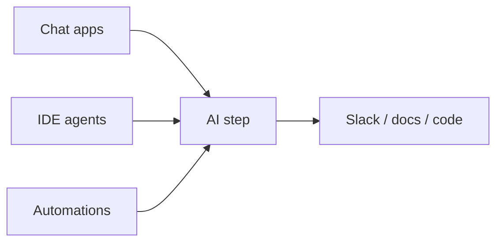

Ferramentas e orquestração — visão geral
Aprofunde-se em **ferramentas e orquestração** — dividido em notas específicas abaixo.

## Mapa deste submenu

| Nota | Foco |
|------|--------|
| [Mapa de ferramentas](ii-tool-map-and-patterns.md) | Parte da trilha de ferramentas e orquestração |
| [Padrões de orquestração](iii-orchestration-patterns.md) | Parte da trilha de ferramentas e orquestração |
| [Conectores, modelos e equipes](iv-connectors-models-and-teams.md) | Parte da trilha de ferramentas e orquestração |
| [Antipadrões e ensaio](v-antipatterns-and-rehearsal.md) | Parte da trilha de ferramentas e orquestração |

Ferramentas e orquestração
**Orquestração** significa conectar AI a **onde você já trabalha** — aplicativos de bate-papo, IDEs, navegadores, documentos, Slack — para que as tarefas fluam sem copiar e colar entre dez guias.

Isso é para **usuários** escolherem e conectarem ferramentas, não para construir pipelines ML.

## Ordem de estudo

[Mapa de ferramentas](ii-tool-map-and-patterns.md) → [Padrões de orquestração](iii-orchestration-patterns.md) → [Conectores, modelos e equipes](iv-connectors-models-and-teams.md) → [Antipadrões e ensaio](v-antipatterns-and-rehearsal.md)
