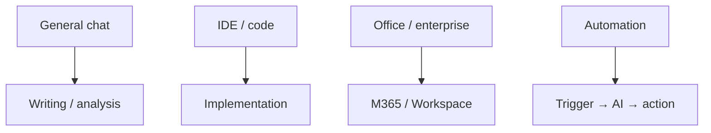

Mapa de ferramentas

## 1. Mapa de ferramentas

| Categoria | Exemplos | Melhor para |
|----------|----------|----------|
| **Bate-papo geral** | ChatGPT, Claude, Gêmeos | Redação, análise, brainstorming |
| **IDE / código** | Cursor, GitHub Copiloto, Cody | Implementação, refatorações, testes — use [Habilidades](../skills-and-agent-instructions/i-overview.md) |
| **Escritório / empresa** | Copiloto da Microsoft, Google Duet | Email, slides, planilhas no locatário |
| **Pesquisa + AI** | Perplexidade, Gêmeos com busca | Pesquisa rápida citada |
| **Automação** | Zapier, Faça, n8n | Gatilho → etapa AI → ação |
| **Reunião / voz** | Lontra, vaga-lumes, transcrição nativa | Notas, acompanhamentos |
| **Design/imagem** | Meio da jornada, DALL·E, Ideograma | Visuais de prompts |

Escolha **um bate-papo principal** e **um assistente de codificação principal** para evitar a expansão do contexto.