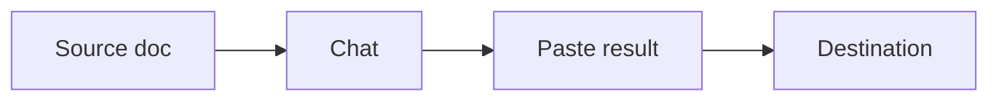
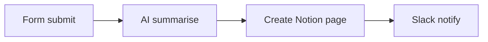

Padrões de orquestração

## 2. Padrões de orquestração

### Ponte copiar e colar (menor fricção)

Ótimo para tarefas ocasionais; não escala.

### Aplicativos conectados (conectores)

ChatGPT / Claude / Copilot **conectores** leia Google Drive, Slack, GitHub, etc.

| Benefício | Cuidado |
|--------|-----------|
| Menos upload manual | Permissões – conecte apenas o que você tem permissão para compartilhar |
| Contexto mais atual | O modelo ainda pode interpretar mal ou resumir errado |

### IDE + contexto do repositório

**Cursor:** índice de base de código, regras, terminal, agente de vários arquivos.

| Prática | Por que |
|----------|-----|
| Manter`README`/ regras precisas | Caso contrário, o agente segue padrões errados |
| Tarefas pequenas e com escopo definido | Revisão mais fácil |
| Usar`@file`/menções | Fixar contexto exato |

### MCP (protocolo de contexto de modelo)

**MCP** conecta o agente a **sistemas ativos** (GitHub, Postgres, Sentry) por meio de **servidores **MCP**. O formato de transmissão é **JSON-RPC** sobre **stdio** (local) ou **HTTP** (remoto) — **não gRPC**. O servidor então chama o **REST/HTTPS API** normal de cada produto.

| Você vê | Sob o capô |
|--------|----------------|
| “Pesquise nossos tickets Lineares” em Cursor | Host → Servidor MCP → Linear HTTPS API |
| MCP configurações /`mcp.json`| Gera ou se conecta ao processo do conector |

**Aprofundamento:** [Como MCP funciona](../how-mcp-works/i-overview.md) — transportes, funções, segurança versus habilidades.

### Cadeias de automação

| Plataforma | Força |
|----------|----------|
| **Zapier / Make** | Sem código; muitas integrações SaaS |
| **n8n** | Auto-hospedeiro; equipas técnicas |

Coloque etapas de **aprovação humana** antes dos envios externos (e-mail para clientes, postagens públicas).