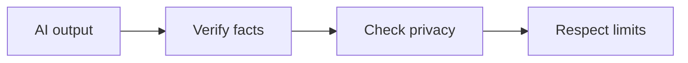

Confiança, privacidade e verificação — visão geral
Aprofunde-se em **confiança, privacidade e verificação** — dividido em notas específicas abaixo.

## Mapa deste submenu

| Nota | Foco |
|------|--------|
| [Alucinações e verificação](ii-hallucinations-and-verification.md) | Parte da confiança, privacidade e rastreamento de verificação |
| [Privacidade e dados empresariais](iii-privacy-enterprise-data.md) | Parte da confiança, privacidade e rastreamento de verificação |
| [Agentes, injeção e limites](iv-agents-injection-limits.md) | Parte da confiança, privacidade e rastreamento de verificação |

Confie, privacidade e verifique
As ferramentas AI são **rápidas e fluentes** — não automaticamente **verdadeiras**, **privadas** ou **permitidas** para seu local de trabalho. Esta nota é o mínimo que todo **usuário** deve praticar.

## Ordem de estudo

[Alucinações e verificação](ii-hallucinations-and-verification.md) → [Privacidade e dados empresariais](iii-privacy-enterprise-data.md) → [Agentes, injeção e limites](iv-agents-injection-limits.md)
