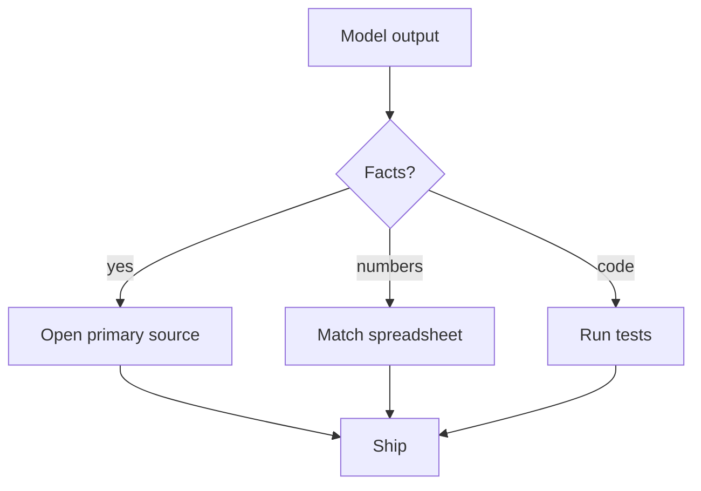

Alucinações e verificação

## 1. Alucinações

**Alucinação** = saída aparentemente plausível que está **errada** – citações falsas, números errados, nomes API inventados.

| Alto risco de alucinação | Menor risco |
|--------------|------------|
| Fatos obscuros, acontecimentos recentes | Editando seu texto colado |
| “Dê-me 10 artigos sobre…” com links | Transformação de estilo/formato |
| Detalhe numérico da memória | Resumindo o documento **fornecido** |

| Hábito | Ação |
|-------|--------|
| **Verifique os fatos** | Verifique a fonte primária |
| **Requer citações** | Clique em links; confirmar se existe papel |
| **Números** | Rastrear para planilha ou relatório |
| **Código** | Execute testes; não se funda sem ser visto |

Trate AI como um **colega inteligente que às vezes blefa**.

## 4. Lista de verificação de verificação (antes de enviar)

- [] Fatos atribuídos a uma fonte **que você** abriu
- [] Os números correspondem à planilha/sistema de registro
- [] Nomes, datas, URLs verificados manualmente
- [ ] Código compilado / testes executados (se aplicável)
- [ ] Tom e compromissos aceitáveis para envio em **seu** nome
- [] Nenhum conteúdo confidencial no histórico imediato do qual você se arrependerá