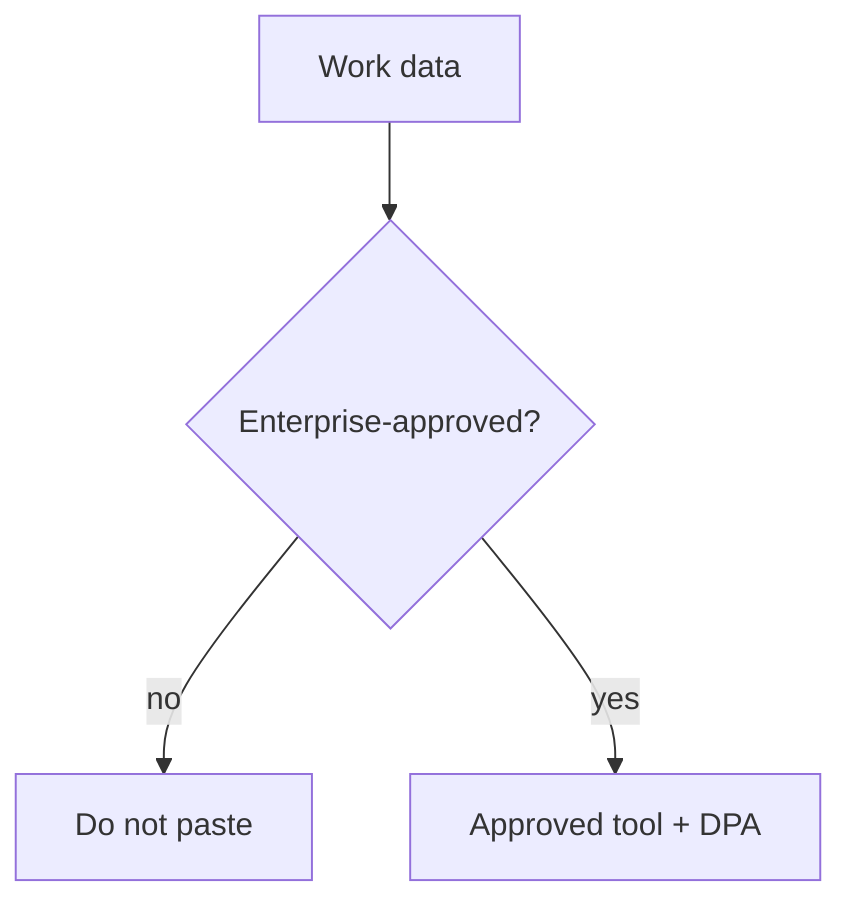

Privacidade e dados empresariais

## 2. O que não colar

| Nunca (a menos que seja aprovado pela empresa) | Por que |
|-----------------------------------|-----|
| Senhas, chaves API, tokens | Treinamento, registros, violações |
| Cliente não editado PII | GDPR, contratos |
| Finanças não divulgadas, fusões e aquisições | Informações relevantes não públicas |
| Registros de pacientes/alunos | HIPAA, FERPA |
| Documentos jurídicos privilegiados | Sem aprovação política |

Use ferramentas **aprovadas pela empresa** com **DPA** e **sem treinamento em dados** ao lidar com dados de trabalho.

## 3. Camadas Empresa vs Consumidor

| Verifique | Livre do consumidor | Empresa / equipe |
|-------|---------------|-------------------|
| Dados utilizados para treinamento | Muitas vezes a desativação varia | Geralmente limitado contratualmente |
| Controles administrativos | Mínimo | SSO, retenção, auditoria |
| Comportamento do modelo | Padrão | Pode adicionar filtros de conformidade |

Em caso de dúvida, pergunte a **IT / segurança** — não ao chatbot.