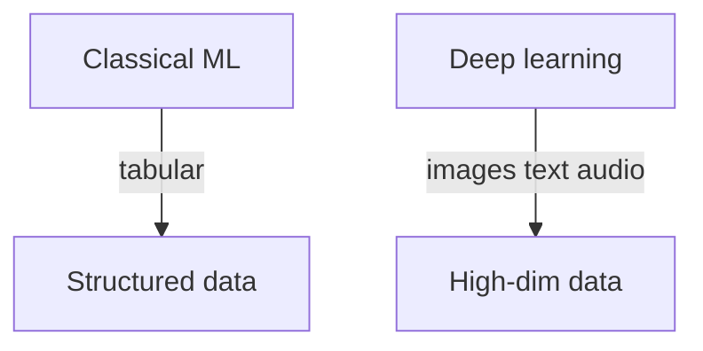

Aprendizado profundo – visão geral
O **aprendizado profundo** usa **redes neurais** com muitas camadas para aprender representações hierárquicas, com destaque para **imagens**, **áudio**, **texto** e outros dados de alta dimensão. É um **subconjunto** de [aprendizado de máquina](../machine-learning/i-overview.md) com requisitos mais pesados ​​de **computação** e **dados**.

## Mapa deste submenu

| Parte | Tópico |
|------|--------|
| **I — Visão geral** | Como o aprendizado profundo se encaixa AI101 |
| **II — Redes neurais e treinamento** | Neurônios, backprop, otimizadores, treinamento em lote |
| **III — CNNs e RNNs** | Arquiteturas espaciais e sequenciais |
| **IV — Transformadores e atenção** | Autoatenção, codificador/decodificador, base para LLMs |

## Quando aprendizagem profunda versus ML clássico

| Prefira o clássico ML | Prefira aprendizado profundo |
|---------------------|----------------------|
| Pequenos conjuntos de dados tabulares | Imagens, texto longo, áudio |
| Precisa de coeficientes interpretáveis ​​| Precisa de aprendizagem de representação |
| Orçamento limitado de GPU | Grandes dados + computação |

Muitos sistemas de produção usam **ambos** — aumento de gradiente em recursos tabulares + rede neural em texto/imagens.

## Pilha

| Camada | Ferramentas comuns |
|-------|-------------|
| **Estrutura** | PyTorch (pesquisa/indústria), TensorFlow/Keras |
| **Treinamento** | GPU/TPU, precisão mista |
| **Servindo** | TorchServe, ONNX, Tritão |

## Próximo

Continue com [Redes neurais e treinamento](ii-neural-networks-and-training.md).

**Relacionado:** [Visão geral do aprendizado de máquina](../machine-learning/i-overview.md), [LLMs visão geral](../llms/i-overview.md).
