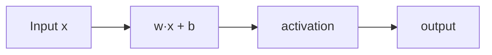
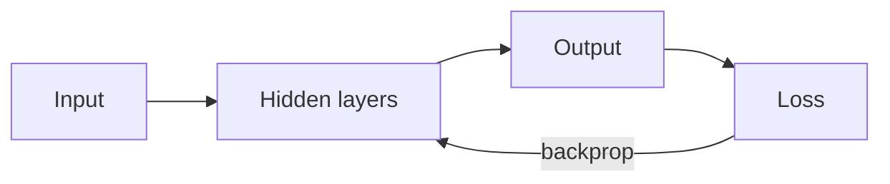

Redes neurais e treinamento
Uma **rede neural** empilha **camadas** de neurônios — cada uma calcula a **ativação(pesos · entrada + polarização)**. **O treinamento** ajusta os pesos por meio de **propagação** e **gradiente descendente** para minimizar a **perda**.

## 1. Neurônio único



| Peça | Função |
|-------|------|
| **o** | Pesos - que podem ser aprendidos |
| **ca** | Viés - aprendido |
| **ativação** | Não linearidade — sem ela, a pilha de camadas se torna linear |

### Funções de ativação

| Função | Usar |
|----------|-----|
| **ReLU** max(0,x) | Camadas ocultas padrão |
| **Sigmóide** | Saída binária (herdado oculto) |
| **Softmax** | Probabilidades multiclasse (soma 1) |
| **GELU** | Suave; comum em transformadores |

## 2. Arquitetura de rede

**Denso (totalmente conectado):** cada entrada se conecta a cada saída na camada.



Mais camadas = rede **mais profunda** = recursos mais ricos (hierárquicos).

<figure class="notes-diagram"><svg xmlns="http://www.w3.org/2000/svg" viewBox="0 0 440 130" role="img" aria-label="Neural network layers">
  <text x="30" y="18" fill="#71717a" font-size="10" text-anchor="middle">Input</text>
  <circle cx="30" cy="55" r="8" fill="#27272a" stroke="#52525b" stroke-width="1.5"/>
  <circle cx="30" cy="85" r="8" fill="#27272a" stroke="#52525b" stroke-width="1.5"/>
  <text x="160" y="18" fill="#71717a" font-size="10" text-anchor="middle">Hidden</text>
  <circle cx="130" cy="45" r="8" fill="#27272a" stroke="#86efac" stroke-width="1.5"/>
  <circle cx="130" cy="75" r="8" fill="#27272a" stroke="#86efac" stroke-width="1.5"/>
  <circle cx="190" cy="45" r="8" fill="#27272a" stroke="#86efac" stroke-width="1.5"/>
  <circle cx="190" cy="75" r="8" fill="#27272a" stroke="#86efac" stroke-width="1.5"/>
  <text x="360" y="18" fill="#71717a" font-size="10" text-anchor="middle">Output</text>
  <circle cx="360" cy="65" r="8" fill="#27272a" stroke="#fbbf24" stroke-width="1.5"/>
  <line x1="38" y1="55" x2="122" y2="45" stroke="#3f3f46" stroke-width="0.8"/>
  <line x1="38" y1="85" x2="122" y2="75" stroke="#3f3f46" stroke-width="0.8"/>
  <line x1="198" y1="45" x2="352" y2="65" stroke="#3f3f46" stroke-width="0.8"/>
  <line x1="198" y1="75" x2="352" y2="65" stroke="#3f3f46" stroke-width="0.8"/>
</svg></figure>

## 3. Retropropagação

**Forward pass:** calcula previsões e perdas.
**Passe para trás:** regra da cadeia → **∂Loss/∂w** para cada peso.
**Atualização:** **w ← w − η · gradiente** (η = taxa de aprendizagem).

Diferenciação automática (PyTorch`autograd`, TF) implementa isso.

## 4. Otimizadores

| Otimizador | Notas |
|-----------|-------|
| **SGD + impulso** | Clássico; precisa de ajuste lr |
| **Adão** | LR adaptável por parâmetro — padrão comum |
| **AdamW** | Adam + redução de peso dissociada |

## 5. Treinamento em minilote

| Modo | Troca |
|------|-----------|
| **Lote completo** | Gradiente estável; memória pesada |
| **Minilote** (32–512) | GPU-eficiente; gradiente barulhento ajuda generalização |
| **SGD lote=1** | Barulhento; raramente usado sozinho em escala |

**Época** = uma passagem completa pelo conjunto de treinamento.

### Cronograma de taxa de aprendizagem

| Edição | Correção |
|-------|-----|
| Perda diverge | Inferior lr |
| Perda plana | Aquecimento + decaimento do cosseno; verificar dados |

## 6. Regularização em redes profundas

| Método | Veja também |
|--------|----------|
| **Abandono** | Aleatoriamente zero ativações durante o trem |
| **Queda de peso** | L2 em pesos (AdamW) |
| **Parada antecipada** | Pare na perda de val |
| **Aumento de dados** | Imagens – corte/inversão aleatória |

[Sobreajuste](../machine-learning/v-overfitting-regularization-and-tuning.md) aplica a mesma intuição de viés-variância.

## 7. Esboço PyTorch

```python
import torch.nn as nn

class MLP(nn.Module):
    def __init__(self, d_in, d_hidden, d_out):
        super().__init__()
        self.net = nn.Sequential(
            nn.Linear(d_in, d_hidden),
            nn.ReLU(),
            nn.Linear(d_hidden, d_out),
        )
    def forward(self, x):
        return self.net(x)
```

## 8. Perguntas de ensaio

- Por que são necessárias ativações não lineares?
- Uma frase: o que o backprop calcula?
- O tamanho do minilote afeta quais duas coisas?

**Relacionado:** [CNNs e RNNs](iii-cnns-and-rnns.md), [Transformadores](iv-transformers-and-attention.md).
