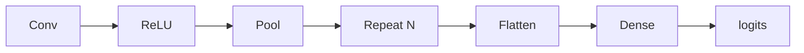
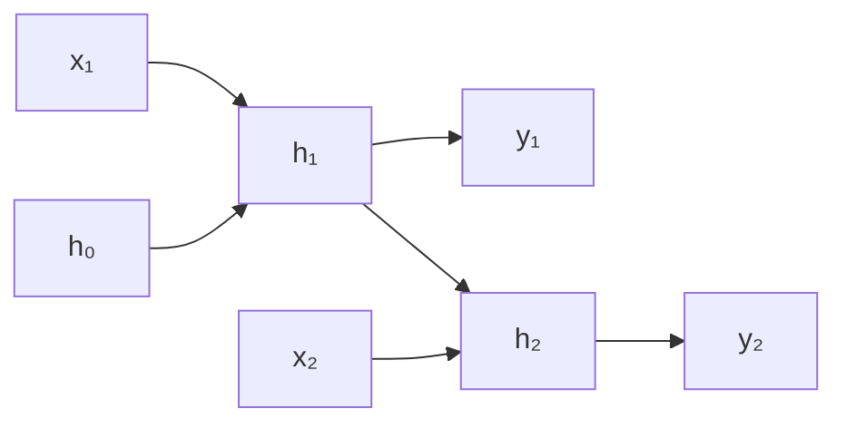

CNN e RNN
Duas arquiteturas especializadas antes dos **transformadores** dominaram: **CNNs** para dados **espaciais** (imagens), **RNNs** para **sequências** (texto, séries temporais).

## 1. CNN — Rede Neural Convolucional

**Ideia:** deslize um **filtro (kernel)** sobre a entrada para detectar **padrões locais** (arestas, texturas, partes).

| Camada | Função |
|-------|------|
| **Conv** | Detecção de recursos locais; pesos compartilhados → parâmetro eficiente |
| **ReLU** | Não linearidade |
| **Agrupamento** (máx./média) | Reduzir a resolução; tolerância de tradução |
| **Achatar + Denso** | Classifique a partir de mapas de alto nível |

### Por que CNNs para imagens

| Propriedade | Benefício |
|----------|---------|
| **Conectividade local** | Pixels próximos são importantes juntos |
| **Divisão de peso** | O mesmo detector de bordas em todos os lugares |
| **Hierarquia** | Bordas das camadas iniciais → objetos das camadas finais |

**Marcos:** LeNet, AlexNet, VGG, **ResNet** (pular conexões corrige gradiente de desaparecimento).

### Aumento de dados

Inversão aleatória, corte, instabilidade de cor – regularização barata para visão.

## 2. RNN — Rede Neural Recorrente

**Ideia:** manter o **estado oculto** **hₜ** atualizado a cada intervalo de tempo:

Memória de entradas anteriores — para linguagem, fluxos de sensores.

| Variante | Correção |
|--------|-----|
| **Baunilha RNN** | Gradiente de desaparecimento em sequências longas |
| **LSTM** | Portões (esquecer, entrada, saída) — dependências de longo alcance |
| **GRU** | LSTM mais simples (2 portas) — precisão frequentemente semelhante |

## 3. CNN vs RNN vs Transformador

| Arquitetura | Viés indutivo | Dominante hoje |
|--------------|----------------|----------------|
| **CNN** | Espacial local | Backbones de visão (geralmente + cabeça de transformador) |
| **RNN** | Recorrência sequencial | Principalmente substituído em NLP |
| **Transformador** | Atenção global | NLP, visão (ViT), multimodal |

RNNs ainda aparecem em modelos de **pequenos dispositivos** ou de **streaming**; a maioria dos novos NLP usa [Transformers](iv-transformers-and-attention.md).

## 4. Perguntas de ensaio

- O que o pooling compra para você?
- Por que os LSTMs superam os RNNs vanilla em textos longos?
- Cite uma família de modelos de visão modernos.

**Relacionado:** [Transformadores e atenção](iv-transformers-and-attention.md), [LLMs visão geral](../llms/i-overview.md).
