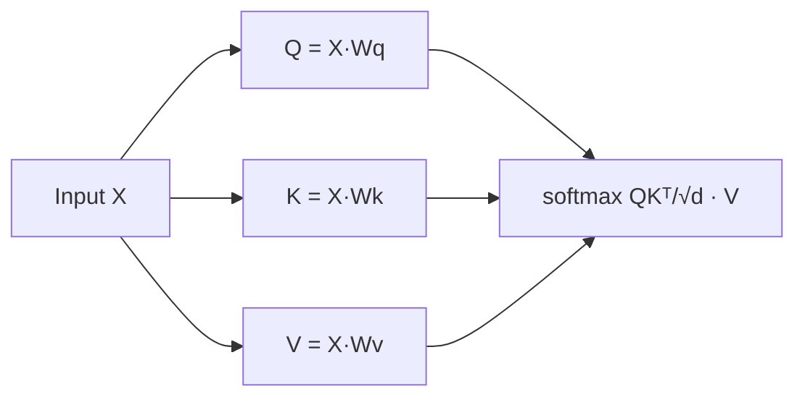
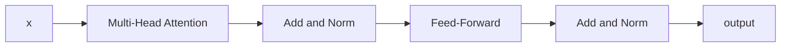
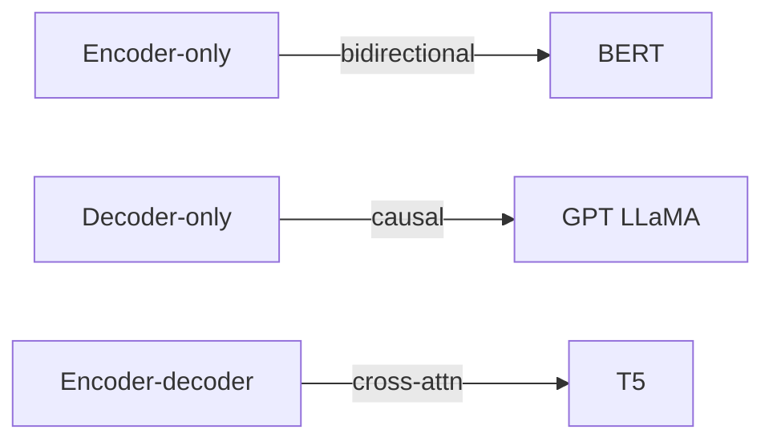

Transformadores e atenção
**"Atenção é tudo que você precisa"** (Vaswani et al., 2017) — a arquitetura por trás dos modernos **LLMs**, **BERT** e da maioria dos transformadores NLP/vision.

## 1. Autoatenção

Cada token constrói uma representação **atendendo** a todos os outros tokens na sequência.

| Símbolo | Significado |
|--------|---------|
| **Q** (consulta) | O que estou procurando? |
| **K** (chave) | O que eu ofereço? |
| **V** (valor) | Quais informações passo caso seja selecionado? |

Saída = **soma ponderada** dos valores; pesos = similaridade de consulta para cada chave.

## 2. Atenção multifacetada

Execute **h** cabeças de atenção em paralelo com **diferentes** projeções aprendidas - capture diferentes tipos de relacionamento (sintaxe, correferência, etc.).

Concatenar cabeças → projeção linear.

## 3. Bloco transformador

| Peça | Função |
|-------|------|
| **Adicionar e norma** | Normalização residual + camada – treinamento profundo estável |
| **Feedforward** | MLP por token — capacidade extra |

Empilhe **N** blocos → transformador profundo.

## 4. Codificação posicional

A atenção por si só é **invariante à permutação** — a ordem deve ser injetada:

| Estilo | Usado em |
|-------|---------|
| **Senoidal** (fixo) | Transformador original |
| **Incorporações aprendidas** | GPT, BERT |

## 5. Codificador vs decodificador

| Arquitetura | Máscara de atenção | Exemplos |
|--------------|----------------|----------|
| **Somente codificador** | Bidirecional — todos os tokens ver todos | BERT (classificação, incorporações) |
| **Somente decodificador** | Causal — token t vê ≤ t | GPT, LLaMA ([LLMs](../llms/i-overview.md)) |
| **Codificador-decodificador** | Codificador bidirecional; decodificador causal cross-attn | T5, tradução original |

**LLMs** para bate-papo são quase sempre LMs causais **somente decodificador**.

## 6. Nota de complexidade

A autoatenção é **O(n²)** no comprimento da sequência **n** — janela de contexto e custo da unidade de computação. Técnicas: **FlashAttention**, atenção escassa, janela deslizante (alguns modelos de contexto longo).

## 7. Perguntas de ensaio

- Que problema a codificação posicional resolve?
- Somente decodificador versus somente codificador — qual para previsão do próximo token?
- Por que √dₖ na escala de atenção?

**Relacionado:** [LLMs — pré-treinamento](../llms/ii-pretraining-and-tokenization.md), [Redes neurais e treinamento](ii-neural-networks-and-training.md).
